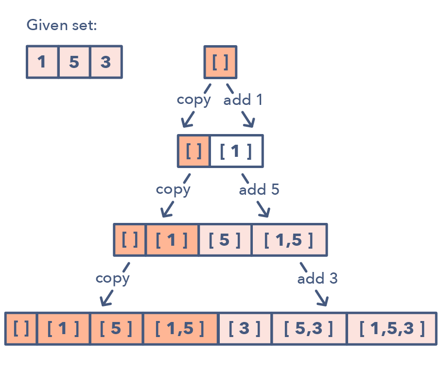

# Backtracking

## Backtracking（回溯法）

Backtracking（回溯法）常用於traverse列表內的所有Subsets。通常這種題目都會跟Combination/Permutation有關，當然還有典型的N皇后問題。

回溯法（backtrack）常用於遍歷列表所有子集，是 DFS 深度搜索一種，一般用於全排列，窮盡所有可能，遍歷的過程實際上是一个决策樹的遍歷過程。時間複雜度一般 O\(N!\)，它不像動態規劃存在重叠子問題可以優化，回溯算法就是純暴力窮舉，複雜度一般都很高。

以下的Backtracking模板，就是從選擇列表裡做一個選擇，然後做遞歸，往下搜索答案。如果遇到路徑不通，就返回來撤銷這一次的選擇。

模板：

```python
result = []
while backtrack(選擇列表,路徑):
    if 滿足結束條件:
        result.add(路徑）
        return
    for 選擇 in 選擇列表:
        做選擇
        backtrack(選擇列表,路徑)
        撤銷選擇
```

```python
result = []
self.backtrack(result,暫時結果,暫時index)
return result

def backtrack(self, result, curr_res, curr_id):
    if 滿足遞歸結束條件:
        result.append(curr_res)
        return
    
    for 選擇i in range(選擇集): 
        self.backtrack(result, curr_res+最新結果, 更新選擇i or 更新curr_id)
```

### Recursion

#### Head recursion vs Tail recursion

If recursive calls before the conditional check, then it's bottom-up \(Tail\). If recursive call after conditional check, it's top-down \(Head\).

### 1. Subsets

A huge number of coding interview problems involve dealing with Permutations and Combinations of a given set of elements. The pattern Subsets describes an efficient Breadth First Search \(BFS\) approach to handle all these problems.



How to identify the Subsets pattern:

* Problems where you need to find the combinations or permutations of a given set
* Problems featuring Subsets pattern:
* Subsets With Duplicates \(easy\)
* String Permutations by changing case \(medium\)

此題存在4種解法。  
\(1\) Backtracking/DFS \( +Recursion \)  
\(2\) BFS

### 2. String Partitioning

和Subsets的作法相同，題目要求的是 ‘partition `s` such that every substring of the partition is an xxxx. '，把String s切分，並且找出所有符合條件的的substring。由此可知，我們可以利用同樣的Backtracking方法來完成。


#### 題目

* [x] word search
* [x] Subsets I & II
* [x] Permutations I & II
* [ ] Letter Case Permutation
* [x] Combination
* [x] Combination Sum I & II & III
* [x] Generate Parentheses
* [x] Palindrome Partitioning
* [x] Letter Combinations of a Phone Number
* [ ] Sudoku Solver
* [ ] N-Queens

