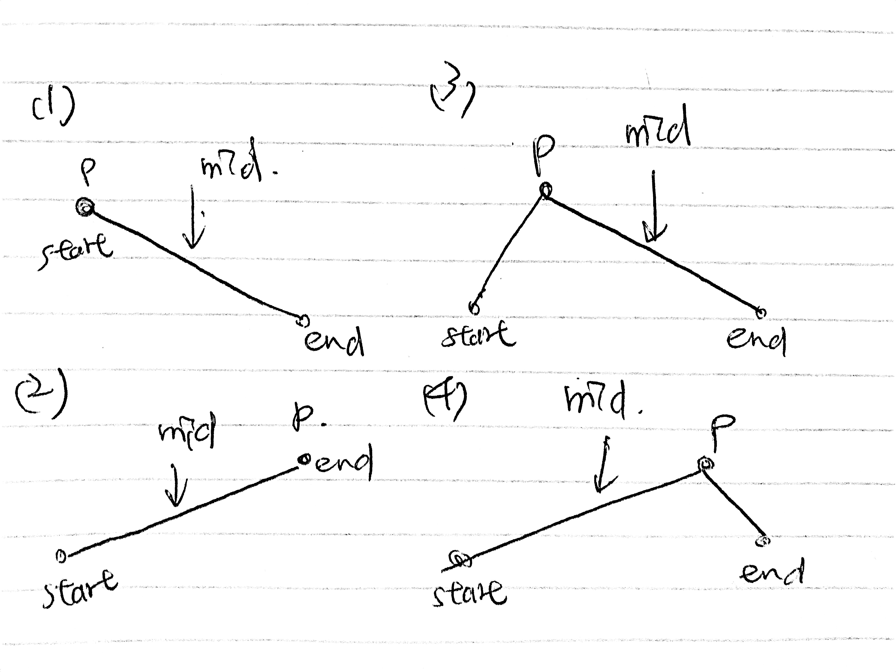

# \[Medium\] Find Minimum in Rotated Sorted Array / \[Hard\] Find Minimum II / \[Medium\] Find Peak Element

## [\[Medium\] Find Minimum in Rotated Sorted Array](https://leetcode.com/problems/find-minimum-in-rotated-sorted-array/)

Suppose an array sorted in ascending order is rotated at some pivot unknown to you beforehand.\(i.e., `[0,1,2,4,5,6,7]` might become `[4,5,6,7,0,1,2]`\).  
Find the minimum element.  
You may assume no duplicate exists in the array.

### 0. Linear Search: O\(N\) / O\(1\)

優點是很簡潔，但缺點是不符合題目要求O\(logN\)的時間。同樣的解法可以應用於下面所有題型。

```python
def findMin(self, nums: List[int]) -> int:
    min_num = min(nums)
    return nums.index(min_num)
```

### 1. Binary Search: O\(logN\) / O\(1\)

如果題意說是Sorted Array/Rotated Sorted Array，通常這種題目都是可以利用Binary Search來達到O\(logn\)的複雜度。  
  
Rotated Sorted Array只有以下三種方式：


又如果要找minimum，就是以下的Binary Search縮小範圍方法


\(a\) \(c\) 符合 `nums[mid] < nums[end]`  
因此可以縮小範圍至`end = mid`，把平滑上升的mid-end部分划掉  
\(b\) 符合 `nums[mid] >= nums[end]`  
縮小範圍至`start = mid`，把平滑上升的start-mid部分划掉


易錯點：  
1. 這裡先用的是nums\[mid\] &lt;= nums\[end\]:  **end = mid** \(划掉mid-end\)  
2. 先去除duplicates，再算mid。否則mid會被改過的start, end修改。


Time Complexity: O\(logn\)  
Space Complexity: O\(1\)



```python
def findMin(self, nums: List[int]) -> int:
    
    if not nums or len(nums) == 0:
        return -1
        
    start, end = 0, len(nums)-1
    
    while start + 1 < end:
        
        mid = start + (end-start)//2
        
        if nums[mid] < nums[end]:
            end = mid
        else:
            start = mid
    
    if nums[start] < nums[end]:
        return nums[start]
    
    return nums[end]
```



#### Follow Up: What if this array has lots of duplicates?   

Ans: 下面題解

## [\[Hard\] Find Minimum in Rotated Sorted Array II](https://leetcode.com/problems/find-minimum-in-rotated-sorted-array-ii/)

Ex: \[1,1,1,1,1,1 ....,0,1\] only has one zero here.   
Then we could not ensure the binary search will give you O\(logn\) time, instead, it will be down to O\(n\) time. 

### 1. Binary Search: O\(logn\)/O\(1\)

#### Code for Array Has Duplicates \(similar to search in rotated sorted array II\)

思路請見Binary Search模板

```python
def findMin(self, nums: List[int]) -> int:

    if not nums or len(nums) == 0:
        return -1
    
    start, end = 0, len(nums)-1
    
    while start + 1 < end:
        
        # 目的--把duplicates去掉
        #
        # 易錯點：先去重
        # step1. 先去duplicates 
        # step2. 再算mid
        while start + 1 < end and nums[start] == nums[start+1]:
            start += 1
        while start + 1 < end and nums[end] == nums[end-1]:
            end -= 1
            
        mid = start + (end-start)//2
        
        ### check for mid <= end  and then-> end = mid
        if nums[mid] < nums[end]:
            end = mid
        # nums[start] < nums[mid] or nums[start] == nums[mid]
        else:
            start = mid
    
    if nums[start] < nums[end]:
        return nums[start]
    return nums[end]
```

## [\[Medium\] Find Peak Element](https://leetcode.com/problems/find-peak-element/)      \(2573/2553\)

A peak element is an element that is strictly greater than its neighbors.  
Given an integer array `nums`, find a peak element, and return its index. If the array contains multiple peaks, return the index to **any of the peaks**.  
You may imagine that `nums[-1] = nums[n] = -∞`.

```text
Ex1
Input: nums = [1,2,3,1]
Output: 2
Explanation: 3 is a peak element and your function should return the index number 2.

Ex2
Input: nums = [2,1]
Output: 0

Ex3
Input: nums = [6,5,4,3,2,3,2]
Output: 0
```

### 1. Binary Search: O\(logN\) / O\(1\)



```python
def findPeakElement(self, nums: List[int]) -> int:

    start, end = 0, len(nums)-1

    while start + 1 < end:
        mid = start + (end - start) // 2
        # peak is at mid idx
        if nums[mid-1] < nums[mid] and nums[mid] > nums[mid+1]:
            return mid    
        # (2)(4) increasing
        if nums[mid] < nums[mid+1]:
            start = mid
        # (1)(3) decreasing
        elif nums[mid] > nums[mid+1]:
            end = mid
    
    # 易錯點：
    # nums[start] < nums[end] 代表函數遞增，取end後面
    #                            函數遞減，取start
    if nums[start] < nums[end]:
        return end
    return start
```

## [\[Easy\] 852 Peak Index in a Mountain Array](https://leetcode.com/problems/peak-index-in-a-mountain-array/)

### 1. Binary Search: O\(logN\) / O\(1\)

跟Find Peak Element一樣的解法

```python
def peakIndexInMountainArray(self, arr: List[int]) -> int:

    nums = arr

    start, end = 0, len(nums)-1

    while start + 1 < end:

        mid = start + (end - start) // 2
        print(mid, start, end)
        if nums[mid-1] < nums[mid] and nums[mid] > nums[mid+1]:
            return mid

        # (1)(3) decreasing
        if nums[mid] < nums[mid-1]:
            end = mid
        # (2)(4) increasing
        elif nums[mid] < nums[mid+1]:
            start = mid

    if nums[start] < nums[end]:
        return end
    return start
```

