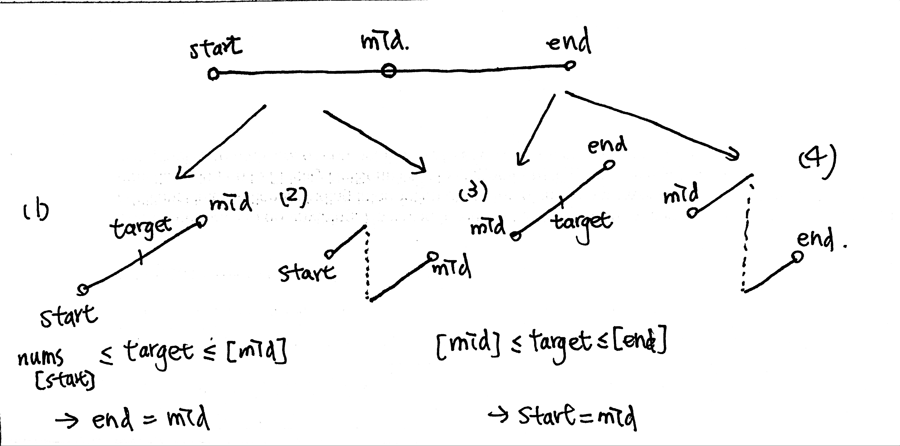

# \[Medium\] Search in Rotated Sorted Array

[Search in Rotated Sorted Array](https://leetcode.com/problems/search-in-rotated-sorted-array/)  
Suppose an array sorted in ascending order is rotated at some pivot unknown to you beforehand.\(i.e., `[0,1,2,4,5,6,7]` might become `[4,5,6,7,0,1,2]`\).  
  
You are given a target value to search. If found in the array return its index, otherwise return `-1`.  
You may assume no duplicate exists in the array.  
Your algorithm's runtime complexity must be in the order of _O_\(log _n_\).

#### Example

```text
Input: nums = [4,5,6,7,0,1,2], target = 0
Output: 4
```

#### Follow-Up

What if it contains duplicates? [Search in Rotated Sorted Array II](https://leetcode.com/problems/search-in-rotated-sorted-array-ii)

## Thought Process

題意要求要time complexity O\(logn\)，代表的是只能用Binary Search來達到。

### 1. Binary Search \(4 conditions, 2 levels of if/else\): O\(logN\) / O\(1\)

此題和Find Minimum in Rotated Sorted Array很像，但難度又提升了一點；由於Find Minimum只要判斷一次，而這題需要做兩次判斷，即四種情況，見下圖。

由下圖我們可以知道，在第一次判斷中，去除掉target == mid這種情況，target只有可能在 `start-[target]-mid` 或 `mid-[target]-end` 中間。在第二次判斷中，target有四種可能\(1\)\(2\)\(3\)\(4\)
，因此兩邊還各需要一個if/else statement來區分。



結束判斷後，由於\[start, end\]是在隔壁，我們需要再用`if nums[start] == target -> return start`and `if nums[end] == target -> return end`來看最後要選start還是end。

剩餘的用Binary Search \(target\) Template完成即可。



```python
def search(self, nums: List[int], target: int) -> int:
    
    if not nums or len(nums) == 0:
        return -1
    
    start, end = 0, len(nums)-1
    
    while start + 1 < end:
    
        mid = start + (end-start)//2
        # equals to target
        if nums[mid] == target:
            return mid
        
        # start - [target] - mid .... end
        if nums[start] < nums[mid]:
            # (1)
            if nums[start] <= target and target <= nums[mid]:
                end = mid
            # (2)
            else:
                start = mid 
            
        #                ... mid - [target] - end
        elif nums[mid] < nums[end]:
            # (3)
            if nums[mid] <= target and target <= nums[end]:
                start = mid
            # (4)
            else:
                end = mid
        
    # determine target is start or end
    if nums[start] == target:
        return start
    if nums[end] == target:
        return end
    
    return -1
    
```



### 0. Search Directly: O\(N\) / O\(1\)

這種解法不符合Follow-Up題意O\(logN\)要求，因此可以在剛開始提出Brute Force解。

```python
def search(self, nums: List[int], target: int) -> int:

    if target in nums:
        return nums.index(target)
    return -1
```

