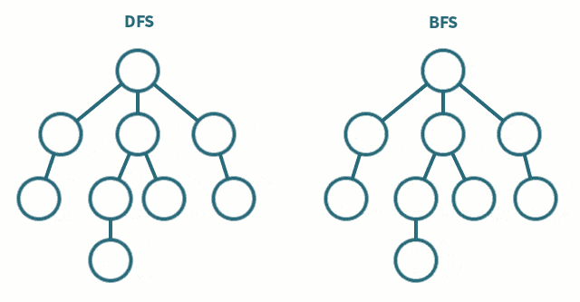

# BFS/DFS

## Stack and Queue \(棧和隊列\)



## Stack

Stack 用於DFS

## Queue

Queue 用於BFS


How to Optimize BFS? 

如果在面試中問到“如何優化BFS”，那Bi-directional BFS 幾乎是標準答案了。

### 1. BFS without Level Order 

```python
queue = dequeue()
visited = []

while len(queue)不為0:
    node = queue.pop()
    for node in 所有和node相鄰節點：
        if node 未訪問過：
            queue.push(node)
            在visited紀錄此節點已被訪問
```

```python
from collections import deque    #double-ended queue 

queue = deque()
seen = set()

seen.add(start)                     #Init: 在seen&queue的初始位置
queue.append(start)
while len(queue):
    head = queue.popleft()          #取current head
    for neighbor in head.neighbors: #for遍歷每一個和head連接的neighbor
        if neighbor not in seen:    #  如果沒看過：
            seen.add(neighbor)      #     加入seen
            queue.append(neighbor)  #     加入queue
```

### 2. BFS with Level Order

```python
depth = 0
while len(queue) 不為0 :
    depth += 1
    
```

