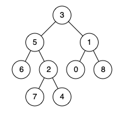
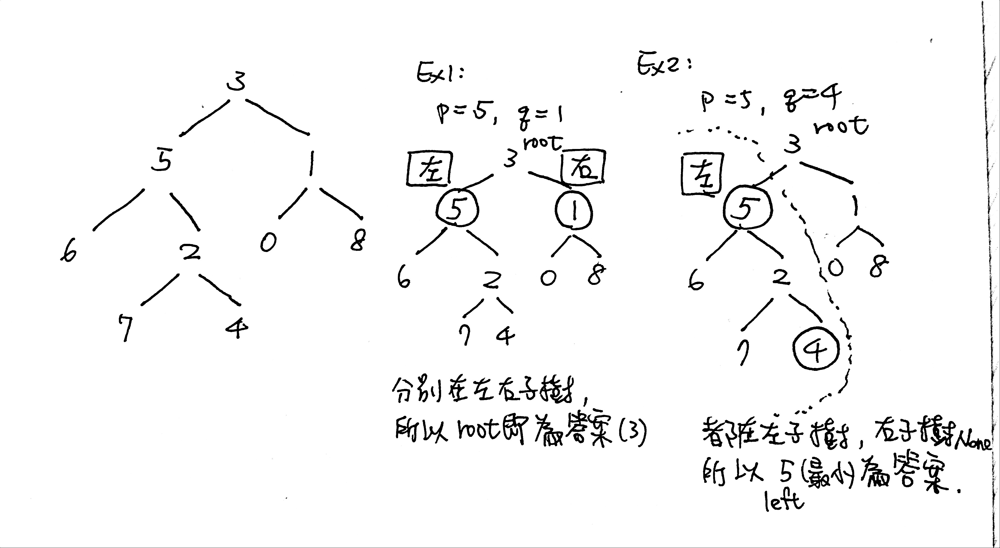

# \[Medium\] Lowest Common Ancestor of a Binary Tree

[Lowest Common Ancestor of a Binary Tree](https://leetcode.com/problems/lowest-common-ancestor-of-a-binary-tree/) \(4056/178\)  
Given a binary tree, find the lowest common ancestor \(LCA\) of two given nodes in the tree.

According to the [definition of LCA on Wikipedia](https://en.wikipedia.org/wiki/Lowest_common_ancestor): “The lowest common ancestor is defined between two nodes p and q as the lowest node in T that has both p and q as descendants \(where we allow **a node to be a descendant of itself**\).”

**Example**



```text
Input: root = [3,5,1,6,2,0,8,null,null,7,4], p = 5, q = 1
Output: 3
Explanation: The LCA of nodes 5 and 1 is 3.
```

```text
Input: root = [3,5,1,6,2,0,8,null,null,7,4], p = 5, q = 4
Output: 5
Explanation: The LCA of nodes 5 and 4 is 5, 
since a node can be a descendant of itself according to the LCA definition.
```

## **Code**



### DFS Recursive

Time Complexity: O\(n\)  
Space Complexity: O\(n\)

> 思路：根據題意，要我們找“ find the lowest common ancestor \(LCA\) of two given nodes in the tree ”  
> 對於given nodes p＆q，只有兩種情況：\(1\)找到\(2\)沒找到。要嘛找到return left or right，要嘛沒找到return None。  
> 又LCA只給我們以下三種可能情況：  
> \(1\) p,q 分別在`左右子樹`   
> \(2\) p,q 都在`右子樹`   
> \(3\) p,q 都在`左子樹`  
> 所以，用DFS Recursive來找是最容易的方法。  
> 當我們DFS Recursion完後，左右分別都回到root節點3，在Ex2情況下，root左邊返回5，root右邊返回None，而p,q自己就是LCA。

```python
# Definition for a binary tree node.
# class TreeNode:
#     def __init__(self, x):
#         self.val = x
#         self.left = None
#         self.right = None
def lowestCommonAncestor(self, root: 'TreeNode', p: 'TreeNode', q: 'TreeNode') -> 'TreeNode':

    return self.dfs(root, p, q)
    
def dfs(self, root, p, q):
    
    # 遞歸出口
    if not root or root == p or root == q:
        return root
    
    left = self.dfs(root.left, p, q)
    right = self.dfs(root.right, p, q)
    
    # p,q 分別在左右子樹 => root本身為最小LCA
    if left != None and right != None:
        return root
        
    # 如果p,q不在左子樹 => p,q都在右子樹 => root.right為最小LCA 
    if not left:
        return right
        
    # 如果p,q不在右子樹 => p,q都在左子樹 => root.left為最小LCA
    if not right:
        return left
        
    
    


```

