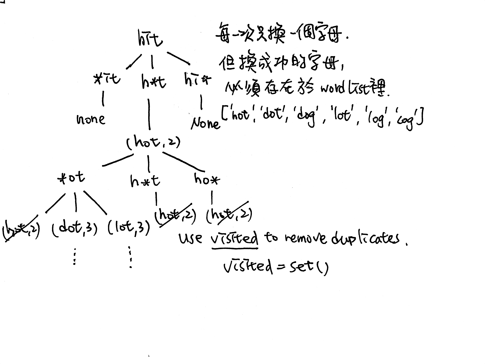

# \[Medium\] Word Ladder

[Word Ladder](https://leetcode.com/problems/word-ladder/) \(3318/1193\)  
Given two words \(_beginWord_ and _endWord_\), and a dictionary's word list, find the length of shortest transformation sequence from _beginWord_ to _endWord_, such that:

1. Only one letter can be changed at a time.
2. Each transformed word must exist in the word list.

**Note:**

* Return 0 if there is no such transformation sequence.
* All words have the same length.
* All words contain only lowercase alphabetic characters.
* You may assume no duplicates in the word list.
* You may assume _beginWord_ and _endWord_ are non-empty and are not the same.

**Example**

```python
Input:
beginWord = "hit",
endWord = "cog",
wordList = ["hot","dot","dog","lot","log","cog"]

Output: 5

Explanation: As one shortest transformation is "hit" -> "hot" -> "dot" -> "dog" -> "cog",
return its length 5.
```

## Thought Process

這題要想到用BFS並不難，由於每次都只能換一個字母，就可以把它想成和BFS遍歷所有neighbor節點一樣。每一個節點都必須要出現在wordList裡面才可以算是成功的路徑。而題目要求，就是希望找到從 `beginWord -> .... -> endWord` 的最短路徑長度。

但有幾點要注意：  
\(1\) 如何**找到相鄰的所有節點**？有兩種辦法：  
第一種X，是每次都遍歷整個wordList字典，比較當前curr word和字典裡的候選字，是否只差一個char。  
第二種O，是換當前字符的某個char，然後再和wordList字典比較。  
由於字典有成千上萬的字，顯然第二種辦法會減少遍歷的次數。  
\(2\)如何**標記節點已被訪問**？我們可以使用`visited = hashSet()/set()`來保存已訪問過的字。  
\(3\)如何**記錄長度**？也是有兩種辦法：  
第一種，可以用分層遍歷，然後記錄level層數，最後返回層數即可。  
第二種，用`tuple (word,dist)`來同時紀錄單字和距離。  




## Code

#### 1. BFS: O\(n\*26^wordLen\) / O\(n\)

```python
def ladderLength(self, beginWord: str, endWord: str, wordList: List[str]) -> int:
    # to avoid TLE. (some wordList has lots of duplicates in there)
    wordList = set(wordList)
    
    # no possible transformation 
    if endWord not in wordList:
        return 0
    
    queue = deque()
    visited = set()
    
    # init queue and visited
    queue.append((beginWord, 1))
    visited.add(beginWord)
    while len(queue) != 0:
        curr, transLen = queue.popleft()
        
        # exit when reaches endWord
        if endWord == curr:
            return transLen
        
        # 建立一個intermediate words list來確認下一個可能的word
        for neighbor in self.possible_words(curr):
            if neighbor not in visited and neighbor in wordList:
                queue.append(neighbor, transLen + 1)
                visited.add(neighbor)
        
    # None of the cases are matched
    return 0
            
    
def possible_words(self, curr):
    allChars = 'abcdefghijklmnopqrstuvwxyz' # or 'string.ascii_lowercase'
    neighborWords = []
    
    for i in range(len(curr)):
        left, right = curr[:i], curr[i+1:]
        for char in allChars:
            if char == curr[i]:
                continue
            neighborWords.append(left + char + right)
    
    return neighborWords
    
```

```python
def ladderLength(self, beginWord: str, endWord: str, wordList: List[str]) -> int:
    # speedup the lookup process at the if statement later. 
    # O(1) instead of O(n)
    wordList = set(wordList)
    
    if endWord not in wordList:
        return 0
    
    queue = deque()
    visited = set()
    alphabets = string.ascii_lowercase()
    
    # init queue and visited with tuple of (word,dist)
    queue.append((beginWord,1))
    visited.add(beginWord)
    while len(queue) != 0:
        curr, dist = queue.popleft()
        
        if curr == endWord:  # 易錯點：這題需要有遞歸出口
            return dist
        
        # iterate thru each char and replace just one of them
        for i in range(len(curr)):
            for char in alphabets:
                # build up the new word by slicing original curr word
                neighbor = curr[:i] + char + curr[i+1:]
                if neighbor not in visited and neighbor in wordList:
                    queue.append((neighbor, dist + 1))
                    visited.add(neighbor)
    # if none of the conditions are met
    return 0
        
```

