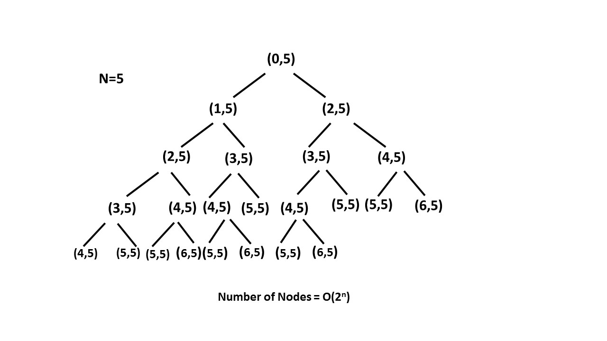

# \[Easy\] Climbing Stairs

## Question

[Climbing Stairs](https://leetcode.com/problems/climbing-stairs/)  
You are climbing a stair case. It takes _n_ steps to reach to the top.  
Each time you can either climb 1 or 2 steps. In how many distinct ways can you climb to the top?

## Thought Process

看到題意 'how many distinct ways can you climb...' 可以知道是求解數，因此至少可以用DP。另外因為不知道有幾層for loop才能到頂端，用Recursion也可以。


要小心Base Case和Edge Case的情況。  
在這裡Base Case **`f[1] && f[2]`**以及 Edge Case **`n == 1`** 時，要個別處理。


### \(1\) DP

  Time Complexity: O\($$n$$\) : Single loop up to n.   
Space Complexity: O\($$n$$\) : dp array f. 

### \(2\) Recursion \(Brute Force\)

  Time Complexity: O\($$2^n$$\) : Size of the recursion tree can go up to.   
Space Complexity: O\( $$n$$ \) : Depth of the recursion tree.    
  



### \(3\) Recursion + Memoization

  Time Complexity: O\($$n$$\) : Size of the recursion tree can go up to.  
Space Complexity: O\($$n$$\) : Depth of the recursion tree.   


### \(4\) Others\(Fibonacci Formula, ...\)

Time Complexity can go down to O\(logn\)

## Full Implementation



```python
def climbStairs(self, n: int) -> int:
    
    if n == 1 or n == 0:
        return n
    
    # dp array    
    f = [0 for i in range(n+1)]
    
    # base case
    f[1] = 1
    f[2] = 2
    
    # NOTE: we start from "3" because of the base case. 
    for i in range(3,n+1):
        f[i] = f[i-1] + f[i-2]
        
    # top of the stairs n.
    return f[n]
```



