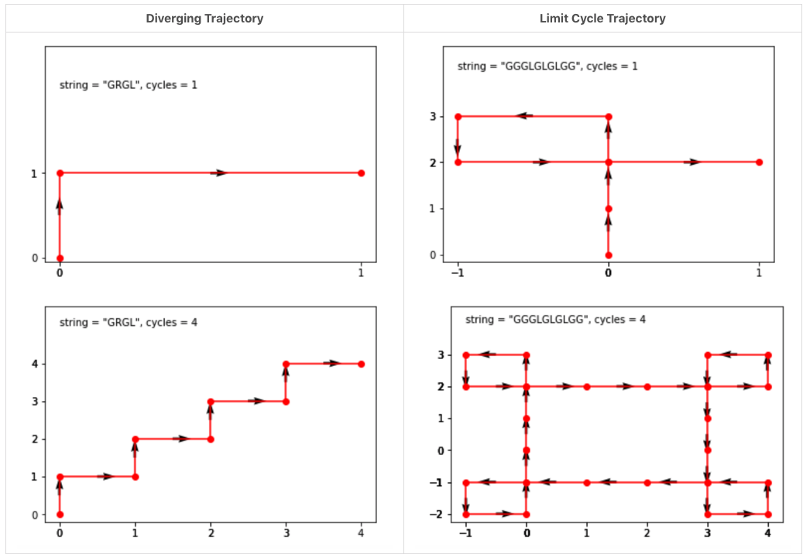
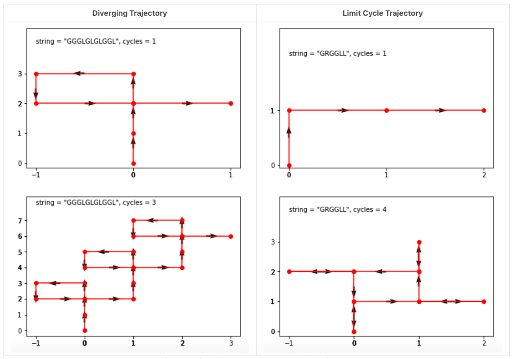
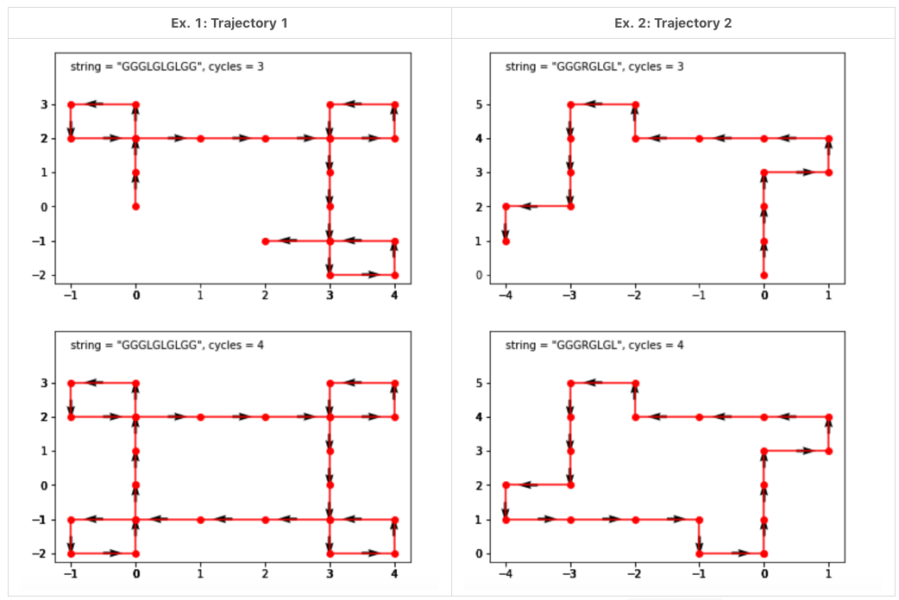
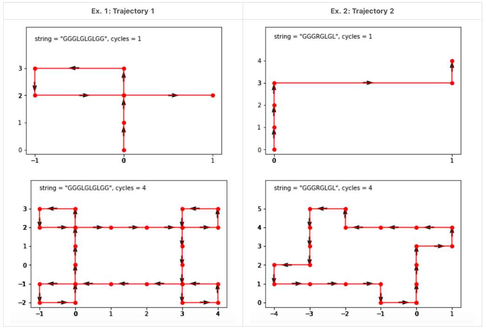

# \[Medium\] Robot Bounded In Circle

`Amazon Tag 265`

## [\[Medium\] Robot Bounded In Circle](https://leetcode.com/problems/robot-bounded-in-circle/)       \(1040/309\)

On an infinite plane, a robot initially stands at `(0, 0)` and faces north. The robot can receive one of three instructions:

* `"G"`: go straight 1 unit;
* `"L"`: turn 90 degrees to the left;
* `"R"`: turn 90 degrees to the right.

The robot performs the `instructions` given in order, and repeats them forever.

Return `true` if and only if there exists a circle in the plane such that the robot never leaves the circle.

```text
Ex1:
Input: instructions = "GGLLGG"
Output: true
Explanation: The robot moves from (0,0) to (0,2), turns 180 degrees, and then returns to (0,0).
When repeating these instructions, the robot remains in the circle of radius 2 centered at the origin.

Ex2:
Input: instructions = "GG"
Output: false
Explanation: The robot moves north indefinitely.

Ex3:
Input: instructions = "GL"
Output: true
Explanation: The robot moves from (0, 0) -> (0, 1) -> (-1, 1) -> (-1, 0) -> (0, 0) -> ...
```

**Draw some trajectories**

robot trajectory\(軌跡\)有兩種可能：  
\(1\) Diverging -- 開放式，永遠不會回來   
\(2\) Limit cycle -- 閉合式，會回到原點

**Is this trajectory attractor in limited cycle or not**  
Why is it interesting to know? There is a bunch of practical problems related to topology, networks planning, and password brute-forcing. For all these problems, the first thing to understand is do we work within a limited space or the behavior of our system could drastically diverge at some point?  
  
[Here is a Jupiter notebook used to draw all figures in this article](https://github.com/leetcode/solution_assets/blob/master/solution_assets/1041_robot_bounded_in_circle/robot_trajectory.ipynb). Do not hesitate to play with it in local or on the online platforms. Drawing different trajectories might help to notice some patterns.



**Trajectory repeat for 4 times:**   
查看是否四個循環後，會回到原點？



### 1. instructions\*4 ＋ Directions：O\(N\) / O\(N\)

This solution is based on two facts about the limit cycle trajectory.

* After at most 4 cycles, the limit cycle trajectory returns to the initial point `x = 0, y = 0`. That is related to the fact that 4 directions \(north, east, south, west\) define the repeated cycles' plane symmetry.



We do not need to run 4 cycles to identify the limit cycle trajectory. One cycle is enough. There could be two situations here.

* First, **if the robot returns to the initial point after one cycle**, that's the **limit cycle trajectory**.
* Second, **if the robot doesn't face north at the end of the first cycle**, that's the **limit cycle trajectory**. Once again, that's the consequence of the plane symmetry for the repeated cycles.



_If at the end of one cycle the robot doesn't face north, that's the limit cycle trajectory_

```python
def isRobotBounded(self, instructions: str) -> bool:
    
    # robot should be able to go back to original, (0, 0).
    ins = list(instructions)*4  

    # (x,y) to record where it is at right now.
    x, y = 0, 0
    DIRECTIONS = [(1,0), (0,1), (-1,0), (0,-1)]  # East, North, West, South 
    dir_pointer = 0                              # direction pointer       
    direction = DIRECTIONS[dir_pointer]
    
#        print('direction/x/y')
    for idx in range(len(ins)):
        if ins[idx] == 'G':
            (x,y) = self.move(direction, x, y)
#                print(direction, x, y)
            
        elif ins[idx] == 'L':
            dir_pointer += 1
            if dir_pointer > 3:
                dir_pointer = 0
            direction = DIRECTIONS[dir_pointer]
#                print(direction)
        elif ins[idx] == 'R':
            dir_pointer -= 1
            if dir_pointer < 0:
                dir_pointer = 3
            direction = DIRECTIONS[dir_pointer]
    
    # check if the robot goes back to original.
    if (x,y) == (0,0):
        return True
    return False
        
        
def move(self, direction, x, y):
    DIRECTIONS = [(1,0), (0,1), (-1,0), (0,-1)] 
    if direction == DIRECTIONS[0]:
        return (x+1,y)
    elif direction == DIRECTIONS[1]:
        return (x,y+1)
    elif direction == DIRECTIONS[2]:
        return (x-1,y)
    else:
        return (x,y-1)
```

### 2. One Pass + Modulous: O\(N\) / O\(1\) 



```python
def isRobotBounded(self, instructions: str) -> bool:
    # north = 0, east = 1, south = 2, west = 3
    directions = [[0, 1], [1, 0], [0, -1], [-1, 0]]
    # Initial position is in the center
    x = y = 0
    # facing north
    idx = 0

    for i in instructions:
        if i == "L":
            idx = (idx + 3) % 4
        elif i == "R":
            idx = (idx + 1) % 4
        else:
            x += directions[idx][0]
            y += directions[idx][1]

    # after one cycle:
    # robot returns into initial position
    # or robot doesn't face north
    return (x == 0 and y == 0) or idx != 0
```



```java
// need to double check again on modulous 
public boolean isRobotBounded(String instructions) {
    int x = 0;
    int y = 0;
    int dx = 0;
    int dy = 1; // Initially face North.
    
    for (int i = 0; i < instructions.length(); i++) {
        char instruction = instructions.charAt(i);
        
        if (instruction == 'G') {
            x = x + dx;
            y = y + dy;
        } else if (instruction == 'L') {
            int tmp = dy;
            dy = dx;
            dx = -tmp;
        } else if (instruction == 'R') {
            int tmp = dx;
            dx = dy;
            dy = -tmp;
        }
    }
    
    return (x == 0 && y == 0) || dy != 1;
}
}
```



