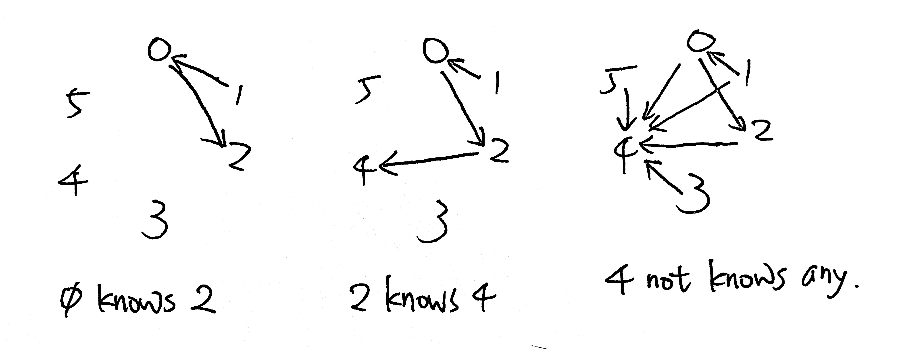

# \[Medium\] Find the Celebrity

\[Medium\] Find the Celebrity

1. Draw Graph



```python
def findCelebrity(self, n: int) -> int:
    
    himself = 0
    
    # 最重要的部分
    # 如果 himself -knows-> other，則代表himself不是celebrity，所以往other看。
    for other in range(n):
        if knows(himself, other):
            himself = other
    
    # 滿足條件2: 如果此人(himself)認識任何其他人，則他不是celebrity。
    # (從himself往所有其他地方發散出去, for other in range(himself))
    if any(knows(himself, other) for other in range(himself)):
        return -1
    
    # 滿足條件3: 如果此人並沒有被所有人認識，則他不是celebrity。
    # (從所有人聚斂到himself， for other in range(n))
    if any(not knows(other, himself) for other in range(n)):
        return -1
    
    return himself
```


