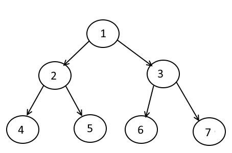

# Binary Tree

Binary Tree 的解法有以下四種: DFS Pre-order, DFS In-order, DFS Post-order Traversal, Breath First Search。

通常Binary Tree Traversal都會和BFS & DFS同時出現，例如要求要level order traversal \(same as BFS\)。因此建議複習Binary Tree時，搭配BFS&DFS一起練習。

另外，還可以搭配Binary Tree的特例 -- Binary Search Tree \(BST\) 一起複習。



|  | 順序 |
| :--- | :--- |
| Depth-First Search | 1 2 4 5 3 6 7 |
| Pre-Order Traversal \(**根**左右\) | 1 2 4 5 3 6 7                                                          |
| In-Order Traversal \(左**根**右\) | 4 2 5 1 6 3 7 |
| Post-Order Traversal \(左右**根**\) | 4 5 2 6 7 3 1 |
| Breath-First Search / Level Order Traversal | 1 2 3 4 5 6 7 |

## Binary Tree Divide&Conquer

先讓Left Subtree和Right Subtree去解決同樣的問題，得到結果之後，再整合為整顆Binary Tree的結果。

#### 為什麼Binary Tree適合使用Divide&Conquer呢？

這樣想，把整個Binary Tree看成一個大問題，而Left Subtree 就是一個subProblem，Right Subtree 是另外一個subProblem，以此類推。而這Binary Tree就直接幫我們Divide好整個問題了。 

## How to Traverse a Tree?

There are two general strategies to traverse a tree:

* _Depth First Search_ \(`DFS`\)

  In this strategy, we adopt the `depth` as the priority, so that one would start from a root and reach all the way down to certain leaf, and then back to root to reach another branch.

  The DFS strategy can further be distinguished as `preorder`, `inorder`, and `postorder` depending on the relative order among the root node, left node and right node.

* _Breadth First Search_ \(`BFS`\)

  We scan through the tree level by level, following the order of height, from top to bottom. The nodes on higher level \(top\) would be visited before the ones with lower levels \(bottom\).


## Time / Space Complexity 

先講結論，time complexity average case **`O(nlogn)`**，worst case **`O(n^2)`**。

Time Complexity: **`O(N)-O(NlogN)-O(N^2)`**, for a balanced tree it would be O\(NlogN\), then worst case O\(N^2\)  
**Balanced Tree \(average case\)  -- O\(nlogn\)**  
Path -- each path from the root to leaf is at most of `O(logn)`, traversing from root to leaf takes O\(logn\), \(aka the height of the tree is O\(logN\)\)  
\# of leaves -- half of all nodes are leaves, and there are no more than `n/2` leaves  
**Single leaf Tree  \(best case\)  -- O\(n\)**  
Path -- Single-chain to the leaf, then `O(n)`  
\# of leaves -- `1` leaf  
**Unbalanced Tree \(worst case\)  -- O\(n^2\)**  
Path -- total \# of paths is increasing, would take up to `n/2`   
\# of leaves -- `n/2` leaves  
1 + 2 + 3 + ... n/2 = \(n/2\)\*\(\(n/2\)+1\)/2 = `n^2`

> 值得一提的是，single leaf tree 是在找Path Sum的情況為best case \(只有1 path\)。如果是Binary Search Tree的話，需要到leaf才能找到答案，因此這種一直線的就會是worst case。

Time complexity varies a lot according to the tree's structure.

* For balanced tree, each path from root to leaf is at most of `O(logn)`, and there are no more than `n` leaves \(obviously\), so `O(nlogn)`
* For a tree which is a single chain with a single leaf - it's `O(n)`, since you do it at most once.
* For a tree where each right subtree is of height exactly one, it's `O(n^2)`, because you sum length of paths which are increasing: `1 + 2 + ... + n/2`, which is in `O(n^2)` from sum of arithmetic progression.

**Worst case** of the algorithm is `O(n^2)`, since there could be no more than `n` leaves, and each of at depth no more than `n` - which gives upper bound of `O(n^2)`, and from the examples - we see this bound is tight.

**Average Case** of the algorithm is `O(nlogn)`, since [tree's average height is logarithmic](https://cs.stackexchange.com/q/6342/874).

An improvement solution with `O(n)` time and `O(h)` space could be a [DFS](https://en.wikipedia.org/wiki/Depth-first_search), where local partial sum is stored and calculated, and when encountering "better" solution, just edit pointers needed to get to the "better" solution.

## Binary Tree Traversal 

透過Pre-order / In-order / Post-order / Level-order\(BFS\) / DFS Traversal 的方式，遊走於整顆Binary Tree。在遍歷的時候，加上一個variable來記錄過程中需要的curr node和計算的結果result。

另外，如果涉及到Iterative版本xxx order的話，都是可以用**DFS Stack**的方式解決，只是什麼時候添加node到result的時間點有所不同而已。


### Recursive or Iterative? 

每種Traversal都有Recursive, Iterative這兩種解法。Recursive, Iterative各有優缺點，就看題目要求提升Space Complexity or Time Complexity了。  
  
**Recursive**  
優點：代碼簡單，比較容易寫。  
缺點：無法Paulse Recursion；相較於Iterative O\(H\)，Recursive 版本Space Complexity較高`O(N)`。  
  
**Iterative**  
優點：可控性高。可以隨時Paulse，在移往下一個node時做各種額外事情；Space Complexity較低 O\(Max Stack Used\)。  
缺點：代碼複雜。

### 1. Pre-order Traversal: **Root-Left-Right** \(根左右\)         O\(n\) / O\(logn\)-O\(n\)

Top -&gt; Bottom  
Left -&gt; Right

```python
Pre-order Recursive 模板
根->左->右

def pre_order(self, root, result):
    if not root:
        return 
    result.append(root.val)        #根
    pre_order(root.left, result)   #左
    pre_order(root.right, result)  #右
    return result
```

第一種preorder模板是利用stack先進後出的特性來決定traversal順序。  
做法是將左右子樹分别壓入棧，然後每次從棧裡取元素。需要注意的是，因为我们應该先訪問左子樹，而stack是先進後出，所以我们壓棧先壓右子樹 \(**入棧先右後左**\)，出棧時才能先左後右。

```python
Pre-order Iterative 模板一 (prefered)

def pre_order2(self, root):
    
    if not root:
        return 

    stack = [root]
    result = []

    while stack:
        curr = stack.pop()
        if curr:
            result.append(curr.val)       #根          #   1根
            if curr.right:      
                stack.append(curr.right)  #右    =>    # | 2左 |
            if curr.left:                              # | 3右 |
                stack.append(curr.left)   #左          #  stack
                
                                                     # -1-2-3->
    return result                                    #[根,左,右]
```

```python
Pre-order Iterative 模板二
使用stack，同樣順序 根->左左左...->右

def pre_order(self, root):
    if not root:
        return 
    result = []
    stack = []
    
    while len(stack) != 0 or root != None:
        while root != None:
            result.append(root.val) # Pre-order result
            stack.append(root)
            root = root.left
        # pop from stack
        root = stack.pop() # pop the last one
        root = root.right
    return result   
```

```python
Pre-order Iterative 模板二-2

def pre_order2(self, root):
    result = []
    stack = []
    while True:
        while root != None:
            result.append(root.val)
            stack.append(root)
            root = root.left    # root -> root.left
        # check if stack is empty
        if len(stack) == 0:
            return
        # pop the node from stack and move onto the right node
        root = stack.pop()
        root = root.right
    return result
```

### 2. In-order Traversal: **Left-Root-Right** \(左根右\)        O\(n\) / O\(logn\)-O\(n\)

Inorder特性：  
\(1\) **root根節點把Tree精確地分成左右子樹**，  
root.left為Left Subtree，root.right為Right Subtree。  
\(2\) **BST Inorder有序**，  
result是以**ascending order**的方式儲存，可以用result\[n-1\]的方式取第n個大的值。

```python
In-order Recursive 模板
左->根->右

def in_order(self, root, result):
    if not root:
        return 
    in_order(root.left, result)     #左
    result.append(root.val)         #根
    in_order(root.right, result)    #右
    return result
```

```python
In-order Iterative 模板
使用stack，同樣順序 左左左...->根->右

def inorder(root):
    if not root:
        return 
    result = []
    stack = []
    # 易錯點：忘了root != None
    while root != None or len(stack) != 0:
        while root != None:
            stack.append(root)  # 左左左...
            root = root.left    
        root = stack.pop()      # 節點為空，就出棧
        result.append(root.val) # inorder result
        root = root.right       # 看右子樹
    return result
```

### 3. Post-order Traversal: Right-Left-Root \(左右根\)       **O\(n\) / O\(logn\)-O\(n\)**

`Bottom -> Top  
Left -> Right`

```python
Post-order Recursive模板
左->右->根

def post_order(self, root, result):
    if not root:
        return 
    post_order(root.left, result)   #左
    post_order(root.right, result)  #右
    result.append(root.val)            #根
    return result
```

在 [这里](https://leetcode.com/problems/binary-tree-postorder-traversal/discuss/45582/A-real-Postorder-Traversal-.without-reverse-or-insert-4ms) 看到另一种想法，还是基于上边分析的入口点，不过解决方案真的是太优雅了。

先看一下 [144 题](https://leetcode.wang/leetcode-144-Binary-Tree-Preorder-Traversal.html) 前序遍历的代码。

> 我们还可以将左右子树分别压栈，然后每次从栈里取元素。需要注意的是，因为我们应该先访问左子树，而栈的话是先进后出，所以我们压栈先压右子树。

后序遍历遇到的问题就是到根节点的时候不能直接 `pop` ，因为后边还需要回来。  
首先我们知道前序遍历的非递归形式会比后序遍历好理解些，那么我们能实现`后序遍历 -> 前序遍历`的转换吗？  
后序遍历的顺序是 `左 -> 右 -> 根`。  
前序遍历的顺序是 `根 -> 左 -> 右`，左右其实是等价的，所以我们也可以轻松的写出 `根 -> 右 -> 左` 的代码。  
然后把 `根 -> 右 -> 左` 逆序，就是 `左 -> 右 -> 根`，也就是后序遍历了。

```python
Post-order Iterative模板
左->右->根
# 跟前面不同是因為要handle null node，
# 下面這樣做可以確保每一次root都不為null。

def post_order(self, root, result):
    if not root:
        return 
    
    stack = []
    stack.append(root)
    result = collections.deque()

    while stack:
        curr = stack.pop()
        if curr:                                                   # 3根
            if curr.left:                 #左                        /
                stack.append(curr.left)                       # | 2右 |
            if curr.right:                #右             =>  # | 1左 |
                stack.append(curr.right)                      # stack
            result.appendleft(curr.val)   #根 .appendleft()
                   
                                          # <-3-2-1-
    return result                         # [根,右,左] 
```

### 4. BFS / Level Order Traversal BFS:

Binary Tree BFS和BFS的技巧一樣，使用queue來紀錄所有在同一個level上的所有nodes，直到所有nodes都遍歷完成後，才會往next level走。

如果題目要求要`level-by-level order traversal`，那Binary Tree BFS pattern就會是很好的解題技巧。Binary Tree BFS pushes root to the queue and then keep iterating until the queue is empty。在每一次循環的時候，我們把queue最前面的curr node popleft，並且mark as visited。移除每一個node後，我們同時把所有的children nodes都放到queue裡。

如何知道用BFS？**To traverse a tree in a level-by-level fashion \(or level order traversal\)**。  
相關的題型有：

1. Binary Tree Level Order Traversal
2. Binary Tree Zigzag Traversal

以下是以Preorder\(根-&gt;左-&gt;右\)順序完成的模板

```python
'''
(1) BFS Level Order Recursive
'''
# BFS Level Order Recursive模板
def levelOrder(self, root: TreeNode) -> List[List[int]]:
    result = []
    return self.dfs(0, root, result)
    
def dfs(self, level, curr, result):
    if not curr:
        return 
    # 到了下一層發現還沒有curr_level，新增一個 []
    if level == len(result):
        result.append([])
    
    result[level].append(curr.val)
    self.dfs(level+1, curr.left, result)
    self.dfs(level+1, curr.right, result)   
    

'''
(2) DFS Level Order Iterative + Stack
'''
# DFS Level Order Iterative, Stack 模板
# 利用紀錄level到stack的方式，來確保DFS一層看完後才會往下一層走
def levelOrder(self, root: TreeNode) -> List[List[int]]:
    
    result = []
    if not root:
        return result
    
    stack = [(root,0)]
    while stack:
        curr, level = stack.pop()  # pop the last item on right
        if level == len(result):
            result.append([])
        
        result[level].append(curr.val)
        # 注意，先right後left
        # 因為stack.pop()是LIFO 
        # 這樣才能    In: right->left 
        #           Out:        left -> right 
        if curr.right:
            stack.append((curr.right, level+1))
        if curr.left:
            stack.append((curr.left, level+1))
    return result
    

'''    
(3) BFS Level Order Iterative + Queue
'''
while (!Q.empty())
 {
     size = Q.size()
     for i in range 0..size
     {
         node = Q.pop()
         Q.push(node.left)
         Q.push(node.right)
     }
 }
```

## 模板比較 Preorder/Inorder/Postorder/Levelorder 

```python
# Preorder
def preorder(self, root):
    result = []
    stack = [root]
    while stack:
        curr = stack.pop()
        result.append(curr.val)        # 結果：result.append(根)->左->右
        if curr.right:
            stack.append(curr.right)
        if curr.left:
            stack.append(curr.left)    # 寫法：result->stack[右<-左]
    return result                      

# level_order using dfs preorder
def level_order(self, root):
    result = []
    stack = [(root,0)]
    while stack:
        curr, level = stack.pop()
        if level == len(result):
            result.append([])
        result[level].append(curr.val)          # 結果：result.append(根)->左->右
        if curr.right:
            stack.append((curr.right, level+1)
        if curr.left:
            stack.append(curr.left, level+1)    # 寫法：result->stack[右<-左]
    return result                            

# level_order_2 using queue
def level_order2(self, root):
    queue = collections.deque([root])
    while queue:
        size = len(queue)     # 先固定queue大小
        for i in range(size):
            curr = queue.pop()
            queue.append(curr.left)
            queue.append(curr.right)
    
    
# Inorder
def inorder(self, root):
    result = []
    stack []
    while root != None or len(stack) != 0:
        while root != None:
            stack.append(root)
            root = root.left
        root = stack.pop()
        result.append(root.val) #inorder
        root = root.right
    return result
    
# Postorder
def postorder(self, root):
    stack = [root]
    result = collections.deque()
    
    while stack:
        curr = stack.pop()
        if curr:
            if curr.left:  
                stack.append(curr.left)
            if curr.right:
                stack.append(curr.right)   # 寫法：stack[左<-右]->result    
            result.appendleft(curr.val)
    return result                          # 結果：左->右->deque.appendleft(根)
```

## Depth, Height, and Diameter of Binary Tree

**Average case/balanced** Binary Tree的高度為`O(logn)` / 葉節點數量為`O(n/2)`

### Find Max 模板

題目如果問Depth/Height/Diameter of Binary Tree，其實都是類似的概念，只要`node - node`，中間的間隔就算是depth/height/diameter = 1 \(通俗來講，嚴格定義並不相同\)。

```python
# 查看Depth of Binary Tree模板
# Recursion Top-Down
def topDownRecursion(self, root):
    if not root:
        return 0
    
    return self.dfs(root)

def dfs(self, curr):
    if not curr:
        return 
    
    left_subtree = self.dfs(curr.left)
    right_subtree = self.dfs(curr.right)
    # 判斷條件，看哪個大
    # (1) if left > right or right > left ....
    # (2) result = max(left, right)
    if left&right.... or 
    result = max(left&right....)
    
    # 最後返回的時候，再做一次處理
    # 看是要丟給self.result or 直接返回比較結果
    return max(left_subtree, right_subtree) + 1

```

基本上Depth和Height的差別，就是在從哪裡開始看。數數看有多少個edges\(箭頭\)。  
\*   `Depth`: 從root開始往current node算距離。 root -&gt; curr node  
\* `Height`: 從current node開始往root算距離。curr node -&gt; root


. 

```python
'''                       #Depth    #Height
                 1          root      root
               /   \          |        ^
              5     3         |        |
             / \   / \        |        |
            4  7  2   8       v       node
               
'''         
# Depth:
#  Depth, how many edges from root to to the node
#  
#  [case1 specific node] For node 3, the depth is 1
#  [case2 entire binary tree] 
#  The depth of a binary tree is the depth of of the deepest node (aka leaf)
#
# Height:
#  Height, how many edges from node to root      
#  [case1 specific node]   
#  The height of a particular node is the number of edges on the longest path from that node to a leaf node.
#  [case2 entire binary tree] 
#  The height of the root node of the binary tree is the height of the whole tree. 

```

#### Reference

1. Time/Space Complexity: [https://stackoverflow.com/questions/31114093/max-sum-root-to-leaf-binary-tree-time-complexity\#31114283](https://stackoverflow.com/questions/31114093/max-sum-root-to-leaf-binary-tree-time-complexity#31114283)
2. Depth vs Height 

