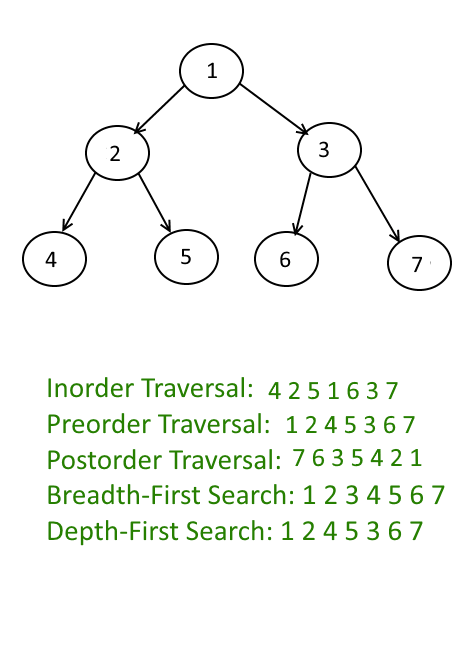

# Binary Tree

Binary Tree 的解法有以下五種: Pre-order, In-order, Post-order Traversal, Breath First Search, Depth First Search。

通常Binary Tree Traversal都會和BFS & DFS同時出現。因此建議複習Binary Tree時，搭配BFS&DFS一起練習。



## Binary Tree Divide&Conquer

先讓Left Subtree和Right Subtree去解決同樣的問題，得到結果之後，再整合為整顆Binary Tree的結果。

#### 為什麼Binary Tree適合使用Divide&Conquer呢？

這樣想，把整個Binary Tree看成一個大問題，而Left Subtree 就是一個subProblem，Right Subtree 是另外一個subProblem，以此類推。而這Binary Tree就直接幫我們Divide好整個問題了。 

## Binary Tree Traversal 

透過Pre-order / In-order / Post-order / Level-order\(BFS\) Traversal 的方式，遊走於整顆Binary Tree。在遍歷的時候，加上一個variable來記錄過程中需要的curr node和計算的結果result。

### 1. Pre-order Traversal: **Root-Left-Right** \(根左右\)  

```python
Pre-order Recursive 模板

def pre_order(self, root, result):
    if not root:
        return 
    result.append(root.val)        #根
    pre_order(root.left, result)   #左
    pre_order(root.right, result)  #右
```

```python
Pre-order Iterative 模板

def pre_order(self, root, result):
    if not root:
        return 
    result = []
    stack = []
    
    while len(stack) != 0 or root != None:
        for root != None:
            # Pre-order
            result.append(root.val)
            stack.append(root)
            root = root.left
        # pop from stack
        curr = stack.pop() # pop the last one
        root = curr.right
    return result
        
```

### 2. In-order Traversal: **Left-Root-Right** \(左根右\)

```python
In-order Recursive 模板

def in_order(self, root, result):
    if not root:
        return 
    in_order(root.left, result)     #左
    result.append(root.val)         #根
    in_order(root.right, result)    #右
```

### 3. Post-order Traversal: Left-Right-Root \(左右根\)

```python
Post-order Recursive模板

def post_order(self, root, result):
    if not root:
        return 
    post_order(root.left, result)   #左
    post_order(root.right, result)  #右
    post_order(root.val)            #根
```

