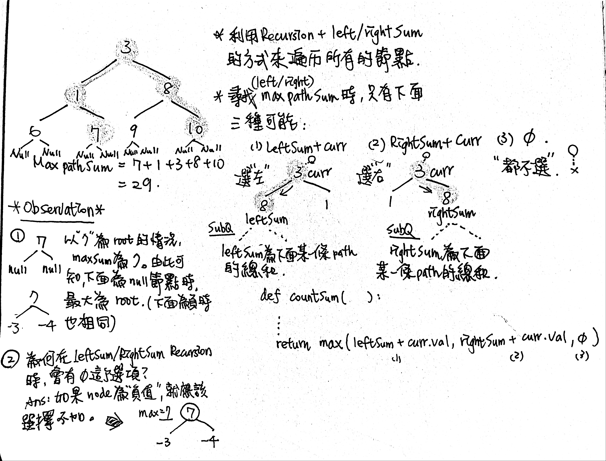
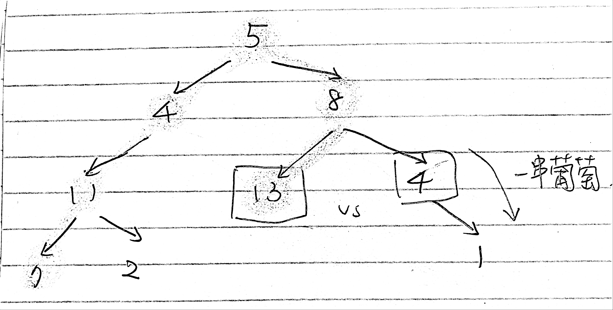

# \[Hard\] Binary Tree Maximum Path Sum \[Easy\] Diameter of Binary Tree

[Binary Tree Maximum Path Sum](https://leetcode.com/problems/binary-tree-maximum-path-sum/)  
Given a **non-empty** binary tree, find the maximum path sum.  
For this problem, a path is defined as any sequence of nodes from some starting node to any node in the tree along the parent-child connections.   
The path must contain **at least one node** and does not need to go through the root.

**Example**

```text
Input: [-10,9,20,null,null,15,7]

   -10
   / \
  9  20
    /  \
   15   7

Output: 42
```


Maximum Path Sum 和 Diameter of Binary Tree 其實都是一樣的思維。  
Maximum Path Sum 找的是**Binary Tree同一條path上所有節點的值的最大總和**，而  
Diameter 找的是**Binary Tree上包含最多節點的path**。



## Maximum Path Sum Solution

### 1. Recursive, DFS:   O\(N\) / O\(H\)

* Time complexity: `O(N)`, where `N` is number of nodes, since we visit each node not more than 2 times.
* Space complexity: `O(H)`, where `H` is a tree height, to keep the recursion stack. In the average case of the balanced tree, the tree height `H = logN`, in the worst case of skewed tree, `Height = N`.

> 思路：同時用recursion left加總左子樹的值，recursion right加總右子樹的值，再比較\(1\)`左子樹+root/curr.val` , \(2\)`右子樹+root/curr.val`, \(3\)`0` 哪個比較大。  
> 同場加映，為什麼不能直接用iterative preorder來處理呢？  
> 雖然是可以，但需要額外處理unbalanced tree的各種情況。  
> 當子樹下有多層children nodes\(一串葡萄\) vs 單一leaf node\(一顆葡萄\) 時，不能直接把leaf node值加入，需要先比較children nodes的總和是否有比leaf node大，等比較完後才能加入。

```python
可以測試的edge case
root = 5
[5,4,8,11,null,13,4,7,2,null,null,null,1]
result = 48  #(not 55)

# traverse每一個node再回來，就會得到55  (X)
# 一串葡萄vs一顆葡萄只選一個，就會得到48  (O)
```



```python
def maxPathSum(self, root: TreeNode) -> int:
    if not root:
        return 0
        
    # global variable to track max path sum
    # 需要用 -infinity 來開頭
    self.maxSum = float('-inf')
    # start the recursion from the root
    self.countPath(root)
    return self.maxSum
    
#        3
#      /   \
#     1     8
#    / \   / \
#   6   7 9  10
# n n  n n ....
def countPath(self, curr):
    # 遞歸出口
    # 如果leaf node(n)沒有東西了，代表curr node下面的sum為0
    if not curr:
        return 0
        
    leftSum = self.countPath(curr.left)
    rightSum = self.countPath(curr.right)
    # 如果找到max path sum則記錄下來，反之則維持maxSum的原樣
    self.maxSum = max(self.maxSum, leftSum + rightSum + curr.val)
    # 最重要的一步：max path sum只能從三種情況選一種
    # (1) leftSum + root
    # (2) rightSum + root
    # (3) 0
    return max(leftSum + curr.val, rightSum + curr.val, 0)
    
```

### 2. Iterative, DFS:

較複雜，略

## Diameter Solution

### 1. Recursion

```python
def diameterOfBinaryTree(self, root: TreeNode) -> int:
    if not root:
        return 0
        
    self.diameter = 0
    self.countDiameter(root)
    return self.diameter
    
def countDiameter(self, curr):
    if not curr:
        reutn 0
    
    leftSum = self.countDiameter(curr.left)
    rightSum = self.countDiameter(curr.right)
    
    self.diameter = max(self.diameter, leftSum + rightSum)
    
    return max(leftSum + 1, rightSum + 1)
    
```

