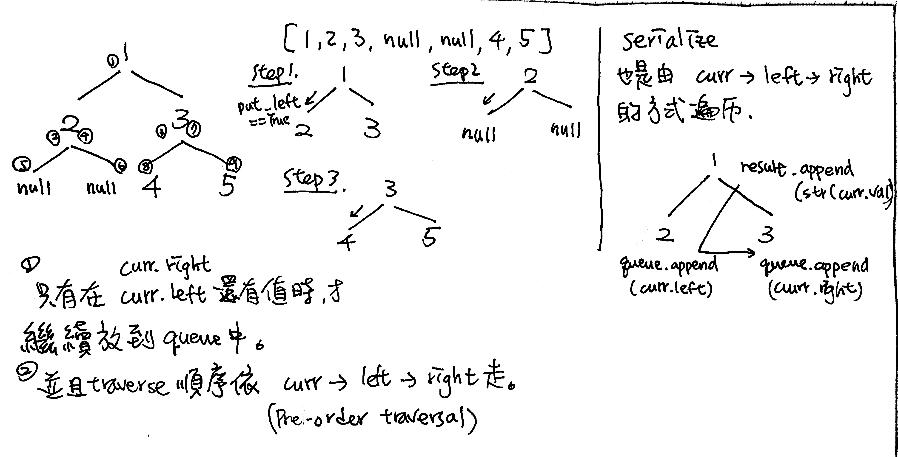

# \[Hard\] Serialize and Deserialize a Binary Tree / \[Medium\] Serialize and Deserialize a BST

## [\[Hard\] Serialize and Deserialize a Binary Tree](https://leetcode.com/problems/serialize-and-deserialize-binary-tree/)        \(4106/189\)

Serialization is the process of converting a data structure or object into a sequence of bits so that it can be stored in a file or memory buffer, or transmitted across a network connection link to be reconstructed later in the same or another computer environment.

Design an algorithm to serialize and deserialize a binary tree. There is no restriction on how your serialization/deserialization algorithm should work. You just need to ensure that a binary tree can be serialized to a string and this string can be deserialized to the original tree structure.

**Example**

```text
You may serialize the following tree:

    1
   / \
  2   3
     / \
    4   5

as "[1,2,3,null,null,4,5]"
```

## Code


\(1\) 這題用Recursive版本比Iterative版本簡單好寫。  
\(2\) 由於要區分null和葉節點ending，用Iterative Preorder模板會需要改動不少。




### 1. BFS Iterative, Preorder: O\(n\)/O\(n\)

為什麼Iterative版本用BFS比DFS好處理呢？根據原題目的Input，`root = [1,2,3,null,null,5]`，在Serialize Binary Tree時，我們會需要區分Input裡的null和葉節點的None，而在DFS中Iterative版本的Stack比較難自動區分這兩者。反之，BFS可以給我們level分層的訊息，這樣就可以比較容易避免明明葉節點就沒有值了，但卻還是一直看None的狀況。當然了，想要用DFS還是可以的。

> **Serialization**: binary tree nodes -&gt; data \(list\)  
> 用Pre-order Traversal的方式遍歷"`curr -> curr.left -> curr.right`"：  
> `result.append(curr.val)  
> queue.append(curr.left)  
> queue.append(curr.right)`

> **Deserialization: data -&gt; binary tree nodes**  
> 用BFS可以一層一層放node。用Pre-order Traversal的方式從1-&gt;len\(all\_nodes\)遍歷。  
> “`curr -> curr.left (put_left == True) -> curr.right (put_left == False)`" 的順序放。  
> 由於是用中-&gt;左-&gt;右的順序放，我們需要一個額外put\_Left的boolean來決定，是否要放在左邊，還是右邊。每一次放完後，就**Flip** put\_left = not put\_left。這裡有一點需要注意：  
> \(1\) curr = queue.popleft\(\) 只有在put\_left == True時才需要
>
> ```python
> while len(queue)不為0:
>     depth += 1
>     n = queue中元素的個數
>     for 循環 n 次：              ==>    for _ in range(1, len(all_nodes))
>         node = queue.popleft()             if put_left == True: 
>                                                curr = queue.popleft()
>                                                curr.left = ....
>                                                # put curr.left into the queue
> ```

```python
# Definition for a binary tree node.
# class TreeNode(object):
#     def __init__(self, x):
#         self.val = x
#         self.left = None
#         self.right = None
class Codec:
    """Encodes a tree to a single string.
    :type root: TreeNode
    :rtype: str
    """
    def serialize(self, root):
        if not root:
            return ""    # empty string
        
        result = []
        queue = deque()
        queue.append(root)
        
        while len(queue) != 0:
            curr = queue.popleft()
            
            # NOTE: pre-order traversal
            # 中-left-right
            if curr != None:
                result.append(curr.val) # 易錯點: convert to str 
                queue.append(curr.left)
                queue.append(curr.right)
            else:
                result.appned('null')
        
        return ','.join(result)
    
    
    """Decodes your encoded data to tree.        
    :type data: str
    :rtype: TreeNode
    """
    def deserialize(self, data):
        
        if not data:
            return None
        
        # init all required nodes & BFS variables
        # req nodes:
        all_nodes = data.split(',')
        root, curr = TreeNode(int(all_nodes[0])), None
        # BFS
        queue = deque()
        queue.append(root)
        put_left = True
        
        i = 1
        while len(queue) != 0:
            # range from 1 to len(all_nodes) 
            # to make sure all data has been visited.
            # update curr only when c.left is available. 
            for _ in range(1, len(all_nodes)):
                #  Option1: LEFT
                #          curr
                #         /    \
                #  (V)c.left   c.right
                #
                if put_left == True:
                    curr = queue.popleft()
                    curr.left = self.getNode(all_nodes[i])
                    if curr.left != None:
                        queue.append(curr.left)
                # Option2: RIGHT
                #          curr
                #         /    \
                #    c.left   c.right(V)
                #                
                else:
                    curr.right = self.getNode(all_nodes[i])
                    if curr.right != None:
                        queue.append(curr.right)
                
                # all done. Increment i + 1 and flip put_left 
                put_left = not put_left
                i += 1
            
        return root
    
    # Utility method to convert string into node        
    def getNode(self, s):
        if s == 'null':
            return None
        else:
            return TreeNode(int(s))
                
```

### 2. \(Recommend\) DFS Recursive, Preorder:     O\(N\) / O\(N\)

```python
class Codec:

    # Util method to do recursive preorder
    def _preorder(self, curr, result):
        if not curr:
            result.append('None')
            return
        
        result.append(str(curr.val))
        self._preorder(curr.left, result)
        self._preorder(curr.right, result)
    
    def serialize(self, root):
        """Encodes a tree to a single string.
        :type root: TreeNode
        :rtype: str
        """
        result = []
        #step1. Preorder根左右
        self._preorder(root, result)
        #step2. 用','把答案黏起來
        return ','.join(result)
        
    # Util method to reconstruct the binary tree with recursion        
    def _constructTree(self, data):
        
        if not data:
            return
            
        # case1: data[0] == None
        # 碰到data裡有None時的處理方式
        if data[0] == 'None':
            data.pop(0)
            return None
        
        # case2: data[0]為數字
        root = TreeNode(data[0])
        data.pop(0)
        
        root.left = self._constructTree(data)
        root.right = self._constructTree(data)     
        return root

    def deserialize(self, data):
        """Decodes your encoded data to tree.
        :type data: str
        :rtype: TreeNode
        """
        if not data:
            return
        
        #STEP1. 先化str -> treeNode(用recursion各個擊破)
        array = data.split(',')
        root = self._constructTree(array)
        return root
        

# Your Codec object will be instantiated and called as such:
# ser = Codec()
# deser = Codec()
# ans = deser.deserialize(ser.serialize(root))
```

或是更簡潔的寫法

```python
def serialize(self, root):
    if not root: return 'x'
    
    return root.val, self.serialize(root.left), self.serialize(root.right)

def deserialize(self, data):
	if data[0] == 'x': return None
	node = TreeNode(data[0])
	node.left = self.deserialize(data[1])
	node.right = self.deserialize(data[2])
	return node
```

## [\[Medium\] Serialize and Deserialize BST](https://leetcode.com/problems/serialize-and-deserialize-bst/)     \(1879/94\)

### 1. DFS Recursive, Preorder: O\(N\) / O\(N\)

和Binary Tree一模一樣的寫法。

```python
class Codec:
   
    def _preorder(self, root, result):
        if not root:
            result.append('None')
            return 
        
        result.append(str(root.val))
        self._preorder(root.left, result)
        self._preorder(root.right, result)
        
    
    def serialize(self, root: TreeNode) -> str:
        """Encodes a tree to a single string.
        """
        result = []
        self._preorder(root, result)
        return ','.join(result)

    def _convertTree(self, array):
        if array[0] == 'None':
            array.pop(0)
            return
        
        num = array.pop(0)
        root = TreeNode(num)
        root.left = self._convertTree(array)
        root.right = self._convertTree(array)
        return root
        
    
    def deserialize(self, data: str) -> TreeNode:
        """Decodes your encoded data to tree.
        """
        
        array = data.split(',')
        root = self._convertTree(array)
        return root
```

#### Reference

1. 精簡寫法，但不易讀 [https://leetcode.com/problems/serialize-and-deserialize-binary-tree/discuss/396124/Python-very-easy-to-understand-recursive-preorder-with-comments](https://leetcode.com/problems/serialize-and-deserialize-binary-tree/discuss/396124/Python-very-easy-to-understand-recursive-preorder-with-comments)

