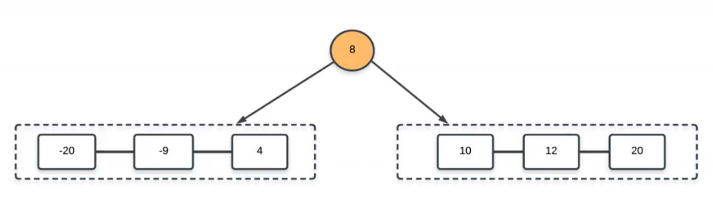
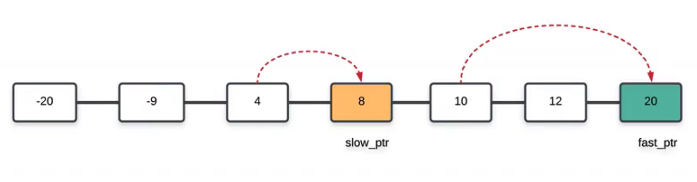
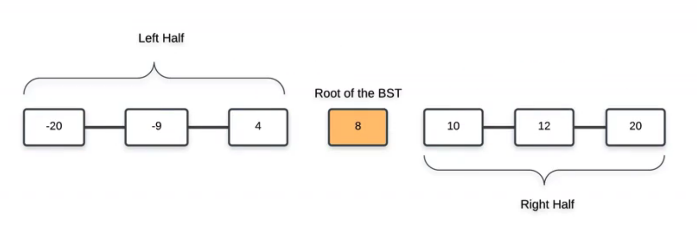

# \[Easy\] Convert Sorted Array -&gt; BST / \[Medium\] Convert Linked List -&gt; BST


核心思想：The **middle element** of the given list would **form the root** of the binary search tree.   
  
All the elements to the left of the middle element would form the left subtree recursively. Similarly, all the elements to the right of the middle element will form the right subtree of the binary search tree. This would ensure the height balance required in the resulting binary search tree.




## [\[Easy\] Convert Sorted Array to Binary Search Tree](https://leetcode.com/problems/convert-sorted-array-to-binary-search-tree/)         \(3610/267\)

Given an integer array `nums` where the elements are sorted in **ascending order**, convert _it to a **height-balanced** binary search tree_.

A **height-balanced** binary tree is a binary tree in which the depth of the two subtrees of every node never differs by more than one.  


```text
Input: nums = [-10,-3,0,5,9]
Output: [0,-3,9,-10,null,5]
Explanation: [0,-10,5,null,-3,null,9] is also accepted
```

### 1. DFS Recursive, Preorder:    O\(N\) / O\(N\)

Time Complexity:  O\(N\)  
Space Complexity:  O\(N\), O\(N\) to keep the output, and O\(logN\) for the recursion stack.

> 思路：  
> BST特性 --- 從左 -&gt; root -&gt; 右為遞增，因此**root為整個nums中點**。  
> 因此要先用 `middle = len(nums) // 2` 取得 `root`

如果要建Binary Tree / Binary Search Tree，我們依次建立`root/root.left/root.right` 之間的三角關係。然後一直往下走，直到nums全部看完為止。

```python
def sortedArrayToBST(self, nums: List[int]) -> TreeNode:

    def convert(left, right):
        # 遞歸出口
        if left > right:
            return
        
        # 取中間(靠左)作為根
        # always choose left middle node as a root
        curr = left + (right - left) // 2

        # 建立 root, root.left, root.right 的相互關係
        # Preorder 根-左-右
        root = TreeNode(nums[curr])
        # 左
        root.left = convert(left, curr - 1)
        # 右
        root.right = convert(curr + 1, right)
        
        return root
    return convert(0, len(nums) - 1)
```

### 2. DFS Recursive, Preorder + Slicing:   O\(N\) / O\(N\)

同樣思路，但更簡潔的寫法。

```python
def sortedArrayToBST(self, nums: List[int]) -> TreeNode:

    if not nums:
        return 
    
    # nums的中點為BST root 
    middle = len(nums)//2
    
    # Preorder: 根-左-右
    root = TreeNode(nums[middle])
    root.left = self.sortedArrayToBST(nums[:middle])
    root.right = self.sortedArrayToBST(nums[middle + 1:])

    return root
```


## [\[Medium\] Convert Sorted List to BST ](https://leetcode.com/problems/convert-sorted-list-to-binary-search-tree/)     \(2758/94\)

Given the `head` of a singly linked list where elements are **sorted in ascending order**, convert it to a height balanced BST.

For this problem, a height-balanced binary tree is defined as a binary tree in which the depth of the two subtrees of _every_ node never differs by more than 1.


```text
Input: head = [-10,-3,0,5,9]
Output: [0,-3,9,-10,null,5]
Explanation: One possible answer is [0,-3,9,-10,null,5], which represents the shown height balanced BST.
```

## 

這題有兩種做法：  
\(1\) \[Space Efficient Ver.\] `Linked List` --&gt; `DFS Recursive Preorder` --&gt; `BST` :    
**STEP1. 找Linked List middle，並斷開成左右兩個 Linked List**   \(Linked List --&gt; 2 Linked Lists\)     
先利用快慢指针找到链表的中点，然后把中点之前的链表断开，让中点做treeNode， 递归， 让left部分为前一半链表做成的BST， right为后一半链表做成的BST

> \[注意\] 如何在Middle斷開Linked List？  
> 在middle斷開時，並不是直接返回slow pointer，還必須要考慮分開前半Linked List / 後半Linked List的問題。  
> 正常會想說，直接把Middle = None就可以斷開Linked List。但這只是改動了Middle本身，原來的head Linked List並沒有任何改變。我們必須要想辦法弄成雙Linked List，最好是Middle前的節點Prev = None，這樣就可以在Traverse時，確保到Prev就停止，並輸出前半Linked List。





**STEP2. Recursive, Preorder** \(2 Linked Lists --&gt; BST\)  
DFS Recursive Preorder。利用Root, Root.left, Root.right的關係，依次把 Middle / Left Linked List / Right Link List 加入。


  
\(2\) \[Time Efficient Ver\] `Linked List`  --&gt; `Array` -&gt; `DFS Recursive Preorder` -&gt; `BST`   
**STEP1. 直接traversal，並append到Array** \(Linked List --&gt; Array\)  
  
**STEP2. Binary Search + Recursive Preorder, 用Slicing斷開left&right** \(Array --&gt; BST\)  
利用Binary Search + Recursive的方式，先找到Binary Search Middle中點，再把中點放到Recursive的範圍內，讓左子樹&右子樹分別用Recursion的方式處理。

### 1. DFS Recursive, Preorder + Middle Linked List:    O\(NlogN\) / O\(logN\)

Time Complexity:  `O(NlogN)`，每次找Middle Linked List需要 N/2時間，並且當越後面長度越切越短，如下$$\begin{aligned} \frac{N}{2} + 2 \cdot \frac{N}{4} + 4 \cdot \frac{N}{8} + 8 \cdot \frac{N}{16} \; \ldots \end{aligned}$$ 。總共需要logN次\(樹的高度\)，因此`N*logN` = `O(NlogN)`

Space Complexity:  `O(logN)`，需要維持Height Balanced BST，因此是 `O(logN)`

```python
def findMiddle(self, head):

    prev = None
    slow = head
    fast = head

    while fast and fast.next:
        prev = slow
        slow = slow.next
        fast = fast.next.next    
    
    # 使用prev來確定斷開位置
    if prev:
        prev.next = None

    return slow

def sortedListToBST(self, head: ListNode) -> TreeNode:

    if not head:
        return None

    middle = self.findMiddle(head)

    # 遞歸
    root = TreeNode(middle.val)
    if head == middle:
        return root

    root.left = self.sortedListToBST(head)
    root.right = self.sortedListToBST(middle.next)

    return root
```

### 2. DFS Recursive, Preorder + Binary Search:     O\(N\) / O\(N\)

相較於前一種解法，我們用更多的空間，換來了更快的時間。Time-Space Tradeoff。

Time Complexity: O\(N\)  
Space Complexity: O\(N\)

```python
# step1
# Utitlity method 1: to convert original linked list -> array
def convert(self, head):
    converted_list = []
    while head:
        converted_list.append(head.val)
        head = head.next
    return converted_list

# step2
# Utility method 2: to convert array -> BST
def listToBST(self, converted, start, end):

    if start > end:
        return

    middle = start + (end - start) // 2
    curr = TreeNode(converted[middle])
    if start == end:
        return curr

    curr.left = self.listToBST(converted, start, middle - 1)
    curr.right = self.listToBST(converted, middle + 1, end)
    return curr

# linked list --> array -binary search--> BST
def sortedListToBST(self, head: ListNode) -> TreeNode:

    if not head:
        return None

    converted = self.convert(head)
    root = self.listToBST(converted, 0, len(converted) - 1)

    return root
```

### 3. DFS Recursive, Inorder + Binary Search:    O\(N\) / O\(logN\)

Time Complexity: `O(N)`  
Space Complexity: `O(logN)` since now the only extra space is used by the recursion stack and since we are building a height balanced BST, the height is bounded by logN

> **Elements processed in the inorder fashion on a binary search tree turn out to be sorted in ascending order.**
>
> We know that the leftmost element in the inorder traversal has to be the head of our given linked list. Similarly, the next element in the inorder traversal will be the second element in the linked list and so on. This is made possible because the initial list given to us is sorted in ascending order.

```text
# Pesudo-Code
➔ function formBst(start, end)
➔      mid = (start + end) / 2
➔      formBst(start, mid - 1)
➔
➔      TreeNode(head.val)
➔      head = head.next
➔       
➔      formBst(mid + 1, end)
➔
```

