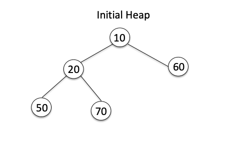
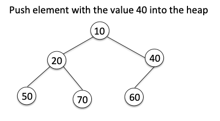
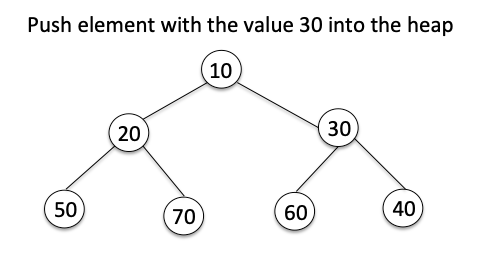

# Heap

## Heap 大小事

#### What is a Heap/Priority Queue?

Priority Queue is an advanced data type \(ADT\) which is a more refined version of a Queue. It dequeues higher-priority items before the lower-priority items. Most programming languages such as Python use Binary heap to implement it.

Python heapq, as stated in the beginning, provides a min-heap implementation.

#### What is a Heap?

* Heap in Computer -&gt; a memory area in a program used for dynamic memory allocation
* Heap in Data Structure -&gt; a complete binary tree 

A heap has multiple meaning in computer science. Sometimes, it refers to a memory area in a program used for dynamic allocation. However, we are talking about the Heap Data Structure here, which is a complete binary tree. It helps in implementing priority queues \(PQ\), the heapsort, and some graph-based algorithms.

A heap has the following two variants:

* A max-heap, in which the parent is more than or equal to both of its child nodes.
* A min-heap, in which the parent is smaller or equal to the child nodes.

### Python's Heapq module


在Python中，會用**`heapq`**來建`min heap`。  
**min heap是binary tree的一種特殊型態**，min heap有下面幾種特性：  
\(1\) root node 可以得到整個binary tree裡的最小值。  
\(2\) 每加一個element到heap時，還是會維持這種root有最小值的狀態。  
\(3\) heap的高度總是logn  
\(4\) min heap 的 child $$\geqslant$$ parent ，即 parent is always less than any of its children

```python
heapq Examples

alist = [3,2,6,15,10,18,8]

import heapq
heapq.heapify(alist)                 # heapify
                                     # heapify alist
# 1.Find smallest 
smallest = heapq.nsmallest(1,alist)  # heapq.nsmallest(# of items, arr)
                                     # smallest -> 2 
                                     # alist keeps the same
# 2.Find largest
largest = heapq.nlargest(2,alist)    # heapq.nlargest(# of items, arr)
                                     # largest -> [18,15]  in descending order
                                     # alist keeps the same
# 3.Get root node
smallest = heapq.heappop(alist)      # heapq.heappop(arr)
                                     # smallest -> 2
                                     # 2 was removed from alist, ordering was changed too
                                     # [3,2,6,15,10,18,8] -> [3,8,6,15,10,18]
# 4.Insert element
heapq.heappush(alist, 1)             # heapq.heappush(arr, element)
                                     # 1 was inserted into heap, ordering is maintained.
heapq.heappush(alist, 20)            #20 was inserted into heap, ordering is maintained.
                                     # [2, 8, 3, 15, 10, 18, 6, 20]

# 5.Delete smallest and insert a new element
heapq.heapreplace(alist, 5)          # heapq.heapreplace(arr, element)
                                     # this method is faster than heappop + heappush
                                     # 2 was deleted from heap, then
                                     # 5 was inserted into heap
                                     # [2,3,6,15,10,18,8] -> [3,5,6,15,10,18,8]

```

### Heapq's Time Complexity:

| Method | Functions | Time Complexity |
| :--- | :--- | :--- |
| heapq.heappush\(arr, item\) | ADD | O\(logn\) |
| heapq.heappop\(arr\) | POLL \(return root, and remove\) | O\(logn\) |
| heapq.nsmallest\(\#,arr\)/.nlargest\(\#,arr\) | min/MAX               | O\(1\)                               |
| heapq.nsmallest\(1,arr\) | PEEK \(return root, but not remove\) | O\(1\) |
| heapq.heapreplace\(arr, item\) | POLL and then ADD | O\(logn\) |

> 注意：這裡heappop\(arr\) 和 heapnsmallest\(1, arr\)為什麼會有不同的time complexity呢？  
> 不同的點在於，nsmallest並不會remove item，而heappop\(arr\)會remove root並且重新heapify\(arr\)。

### Heapq.heappush\(arr, item\)

```python
aqueue = [10, 50, 60, 20, 70]
heapq.heapify(aqueue)         # -> [10,20,60,50,70]
```



```python
heapq.heappush(aqueue, 40)             # -> [10,20,40,50,70,60]  
```



```python
heapq.heappush(aqueue, 30)            # -> [10,20,30,50,70,60,40]
```



## Two Heaps -- Min Heap & Max Heap

Min Heap to find the smallest element, Max Heap to find the largest element. 

#### 如何知道要用 Two Heaps Pattern?

1. 跟Scheduling Tasks \(排程\)、Priority Queue有關的情況
2. 如果問你有關 Find smallest/larget/median elements in a set 的問題  e.g. [Find Median from Data Stream](https://app.gitbook.com/@iscolectivo/s/algonote/shu-ju-jie-gou/design-qs/hard-find-median-from-data-stream)
3. 有些跟Binary Tree有關的問題

#### FAQ: min heap 和 ordered sorted array 相同嗎？

No. min heap 雖然有 parent is always less than any of its children的特性，但在同一層時並不能保證總是有序。

然而，min heap有個很好的特性，即`root node總是最小`，而且heap總是會維持此狀態。因此取smallest element只需要`O(1)`的時間，並且下一次再取smallest element時，root node還是整個heap裡最小。

#### 

