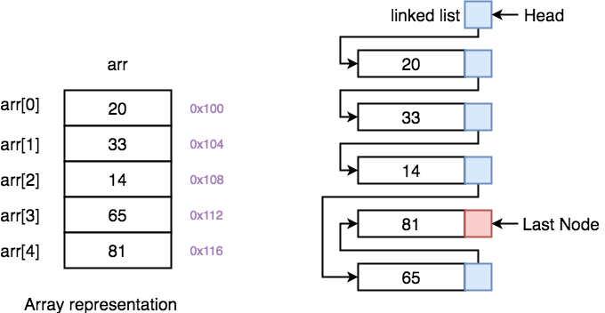
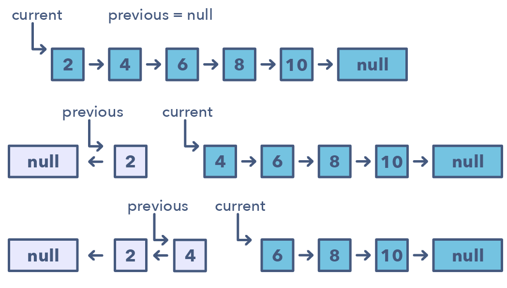

# Linked List

## Linked List核心技巧

Linked List Traversal/Insert的性質

* Linked List是一串葡萄，只要拿head就會有所有的elements。
* 維持 head & head.next 的關係
* Linked List頭部（即`ListNode(0)`）需要有Dummy Node來當Reference。 ex: **`0 ->`** 1 -&gt; 2 -&gt; 3 -&gt; 4 -&gt; 5 -&gt; Null 寫法： `Dummy = ListNode(0) Dummy.next = Head .....`
* **skip/remove duplicates** : `node.next = node.next.next`
* **i += 1** :  `node = node.next` 


## 基本概念



### 1. Linked List vs Array

|  | **Array** | **Linked List** |
| :--- | :---: | :---: |
| 特性 | Value & Index | Value & Next \(-&gt;\)  |
| 如何取值 | arr\[index\]  \(ex: arr\[0\]\) | head.next |
| Retrieve Specific Element | O\(1\) | O\(n\) |
| Insert/Delete | O\(n\)/O\(n\) | O\(1\)/O\(1\) \(only head\) |
|  |  |  |

使用LInked List的好處在於，Insert/Delete Operation只需要O\(1\)的時間複雜度。

### 2. Linked List需要注意的地方

由於Linked List取值只能用`node.next`來取。在解題時，需要實時地maintain \(1\)`head` \(2\) `head.next` 這兩者的關係。

### 3. Linked List Basic Operations

\(1\) 往後移一格

```text
Head->Head
(1) -> 2 -> 3 -> 4 -> 5   head = head.next
       
      (2)-> 3 -> 4 -> 5
```

\(2\) Skip/Remove Duplicates 跳過，直接往下下一格走

```text
Head     ->Head
(1) -> 2 -> 3 -> 4 -> 5   head.next = head.next.next
       
           (3)-> 4 -> 5
```

\(3\) 把B LinkedList 黏到 A 上

```text
node A: (1) -> 3 -> 5
node B: (2) -> 4             A.next = B

(1) -> 3 -> 5 -> 2 -> 4
```

\(4\) 在head最前面加上一個dummy node

```text
     Head 
      (1) -> 2 -> 3 -> 4 -> 5    dummy = ListNode(0)
dummy                            dummy.next = head
(0) -> 1 -> 2 -> 3 -> 4 -> 5 
```


## Fast & Slow Pointers

## Reverse Linked List \(In-Place\)

In a lot of problems, you may be asked to reverse the links between a set of nodes of a linked list. Often, the constraint is that you need to do this in-place, i.e., using the existing node objects and without using extra memory. This is where the above-mentioned pattern is useful. 

This pattern reverses one node at a time starting with one variable \(current\) pointing to the head of the linked list, and one variable \(previous\) will point to the previous node that you have processed. In a lock-step manner, you will reverse the current node by pointing it to the previous before moving on to the next node. Also, you will update the variable “previous” to always point to the previous node that you have processed.




### Reverse Linked List Pattern: 

* If you’re asked to **reverse a linked list without using extra memory**

### Problems

* Reverse a Sub-list \(medium\)
* Reverse every K-element Sub-list \(medium\)
* [x] Reverse Linked List \(easy\)
* [ ] Reverse Linked List II \(medium\)

