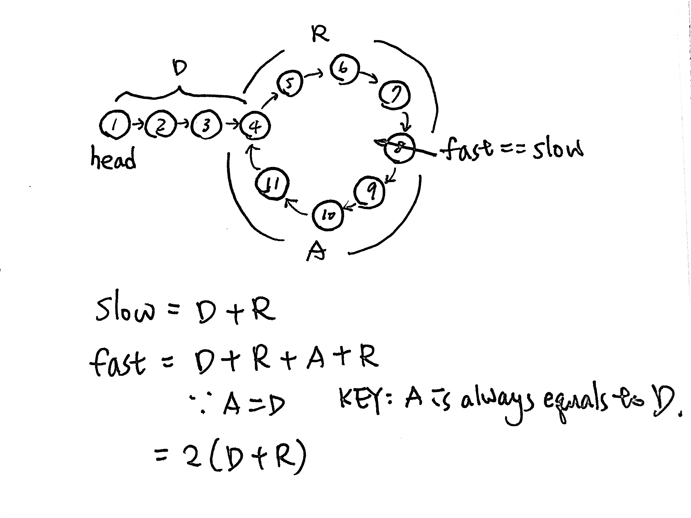

# \[Easy\] Linked List Cycle & \[Medium\] Linked List Cycle II

## [Linked List Cycle](https://leetcode.com/problems/linked-list-cycle/)

Given a linked list, determine if it has a cycle in it.  
To represent a cycle in the given linked list, we use an integer `pos` which represents the position \(0-indexed\) in the linked list where tail connects to. If `pos` is `-1`, then there is no cycle in the linked list.

#### Example

```text
Input: head = [3,2,0,-4], pos = 1
Output: true
Explanation: There is a cycle in the linked list, where tail connects to the second node.
```


### Thought Process

### Code

```python
# Definition for singly-linked list.
# class ListNode:
#     def __init__(self, x):
#         self.val = x
#         self.next = None
def hasCycle(self, head: ListNode) -> bool:
    # edge case
    if head == None:
        return False

    # init slow&fast pointers
    slow = fast = head
    
    # if fast and fast.next do not reach the end of the list.
    while fast != None and fast.next != None:
        fast = fast.next.next  # double the speed of fast pointer 
        slow = slow.next       # see if fast pointer can catch up with slow
        
        # NOTE: Do not use .val here!
        # fast catches up with slow -> cycle
        if fast == slow:
            return True
    return False
        
```

## [Linked List Cycle II](https://leetcode.com/problems/linked-list-cycle-ii/)

Given a linked list, return the node where the cycle begins. If there is no cycle, return `null`.  
To represent a cycle in the given linked list, we use an integer `pos` which represents the position \(0-indexed\) in the linked list where tail connects to. If `pos` is `-1`, then there is no cycle in the linked list.  
Note: Do not modify the linked list.

#### Example

```python
Input: head = [3,2,0,-4], pos = 1
Output: tail connects to node index 1
Explanation: There is a cycle in the linked list, where tail connects to the second node.
```

### Thought Process



1. edge case
2. **Init fast & slow pointers = head**
3. **Move Pointers**: `fast = fast.next.next`, `slow = slow.next`
4. **Fast Back to Begining**: if fast catches slow \(`fast == slow`\), then move fast back to `head`
5. **Move Pointers**: move fast & slow pointers again. But this time with the same speed `fast = fast.next`, `slow = slow.next`
6. **Result:** return slow

### Code

```python
# Definition for singly-linked list.
# class ListNode:
#     def __init__(self, x):
#         self.val = x
#         self.next = None
def detectCycle(self, head: ListNode) -> ListNode:
    # edge case
    if head == None:
        return head
    # init fast & slow pointers
    # slow, fast = head, head
    slow = fast = head 

    # start to move pointers
    while fast != None and fast.next != None:
        # 注意：要先動fast&slow指針後才能判斷fast==slow，否則一開始就會掉入fast==slow
        fast = fast.next.next
        slow = slow.next

        # 當fast追上slow時，把fast調回head，並且放慢fast
        if fast == slow:
            fast = head
            # make fast same steps as slow
            while fast != slow:
                fast = fast.next
                slow = slow.next
            return slow
    return None  
```

