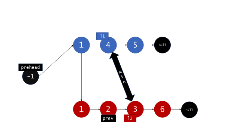

# \[Easy\] Merge Two Sorted Lists

## [\[Easy\] Merge Two Sorted Lists](https://leetcode.com/problems/merge-two-sorted-lists/)    \(7165/795\)

Merge two sorted linked lists and return it as a **sorted** list. The list should be made by splicing together the nodes of the first two lists.


### 1. Linked List -&gt; List -&gt; Linked List: O\(n+m\) / O\(n+m\)

```python
def mergeTwoLists(self, l1: ListNode, l2: ListNode) -> ListNode:
    
    # l1 Linked List -> List
    list_1 = []
    while l1:
        list_1.append(l1.val)
        l1 = l1.next
    
    # l2 Linked List -> List
    list_2 = []
    while l2:
        list_2.append(l2.val)
        l2 = l2.next
    
    # sort merged list
    merged = sorted(list_1 + list_2)
    
    # convert back: List -> Linked List
    pointer = dummy = ListNode(0)
    for num in merged:
        pointer.next = ListNode(num)
        pointer = pointer.next
    
    return dummy.next
```

### 2. Iteration: O\(n+m\) / O\(1\)



STEP1. 使用一個dummy head \(跟法一相同\)  
STEP2. 比較`l1.val & l2.val`，看哪個大，就放到dummy head.next。並且把已經放了的item往後移一格。

```python
def mergeTwoLists(self, l1, l2):
    # maintain an unchanging reference to node ahead of the return node.
    prehead = ListNode(-1)

    prev = prehead
    while l1 and l2:
        if l1.val <= l2.val:
            prev.next = l1
            l1 = l1.next
        else:
            prev.next = l2
            l2 = l2.next            
        prev = prev.next

    # At least one of l1 and l2 can still have nodes at this point, so connect
    # the non-null list to the end of the merged list.
    prev.next = l1 if l1 is not None else l2

    return prehead.next
```

