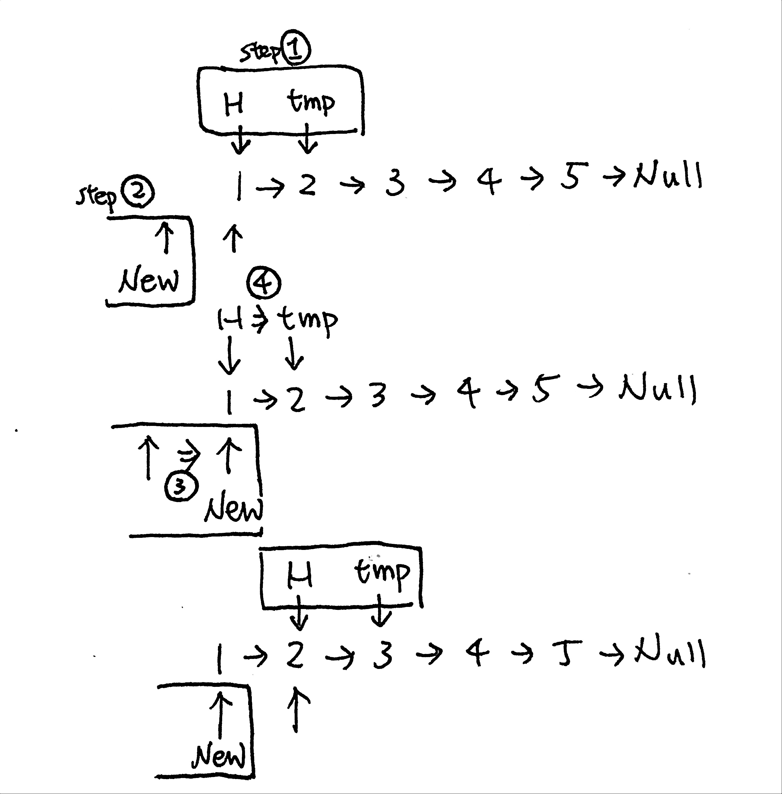
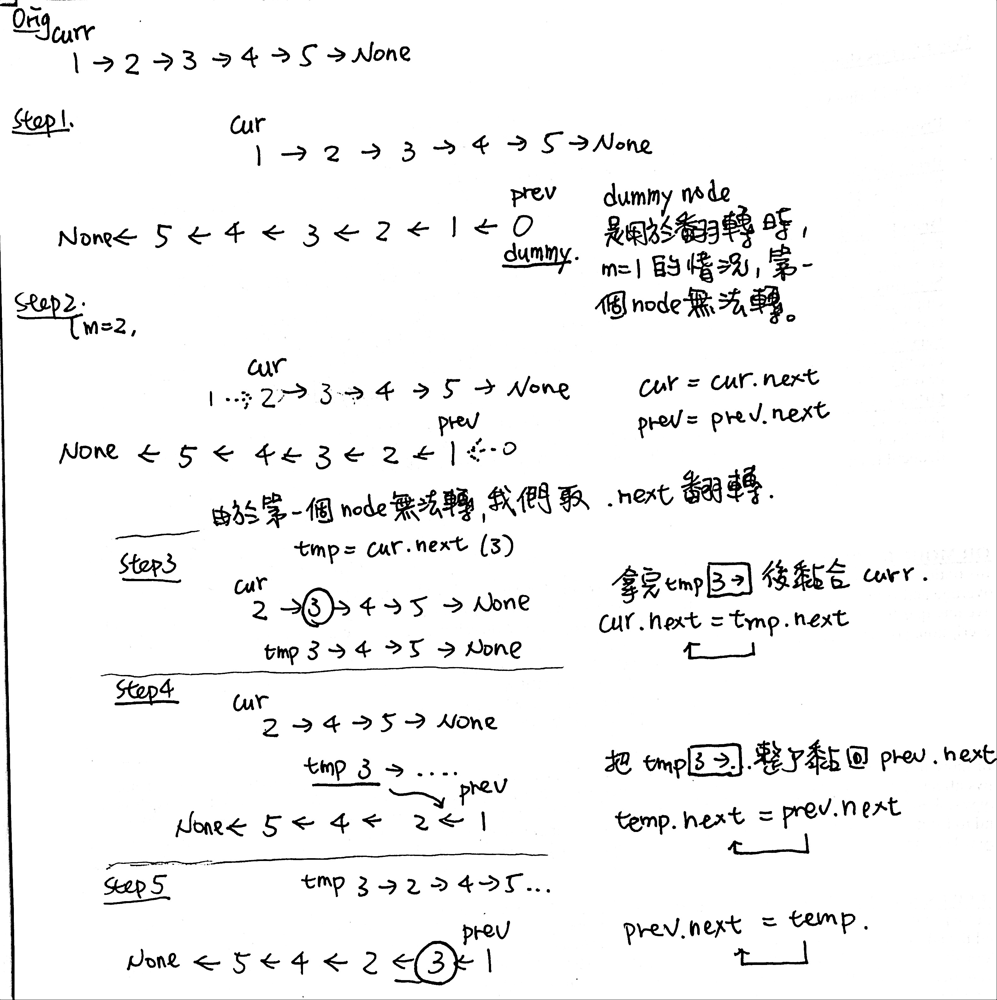

# \[Easy\] Reverse Linked List & \[Medium\] Reverse Linked List II

#### Reverse Linked List 核心要素：

* 取dummy node \(ListNode\(0\)\)，防止m=1翻轉時，沒有前面的node狀況。
* 建curr&prev，分別代表改前&改後
* curr.next --&gt; prev.next
* 用temp一個一個移動到prev


先寫\(1\)\(4\) `temp <--> head`       ：\(1\)保存head.next的關係，並且\(4\)移動一格  
在寫\(2\)\(3\) `new_head <--> head`：\(2\)把head.next換成`new_head`，並且\(4\)new\_head跟著head移動


```python
模板：
     temp = curr.next   #(1)       tmp   curr.next
curr.next = temp.next   #(2) curr.next
temp.next = prev.next   #(3)             prev.next
prev.next = temp        #(4) prev.next   tmp
```

**Reverse Linked List的指針移動步驟**

```python
sourceHead -> "A" -> "B" -> "C" -> NULL
your pointer   ^
targetHead -> NULL

sourceHead -> "A" -> "B" -> "C" -> NULL
your pointer          ^
targetHead -> "A" -> NULL

sourceHead -> "A" -> "B" -> "C" -> NULL
your pointer                 ^
targetHead -> "B" -> "A" -> NULL

sourceHead -> "A" -> "B" -> "C" -> NULL
your pointer                        ^
targetHead -> "C" -> "B" -> "A" -> NULL
```


## [\[Easy\] Reverse Linked List](https://leetcode.com/problems/reverse-linked-list/)

Reverse a singly linked list.

#### Example

```text
Input: 1->2->3->4->5->NULL
Output: 5->4->3->2->1->NULL
```

### Thought Process

既然要Reverse Linked LIst，我們可以把原來的 `new = head.next`變成 new.next = head。要注意在轉換的過程中，需要用temp臨時指針，來保存head & head.next的相對關係和值。

在這裡，我們需要去維護的就是`Head & Head.next` 這兩個Nodes。下面四個步驟就是拆解Head&Head.next，並且建立新的Reversed Linked List方法。

Step1. **Copy head.next：**確立Head & temp的關係，並且利用temp拷貝head.next原來的值。即 temp = head.next  
Step2. **Override head.next**：移動head.next到new\_head  
Step3. **Override Head**：移動new\_head到原head的位置。  
Step4. **恢復原始temp**：提取step1的temp值，移動head到temp。 



### 1. Iterative + no dummy head: O\(n\)/O\(1\)

```python
def reverseList(self, head: ListNode) -> ListNode:
    # edge case
    if head == None:
        return head
    # init reverse head
    new_head = None
    
    while head != None:
        # step1. preserve head.next's value
        temp = head.next
        # step2. override head.next
        head.next = new_head
        # step3. move new_head
        new_head = head
        # step4. move original head
        head = temp
    
    return new_head
```

### 2. Iterative + dummy head: O\(n\) / O\(1\)

```python
def reverseList(self, head: ListNode) -> ListNode:
    if head == None:
        return head
    
    # init dummy head Null, then point head -> Null
    dummy = ListNode(0)
    dummy.next = head
    
    # init curr, prev to preserve head, reverse_head
    curr, prev = head, dummy
    
    # the reason of using temp is to preserve the .next value & remaining pieces
    # while doing curr->prev move 
    while head != None and head.next != None:
        temp = curr.next
        curr.next = temp.next # curr.next
        temp.next = prev.next #            -> prev.next
        prev.next = temp      # reconnect temp to prev.next
    
    return dummy.next
```

### 2. Recursive: O\(n\)/O\(1\)

```python
def reverseList(self, head: ListNode) -> ListNode:
    return self.helper(head, None)
    
def helper(self, head, node):
    if not head:
        return node     # 這裡是返回node
    temp = head.next
    head.next = node
    return self.helper(temp, head)
```

## [Reverse Linked List II](https://leetcode.com/problems/reverse-linked-list-ii/) 

### 1. LinkedList -&gt; List -&gt; LinkedList: O\(N\) / O\(N\)

```python
def reverseBetween(self, head: ListNode, left: int, right: int) -> ListNode:
    
    if not head:
        return head
    
    #STEP1. LL -> List: convert to list
    r_list = []
    while head:
        r_list.append(head.val)
        head = head.next
    
    #STEP2. reverse middle
    if left <= len(r_list) and right <= len(r_list): 
        middle = r_list[left-1:right]
        middle.reverse()
        # attach them back to r_list
        r_list = r_list[:left-1] + middle + r_list[right:]      
            
    #STEP3. List -> LL: convert back to LL
    dummy = pointer = ListNode(0)
    for i in range(len(r_list)):
        pointer.next = ListNode(r_list[i])
        pointer = pointer.next
    
    #STEP4. dummy node next
    return dummy.next
```

### **Follow up:** Could you do it in one pass?    O\(N\) / O\(N\)

Find linked list \[m,n\], reverse it. Then connect m with n+1, connect n with m-1.

1. **Init dummy node:** dummy = ListNode\(0\) and link it to head
2. **Create curr & prev:** curr represents unreversed linkedList, prev represent reversed linkedList
3. **Fast forward curr&prev to m-1**
4. **Reverse curr's List Node between \[m,n\]** 4-1. **Take curr.next out:** temp = curr.next 4-2. **Move from curr.next to prev.next** 4-3. **Attach temp back to prev.next:** prev.next = temp
5. Get result from dummy.next



```python
def reverseBetween(self, head: ListNode, m: int, n: int) -> ListNode:
    if head == None:
        return head
    # init dummy node 0
    dummy = ListNode(0)
    dummy.next = head
    # init curr, prev as head, dummy
    #                 curr (1)->2->3->4->5->Null
    # Null<-5<-...<-1<-(0) prev
    curr, prev = head, dummy
    # move curr, prev forward until m-1 (regular)
    for _ in range(m-1):
        curr = curr.next
        prev = prev.next
    #             curr (2)->3->4->5
    # 5<-4<-3<-2<-(1) prev
    
    # between [m,n] reverse linked list using temp
    #    curr (2)->[3]->4->5
    #        temp [(3)]->2->4...
    #     5<-4<-2<-[3]<-(1) prev  
    #
    #    curr (2)->[4]->5
    #        temp [(4)]->3->2...
    #     5<-2<-3<-[4]<-(1) prev
    i = m
    while head != None and i < n:
        temp = curr.next
        curr.next = temp.next
        temp.next = prev.next
        prev.next = temp
        i += 1
    
    # we don't need to care the remaining of [n,end] 
    # because the position won't change during that reverse process
    
    # dummy is pointing to 0 as head, so we need to get dummy.next
    return dummy.next
    
```

