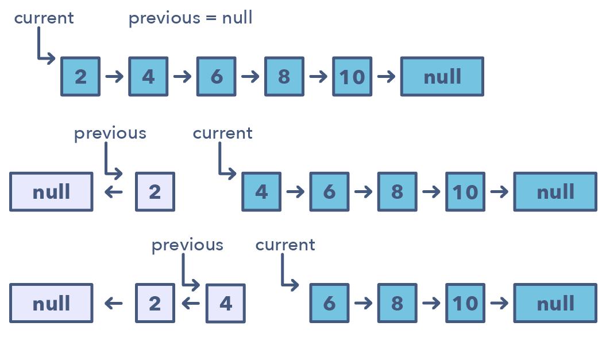

# \[Easy\] Reverse Linked List & \[Medium\] Reverse Linked List II

## [Reverse Linked List](https://leetcode.com/problems/reverse-linked-list/)

Reverse a singly linked list.

#### Example

```text
Input: 1->2->3->4->5->NULL
Output: 5->4->3->2->1->NULL
```

### Thought Process

既然要Reverse Linked LIst，我們可以把原來的 `new = head.next`變成 new.next = head。要注意在轉換的過程中，需要用temp臨時指針，來保存head & head.next的相對關係和值。

在這裡，我們需要去維護的就是`Head & Head.next` 這兩個Nodes。下面四個步驟就是拆解Head&Head.next，並且建立新的Reversed Linked List方法。

Step1. **Copy head.next：**確立Head & temp的關係，並且利用temp拷貝head.next原來的值。即 temp = head.next  
Step2. **Override head.next**：移動head.next到new\_head  
Step3. **Override Head**：移動new\_head到原head的位置。  
Step4. **恢復原始temp**：提取step1的temp值，移動head到temp。 




### Code

#### 1. Iterative Version: O\(n\)/O\(1\)

```python
def reverseList(self, head: ListNode) -> ListNode:
    # edge case
    if head == None:
        return head
    # init reverse head
    new_head = None
    
    while head != None:
        # step1. preserve head.next's value
        temp = head.next
        # step2. override head.next
        head.next = new_head
        
        # step3. move new_head
        new_head = head
        # step4. move original head
        head = temp
    
    return new_head
        
         
```

#### 2. Recursive Version: O\(n\)/O\(1\)

## [Reverse Linked List II](https://leetcode.com/problems/reverse-linked-list-ii/) 

### Thought Process

Find linked list \[m,n\], reverse it. Then connect m with n+1, connect n with m-1.

### Code

