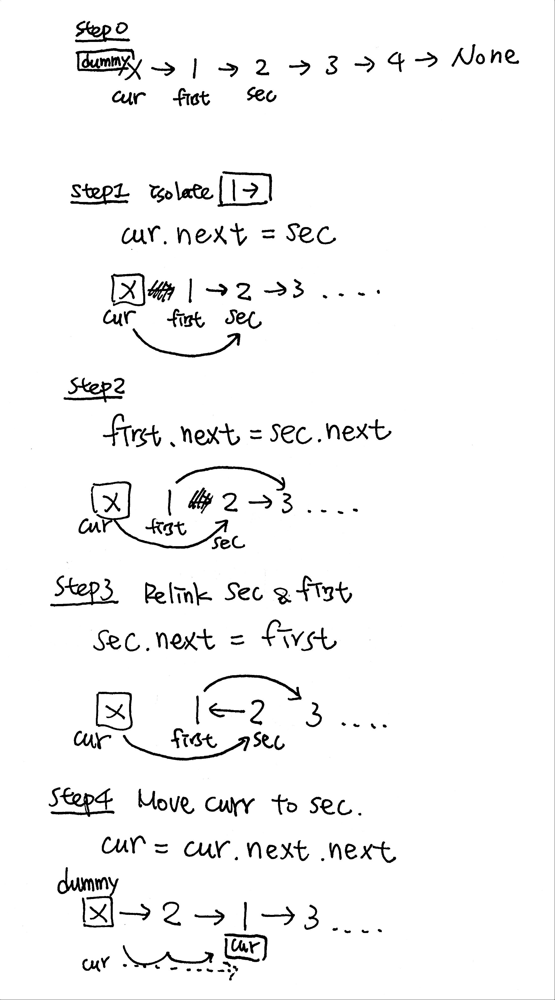

# \[Medium\] Swap Nodes in Pairs

## [Swap Nodes in Pairs](https://leetcode.com/problems/swap-nodes-in-pairs/)

Given a linked list, swap every two adjacent nodes and return its head.  
You may **not** modify the values in the list's nodes, only nodes itself may be changed.

Example

```python
Given 1->2->3->4, you should return the list as 2->1->4->3.
```

### Thought Process



### Code

```python
# Definition for singly-linked list.
# class ListNode:
#     def __init__(self, val=0, next=None):
#         self.val = val
#         self.next = next
def swapPairs(self, head: ListNode) -> ListNode:
    if head == None:
        return head
        
    dummy = ListNode(0)
    dummy.next = head
    # NOTE: curr here we start from dummy node
    curr = dummy
    
    while curr.next != None and curr.next.next != None:
        # init 1st & 2nd
        first = curr.next
        second = curr.next.next
        
        # isolate 1st
        curr.next = second
        # reconnect 1st
        first.next = second.next
        # Relink sec&first
        second.next = first
        
        # move curr pointer
        curr = curr.next.next
        
    return dummy.next
        
```

