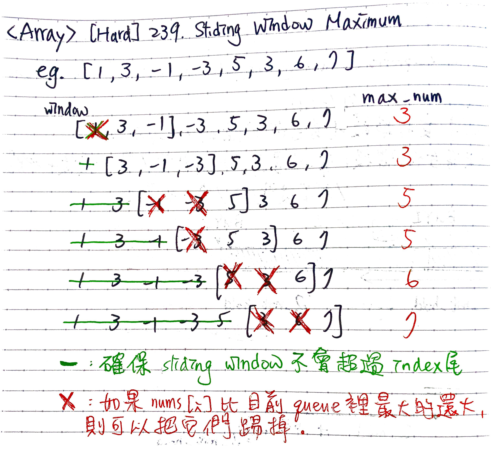

# \[Hard\] Sliding Window Maximum

## [\[Hard\] Sliding Window Maximum](https://leetcode.com/problems/sliding-window-maximum/)    \(\)


### 1. Brute Force: O\(N\*K\) / O\(1\)

Time Complexity: O\(N\*K\) k is the sliding window size, N is the number of elements in nums

```python
def maxSlidingWindow(self, nums: List[int], k: int) -> List[int]:

    dp = []

    for left in range(len(nums)-k+1):
        right = left + k        
        max_sliding_window = max(nums[left:right])
        dp.append(max_sliding_window)
    
    return dp
```

### 2. Deque: O\(N\) / O\(N\)




```python
import collections
def maxSlidingWindow(self, nums: List[int], k: int) -> List[int]:

    queue = collections.deque()
    result = []

    for i in range(len(nums)):

        # poll/remove from first
        while queue and queue[0] < i - k + 1:
            queue.popleft()

        # poll/remove from last
        # while
        while queue and nums[queue[-1]] < nums[i]:
            queue.pop()
        
        # now we are able to put elements into queue
        # append to last
        queue.append(i)
        
        # remaining part would be max num, then append them to the result
        if i >= k - 1:            
            result.append(nums[queue[0]])

    return result
```

