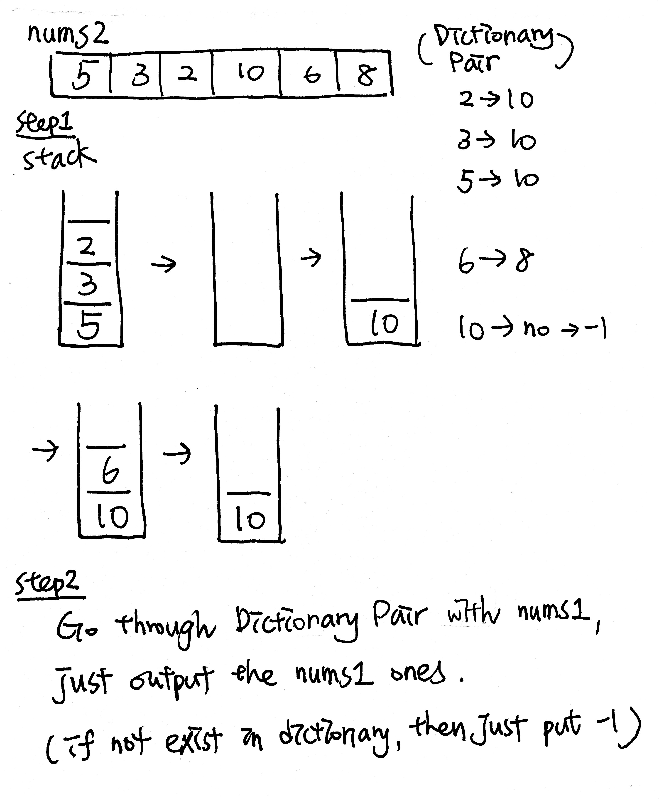

# Next Greater Element I

### 496. Next Greater Element I

You are given two arrays **\(without duplicates\)** `nums1` and `nums2` where `nums1`’s elements are subset of `nums2`. Find all the next greater numbers for `nums1`'s elements in the corresponding places of `nums2`.

The Next Greater Number of a number **x** in `nums1` is the first greater number to its right in `nums2`. If it does not exist, output -1 for this number.

#### Example

```text
Input: nums1 = [4,1,2], nums2 = [1,3,4,2].
Output: [-1,3,-1]
Explanation:
    For number 4 in the first array, you cannot find the next greater number for it in the second array, so output -1.
    For number 1 in the first array, the next greater number for it in the second array is 3.
    For number 2 in the first array, there is no next greater number for it in the second array, so output -1.
```

## Code

### 1. Dictionary: O\(m\*n\) / O\(m\), m = len\(nums1\) & n = len\(nums2\)

Runtime only beats 10.96%

1. 利用Dictionary建立nums1 element & nums2 index 之間的映射。這樣做的好處是，可以很快locate element in nums2，直接快速定位該數字在原數組的位置。
2. 從剛找到的element往右邊尋找，直到找到next greater element時即可。 

```python
def nextGreaterElement(self, nums1: List[int], nums2: List[int]) -> List[int]:

    if not nums1 or not nums2:
            return []
        
    location = {}
    for item in nums1:
        if item in nums2:
            location[item] = nums2.index(item)
        else:
            location[item] = -1
#        print(location)
        
    result = [ -1 for _ in range(len(nums1))]
#        for start in location.values():
    for curr_num, start in location.items():
        for j in range(start,len(nums2)-1):
            next_item = nums2[j+1]
            if next_item > nums2[start]:
#                    nums1_id = nums1.index(nums2[curr])
                nums1_id = nums1.index(curr_num)
                result[nums1_id] = next_item
                break
    return result
```

### 2. Dictionary + Stack: O\(m+n\) / O\(m+n\)

Time Complexity: The entire nums2 array is only scanned once from step1. The nums1 array is also scanned once from step2.   
  
Space Complexity: stack and map n are both used. result array is the size of m.



使用stack的top特性來依序比較nums2上每一個item的大小。  
**Step1:**  
如果現在手上的比stack top還小\(e.g. 5,3,2\)，則一個一個壓入stack；  
反之，如過手上的比stack top還大\(e.g. 10\)，則建立配對 \(top -&gt; curr\)，並且儲存在dictionary裡。  
**Step2:**  
看nums1有哪些數字，藉由dictionary上的pair，來快速取得next\_greater，找不到者就加上-1。

```python
def nextGreaterElement(self, nums1: List[int], nums2: List[int]) -> List[int]:

    if not nums1 or not nums2:
        return []
        
    result = []
    stack = []
    location = {}
        
    for num in nums2:
        while len(stack) != 0 and stack[-1] < num:
            location[stack[-1]] = num
            stack.pop()
        stack.append(num)
        
    # we have all the corresponding pair
    # just have to put all of them into result list, else just filled with -1
    for num in nums1:
        # next_greater
        next_greater = location.get(num,-1)
        result.append(next_greater)
        
    return result
```

