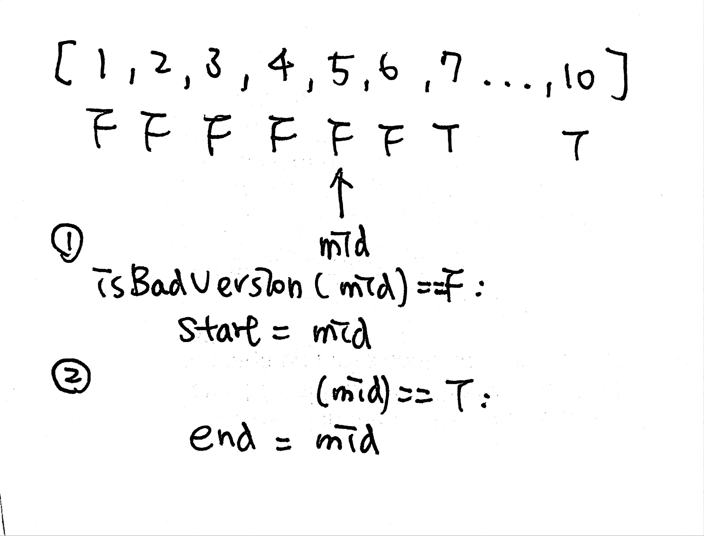

# \[Easy\] First Bad Version

[First Bad Version](https://leetcode.com/problems/first-bad-version/)  
You are a product manager and currently leading a team to develop a new product. Unfortunately, the latest version of your product fails the quality check. Since each version is developed based on the previous version, all the versions after a bad version are also bad.  
  
Suppose you have `n` versions `[1, 2, ..., n]` and you want to find out the first bad one, which causes all the following ones to be bad.  
  
You are given an API `bool isBadVersion(version)` which will return whether `version` is bad. Implement a function to find the first bad version. You should minimize the number of calls to the API.

## Thought Process

### Binary Search: O\(logn\)/O\(1\)

由題意要求從一個arraylist \[1,2,3...,n\] 裡面找badVersion，我們可以想到最快找到badVersion的辦法是Binary Search。如果找到即`badVersion(mid) == True`則`end=mid`，反之==False則`start=mid`。  
剩下的還是就用模板來完成。



## Code



```python
# The isBadVersion API is already defined for you.
# @param version, an integer
# @return an integer
# def isBadVersion(version):
def firstBadVersion(self, n):

    if not n:
        return False
        
    start, end = 0, n # use n we don't need len()
    
    while start + 1 < end:
        
        mid = start + (end-start)//2
        
        if isBadVersion(mid) == True:
            end = mid
        
        elif isBadVersion(mid) == False:
            start = mid
    
    if isBadVersion(start) == True:
        return start
    return end
```



