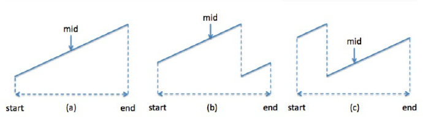

# \[Medium\] Find Minimum in Rotated Sorted Array

[Find Minimum in Rotated Sorted Array](https://leetcode.com/problems/find-minimum-in-rotated-sorted-array/)  
Suppose an array sorted in ascending order is rotated at some pivot unknown to you beforehand.\(i.e., `[0,1,2,4,5,6,7]` might become `[4,5,6,7,0,1,2]`\).  
Find the minimum element.  
You may assume no duplicate exists in the array.

## Thought Process

### Binary Search

如果題意說是Sorted Array/Rotated Sorted Array，通常這種題目都是可以利用Binary Search來達到O\(logn\)的複雜度。  
  
Rotated Sorted Array只有以下三種方式：



又如果要找minimum，就是以下的Binary Search縮小範圍方法


\(a\) \(c\) 符合 `nums[mid] < nums[end]`  
因此可以縮小範圍至`end = mid`，把平滑上升的mid-end部分划掉  
\(b\) 符合 `nums[mid] >= nums[end]`  
縮小範圍至`start = mid`，把平滑上升的start-mid部分划掉


易錯點：這裡先用的是nums\[mid\] &lt;= nums\[end\]:  **end = mid** \(划掉mid-end\)


Time Complexity: O\(logn\)  
Space Complexity: O\(1\)

### Follow Up: What if this array has lots of duplicates?  

[Search in Rotated Sorted Array II](https://leetcode.com/problems/find-minimum-in-rotated-sorted-array-ii/)  
Ex: \[1,1,1,1,1,1 ....,0,1\] only has one zero here.   
Then we could not ensure the binary search will give you O\(logn\) time, instead, it will be down to O\(n\) time. 

## Code

#### 1. Binary Search: O\(logn\)/O\(1\)

思路請見Binary Search模板



```python
def findMin(self, nums: List[int]) -> int:
    
    if not nums or len(nums) == 0:
        return -1
        
    start, end = 0, len(nums)-1
    
    while start + 1 < end:
        
        mid = start + (end-start)//2
        
        if nums[mid] <= nums[end]:
            end = mid
        else:
            start = mid
    
    if nums[start] < nums[end]:
        return nums[start]
    
    return nums[end]
```



#### Code for Array Has Duplicates \(search in rotated sorted array II\)

```python
def findMin(self, nums: List[int]) -> int:

    if not nums or len(nums) == 0:
        return -1
    
    start, end = 0, len(nums)-1
    
    while start + 1 < end:
        
        while start + 1 < end and nums[start] == nums[start+1]:
            start += 1
        while start + 1 < end and nums[end] == nums[end-1]:
            end -= 1
            
        mid = start + (end-start)//2
        
        ### check for mid <= end  and then-> end = mid
        if nums[mid] < nums[end]:
            end = mid
        else:
            start = mid
    
    if nums[start] < nums[end]:
        return nums[start]
    return nums[end]
```

