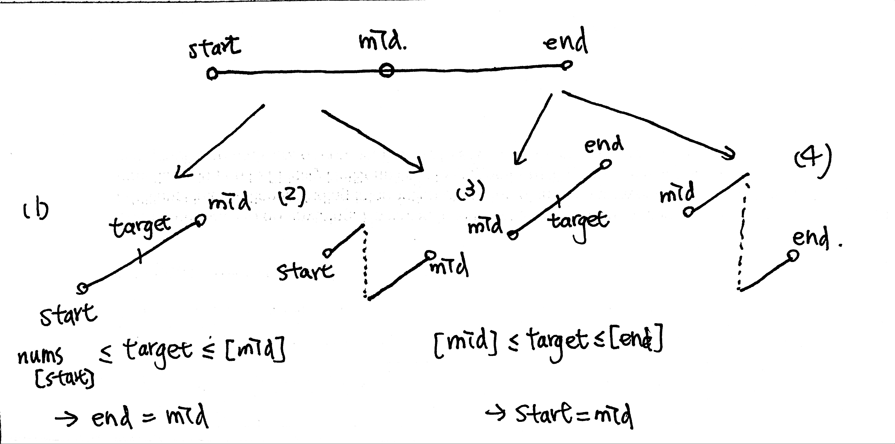

# \[Medium\] Search in Rotated Sorted Array

[Search in Rotated Sorted Array](https://leetcode.com/problems/search-in-rotated-sorted-array/)  
Suppose an array sorted in ascending order is rotated at some pivot unknown to you beforehand.\(i.e., `[0,1,2,4,5,6,7]` might become `[4,5,6,7,0,1,2]`\).  
  
You are given a target value to search. If found in the array return its index, otherwise return `-1`.  
You may assume no duplicate exists in the array.  
Your algorithm's runtime complexity must be in the order of _O_\(log _n_\).

#### Example

```text
Input: nums = [4,5,6,7,0,1,2], target = 0
Output: 4
```

## Thought Process

題意要求要time complexity O\(logn\)，代表的是只能用Binary Search來達到。

### Binary Search \(4 conditions, 2 levels of if/else\)

此題和Find Minimum in Rotated Sorted Array很像，但難度又提升了一點；由於Find Minimum只要判斷一次，而這題需要做兩次判斷，即四種情況，見下圖。

由下圖我們可以知道，在第一次判斷中，去除掉target == mid這種情況，target只有可能在 `start-[target]-mid` 或 `mid-[target]-end` 中間。在第二次判斷中，target有四種可能\(1\)\(2\)\(3\)\(4\)
，因此兩邊還各需要一個if/else statement來區分。



結束判斷後，由於\[start, end\]是在隔壁，我們需要再用`if nums[start] == target -> return start`and `if nums[end] == target -> return end`來看最後要start or end。

## Code

