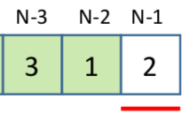
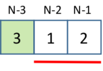

# \[Medium\] Decode Ways

## Question

[Decode Ways](https://leetcode.com/problems/decode-ways/)  
A message containing letters from `A-Z` is being encoded to numbers using the following mapping:

```text
'A' -> 1
'B' -> 2
...
'Z' -> 26
```

Given a **non-empty** string containing only digits, determine the total number of ways to decode it.

## Thought Process

根據原題意，要求 'total number of ways to decode it' （decode --&gt; 划分）， 因此用**划分型DP。**  
  
另外我們知道，A-Z 有26種對應方式，可以區分為`1-9` and `10-26`兩種不同類別。  
   
**&lt;方式1&gt; 1-9                                     &lt;方式2&gt; 10-26**  
    
1. **確定狀態**：  
    我們可以從**最後一個**環節開始拆分。因為最後也只有兩種可能 1--9 or 10--26，因此  
    **\(1\) 最後一步**：either 1--9 or 10--26    
    \(2\) **Subproblem**：`f[n-1]` or `f[n-1] + f[n-2]`  
    把DP設定為`f[i] = f[i-1] or f[i-1] + f[i-2]`     **`(when i > 1)`**  
  
2. **轉移方程**：  
    `f[i] = f[i-1] or f[i-1] + f[i-2]`     **`(when i > 1)`**  
3. **初始狀態和邊界條件**：  
                 init state: `f[0] = 1`  
      set boundaries: `i > 1` 時，才有繼續break into subproblem的可能。   
4. **計算順序**：  
     f\[0\], f\[1\], .... f\[len\(string\)\]  
     最後return f\[len\(string\)\]  



注意：\(1\)只有當 i  &gt; 1時，才有繼續break into subproblems的可能。  
            \(2\)因為s是string，因此如果在比的話是按ASCII Code順序比，需要轉成int\(\)。 


## Full Implementation

```python
def numDecodings(self, s: str) -> int:

    if not s:
        return 1 #看題意要求
        
    f = [0 for i in range(len(s) + 1)] #見一個長度為 len(s)+1 的數組紀錄
    
    f[0] = 1
    for i in range(len(s) + 1):
        
        # last digit condition f[i-1]
        last_digit = s[i-1]
        if int(last_digit) >= 1 and int(last_digit) <= 9:
            f[i] += f[i-1]
        
        # two digits or more
        # if remaining digits are still more than 1, 
        # then it means we can break it into subProblems again.
        if i > 1:
            # where s[i-2] + s[i-1] represents two digits ex: '23' 
            if int(s[i-2] + s[i-1]) >= 10 and int(s[i-2] + s[i-1]) <= 26:
                f[i] += f[i-2]
        
    return f[len(s)]
    

```

