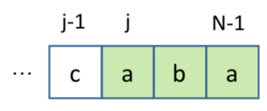
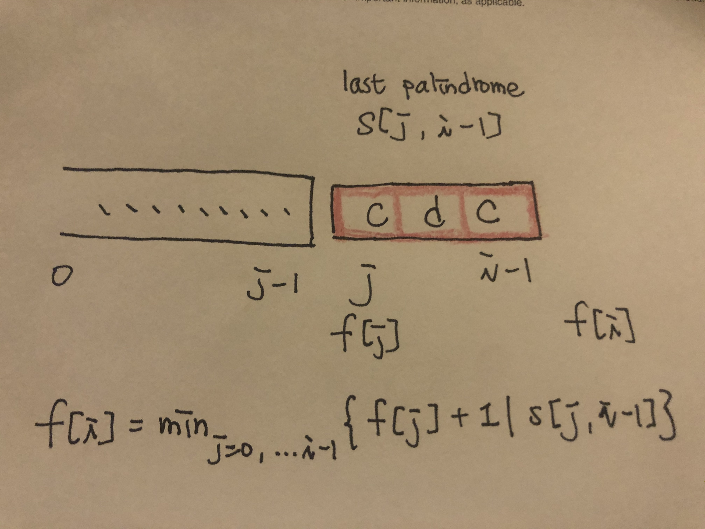

# \[Hard\] Palindrome Partitioning II

## Question

[Palindrome Partitioning II](https://leetcode.com/problems/palindrome-partitioning-ii/)  
Given a string _s_, partition _s_ such that every substring of the partition is a palindrome.  
Return the minimum cuts needed for a palindrome partitioning of _s_.

#### Example:

```text
Input: "aab"
Output: 1
Explanation: The palindrome partitioning ["aa","b"] 
could be produced using 1 cut.
```

## Thought Process

**定義狀態**  
\(1\)最後一步：最後一部分肯定是由palindrome組成  
\(2\)Subproblem：原來的palindrome partitioning II 問題，可以簡化為  
     "subproblem + last palindrome"  






**state:** `f[i]`，代表`前i個chars (s[0,...,i-1])`需要最少幾次的cut才能有palindrome。  
**function:** $$f[i] = min(f[j]+1 | s[j, i-1] )$$   
**initialize:** `f[i] = i-1 (where f[0] = -1)`  
**answer:** `f[len(s)]`

Time Complexity: O\( $$n^3$$ \)  
Space Complexity: O\( $$n$$ \)

#### 如何優化？ 可以用DFS + 剪枝來達到time complexity O\(n^2\)

## Full Implementation



```python

def minCut(self, s: str) -> int:

    if not s or len(s) == 0 or len(s) == 1:
        return 0
    
    f = [0 for i in range(len(s)+1)]
    f[0] = -1
    f[1] = 0
    
    for i in range(len(s)+1):
        f[i] = i-1     ### initial state.
        for j in range(i):
            if self.isPalindrome(s, j, i-1):
                f[i] = min(f[j]+1, f[i])
    
    return f[len(s)]

def isPalindrome(self, s, start, end):
    
    while start < end:
        if s[start] != s[end]:
            return False
        
         start += 1
         end -= 1
     return True 
```



