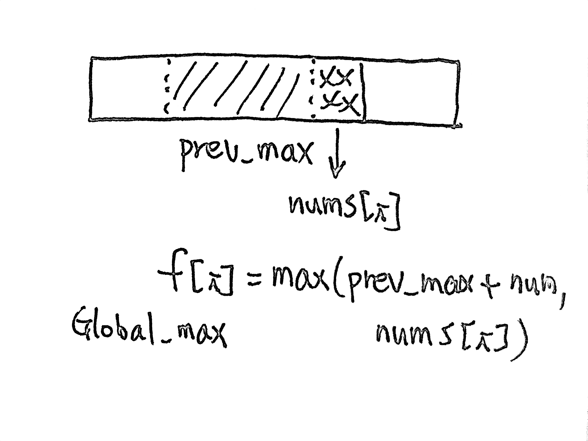

# \[Easy\] Maximum Subarray

[Maximum Subarray](https://leetcode.com/problems/maximum-subarray/)  
Given an integer array `nums`, find the contiguous subarray \(containing at least one number\) which has the largest sum and return its sum.

#### Example

```text
Input: [-2,1,-3,4,-1,2,1,-5,4],
Output: 6
Explanation: [4,-1,2,1] has the largest sum = 6.
```

#### Follow-up Question:

If you have figured out the O\(_n_\) solution, try coding another solution using the divide and conquer approach, which is more subtle.

## Thought Process

### 0. Brute Force

用for loop i & j，i代表頭, j代表尾，找`max(sum(nums[i:j]))`即可，但這Time complexity顯然不符合題目要求。Time Complexity: O\(n^2\), Space O\(n\)

### 1. DP \(Sequence DP\): O\(n\)/O\(n\)

根據題意“find the contiguous subarray which has the largest sum...”，我們可以知道是找最大/最小值的optimization problem，也就是可以用DP來解。  
由於用DP，我們就需要找subproblem。又題目說找最大值，我們可以用max\(a,b\)來比較上一個狀態，看哪一個符合。  
  
**Define the State:**  
\(1\)最後一步: `global_max = nums[i] + prev_max`  
\(2\)Subproblem: `max(nums[i] + prev_max, nums[i])` or `nums[i] + max(prev_max,0)`  
**Transfer Function:**  
 ``**`f[i] = max(nums[i] + f[i-1], nums[i])`** where i = 0, len\(nums\)-1  
**Init state and set Boundaries:**  
Init: f\[0\] = 0  
Boundaries: 0~len\(nums\)  
**Calculate Sequence and Answers:**  
f\[0\], f\[1\], ..., f\[len\(nums\)\]  
answer: `max(f)`



### 2. DP2 \(Optimize Space\): O\(n\)/O\(1\)

#### a.k.a. [Kadane's algorithm](https://en.wikipedia.org/wiki/Maximum_subarray_problem) 

由上一個解法我們可以發現，其實並不需要一整個f\[n\]，我們可以用兩個變量代替: 1. global\_max   
2. local\_max，並且用max\(a,b\)來比較它們。當找到更大的max的時候，就update變量。當然，transfer function還是一樣的，只是變成了global\_max & local\_max。  
Transfer Function: `local_max = max(local_max + nums[i], nums[i])`

> 注意：\(1\)初始值 `global_max = local_max = nums[0]` 為 init state f\[0\]，  
> \(2\)邊界條件 i 為 range\(1, len\(nums\)\)

### 3. Binary Search: O\(n\)/O\(n\)

依照follow up要求，如果要divide and conquer，那大概只有Binary Search可以用了。一般來說Binary Search可以讓Time Complexity: O\(logn\)，但是此題還是要遍歷一整個list，因此還是O\(n\)。  
[Binary Search 參考答案](https://leetcode.com/problems/maximum-subarray/discuss/20371/Java-Dynamic-Programming-or-Binary-Search)

### 4. Greedy: O\(n\)/O\(1\)

見下解。

## Code

#### 1.DP \(Sequence DP\)



```python
def maxSubArray(self, nums: List[int]) -> int:
    
    if not nums or len(nums) == 0:
        return 0
        
    f = [0 for i in range(len(nums))]
    
    for i in range(len(nums)):
        f[i] = max(f[i-1] + nums[i], nums[i]) # local_max = f[i]
        # or this way -> f[i] = f[i-1] + max(0, nums[i]) 
    
    return max(f) # global_max
    
```



#### 2. DP\(Space Optimized\)



```python
def maxSubArray(self, nums: List[int]) -> int:
    
    if not nums or len(nums) == 0:
        return 0
    
    #init state: nums[0]
    global_max = local_max = nums[0]
    
    # boundaries: range(1, len(nums))
    for i in range(1, len(nums)):
        local_max = max(local_max + nums[i], nums[i])
        global_max = max(global_max, local_max)
    
    return global_max
    
```



#### 3. Binary Search

#### 4. Greedy



```python
def maxSubArray(self, nums: List[int]) -> int:

    if not nums:
        return 0
    
    localMax = 0
    globalMax = float('-inf') # can't be 0, because max could possibly be 0.
    
    for num in nums:
        localMax = localMax + num
        globalMax = max(localMax, globalMax)
        localMax = max(0, localMax) 
        # why 0 on max(0, localMax)? 
        # because there's a chance localMax could be negative, 
        # there's no reason to add this number 'num', so to clear it up become 0.
    
    return globalMax

```



