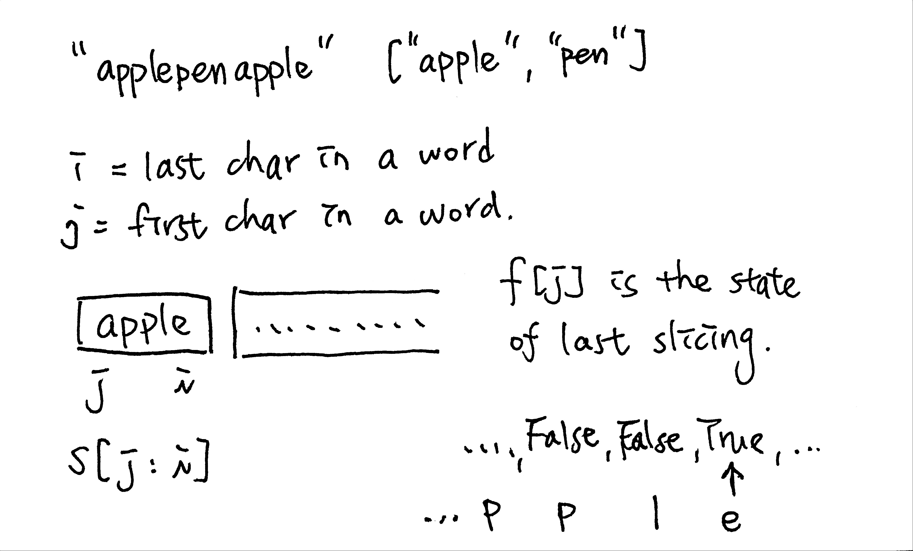

# \[Medium\] Word Break

[Word Break](https://leetcode.com/problems/word-break/)

> Given a **non-empty** string _s_ and a dictionary _wordDict_ containing a list of **non-empty** words, determine if _s_ can be segmented into a space-separated sequence of one or more dictionary words.
>
> **Note:**
>
> * The same word in the dictionary may be reused multiple times in the segmentation.
> * You may assume the dictionary does not contain duplicate words.

#### Example:

```text
Input: s = "applepenapple", wordDict = ["apple", "pen"]
Output: true
Explanation: Return true because "applepenapple" can be segmented as "apple pen apple".
             Note that you are allowed to reuse a dictionary word.
```

```text
Input: s = "catsandog", wordDict = ["cats", "dog", "sand", "and", "cat"]
Output: false
```

## Thought Process

根據題意，"determine if _s_ can be segmented into..." 代表找DP的可行性\(Yes/No\)，因此可以使用DP求解。

### \(1\) Brute Force DFS

用DFS枚舉所有可能性。意即，如果找到符合的word，就用**DFS** **Recursion** move on to the next one，直到所有的index都看過為止。  
  
**Brute Force DFS寫法：** 

```text
Define DFS
    (1)DFS Exit:
        start_i == len(s), 並返回True
        
    (2)Recursion Split: yes, no  (for word in wordDict)
        (3)Yes:  
            if start_i 在s的尾端，則continue。
        (4)No:
            if not s尾端，繼續尋找
            (5) 如果找到s[end:start] == word
                 則繼續用DFS判斷剩下的是否可以 (if self.DFS(start+len(word))
                 return True
     
     (6)找完所有可能但不能找到，return False
```

Time Complexity: O\(2^n\), such as s = "aaaaaaaaaaab", dict = {"a", "aa", "aaa", ...., "aaaaaaaaa"}  
Space Complexity: O\(n\), where n is the depth of the recursion  
  
會造成Time Limit Exceeded \(TLE\)

### \(2\) DP

此題為**Sequence DP**。  
既然用DP，則此問題可以化為subProblem，即`applepenapple` can be sliced into `apple/pen/apple`。這裡的subProblem就是：如何判斷在s裡面，當`apple`已在wordDict裡，接下來的`pen`是否也在wordDict裡，此時如何正確地slicing變得很重要。  


#### 1.Define the State:

**最後一步**：  
有別於其他的DP題，這題的最後一步是看 "是否能把s裡所有chars組合安全地slicing然後map到wordDict裡"，因此直接從頭開始slice。  
**SubProblem**：  
原來的找`applepenapple`是否在wordDict，則可化為`"apple + penapple"` 找`"penapple"`是否在wordDict。



#### 2. Transfer Function:

`f[i] = f[j] && s[j:i] in wordDict`  

#### 3. Init State and Set Boundaries:

Init State: `f[0] == True`  
Boundaries: `i = 1, ..., len(s)+1` and `j = maxLen-i, ..., i` where `j < i`

#### 4. Calculate Sequence:

f\[0\], f\[1\], ... f\[len\(s\)\]  
answer: `f[len(s)]` or `f[-1]`

**Time Complexity: O\(**$$n^2$$**\)**   
**Space Complexity: O\(** $$n$$ **\)**

#### 如何優化？

由於在for loop的時候有很多從0開始的重複計算，而這些可以省去，因為word不可能比任何一個在wordDict裡面最長的字還長，可以少掉一些計算。因此可以用`i - maxLen`來節省計算。

### \(3\) DP + 剪枝

利用`i-maxLen`來簡化計算。`maxLen = max([len(word) for word in wordDict])`

## Full Implementation

#### \(1\) Brute Force DFS



```python
def wordBreak(self, s: str, wordDict: List[str]) -> bool:
    
    if not s:
        return True
    if not wordDict:
        return False
    
    return self.dfs(0, s, wordDict)
    
# define recursion of dfs            
def dfs(self, start_i, s, wordDict):
    
    # recursion exit
    if start_i == len(s):
        return True
    
    # recursion split
    for word in wordDict:
        
        # no
        if start_i + len(word) > len(s):
            continue
        
        # yes
        end_i = start_i + len(word)
        if s[start_i:end_i] == word:
            # if s[start_i:end_i] is the word, 
            # then take it out (move start_i to start_i + len(word)) 
            # and check the next one to see if it satisfy.
            if self.dfs(start_i+len(word), s, wordDict) 
                return True
    
    # if start_i reaches the end of the index and still cannot find anything,
    # then return False 
    return False

```



#### \(2\) DP



```python
def wordBreak(self, s: str, wordDict: List[str]) -> bool:
    
    if not s:
        return True
    
    if not wordDict:
        return False
    
    f = [False for i in range(len(s)+1)]
    
    # init state to ensure for loop start from 1
    f[0] = True
    for i in range(1, len(s)+1):
        for j in range(0, i): #<-- room to improve
            
            # 1: f[j] == True represents previous word is in wordDict, 
            # so then the next word should start from there. 
            # 2: s[j:i] represents the current word whether it is in wordDict.
            # If both conditions are met, then mark f[i] to True.
            if f[j] and s[j:i] in wordDict:
                f[i] = True
                break
            
     return f[-1]
```



#### \(3\) DP + 剪枝



```python
def wordBreak(self, s: str, wordDict: List[str]) -> bool:
    
    if not s:
        return True
        
    if not wordDict:
        return False
        
    # find the longest word within wordDict.
    # why? Because we can skip the checking steps when iterating in j for loop. 
    # Those steps are longer than max length, which are not possible.
    maxLen = max([len(word) for word in wordDict(wordDict)])
    
    f = [False for i in range(len(s) + 1)]
    
    for i in range(1, len(s)+1):
        # "i - maxLen" can skip words are longer than maxLen
        for j in range(i-maxLen, i):
            
            if f[j] and s[j:i] in wordDict:
                f[i] = True
                break
    
    return f[-1]
```



