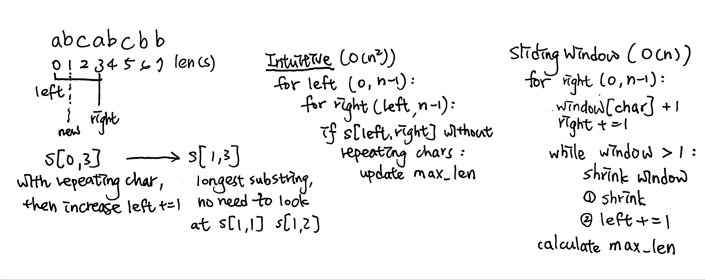

# \[Medium\] Longest Substring without Repeating Characters

[Longest Substring Without Repeating Characters](https://leetcode.com/problems/longest-substring-without-repeating-characters/)  
Given a string, find the length of the **longest substring** without repeating characters.

#### Example

```text
Input: "abcabcbb"
Output: 3 
Explanation: The answer is "abc", with the length of 3. 
```

## Thought Process

### 1. Two Pointers\(-&gt;/-&gt;\) + Hashset: O\(n^2\)/O\( $$\Sigma \ charset$$ \)

用兩個pointers i, j來比較`s[i:j]`裡面是否有repeating chars。如果在Hashset裡發現和`s[j]`相同的重複字母，則break結束比較；反之如果沒發現`s[j]`重複字母，則加入字母到Hashset裡並且update max length。

這裡`for i in range(0,len(s))，for j in range(i, len(s))`  


### 2. Sliding Window + Dictionary: O\(n\)/O\(dict size\)

由上面的Two Pointers 解法我們可以發現，如果已經看到目前max\_len of window，其實left pointer並不需要重複看right pointer已經走過的路，可以直接透過收縮window來跳過那些已經看過的值。

這裡的sliding window就是max\_len & 字母不重複的狀態。



Sliding Window 模板如下

```go
 // 滑動窗口核心四要素：
 1、右指針右移 
    2、根據題意收缩窗口 
    3、左指針右移更新窗口 
 4、根據題意計算结果
```


易錯點：  
1. 用dictionary來記錄char的出現次數，跟hashset不一樣（當然也可以用hashset作為window，就是用curr\_len & max\_len來update）  
2. 第二層window shrink的範圍是`window[char] > 1`  
3. 最後的calculate `max_len = max(right-left, max_len)`，這裡是**`right-left`**



## Code

#### 1. Two Pointers \(-&gt;/-&gt;\) + Hashset: O\(n^2\)/O\( $$\Sigma \ charset$$ \)



```python
def lengthOfLongestSubstring(self, s: str) -> int:

    if not s or len(s)<=1:
        return len(s)
    
    max_len = 0
    for i in range(0, len(s)):
        char_set = set()
        curr_len = 0
        for j in range(i, len(s)):
            if s[j] in char_set:
                curr_len = j-i
                break
            else:
                curr_len += 1
                char_set.add(s[j])
        max_len = max(curr_len, max_len)
    return max_len
```



#### 2. Sliding Window + dictionary: O\(n\)/O\(dict size\)

```python
#1.右指針右移
#   2.根據題意收縮window
#   3.左指針右移
#4.根據題意計算結果
def lengthOfLongestSubstring(self, s: str) -> int:

    if not s or len(s) <= 1:
        return len(s)
    
    window = {}
    left, right = 0, 0
    max_len = 1
    
    # right: 0 -> len(s)
    while right < len(s):
        
        char = s[right]
        # .get(char,0)+1 provides default value 0 if not exist. 
        window[char] = window.get(char,0)+1
        right += 1
        
        # sliding window shrink
        while window[char] > 1:
            
            del_char = s[left]
            window[del_char] -= 1
            left += 1
            
        # here we get max_len from 'right-left'
        max_len = max(max_len, right-left)
    
    return max_len
```

