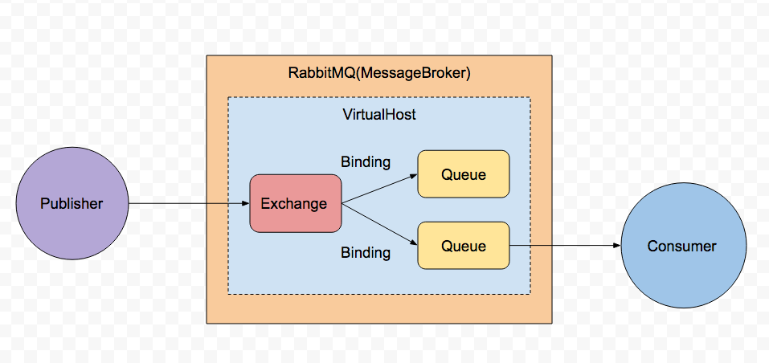
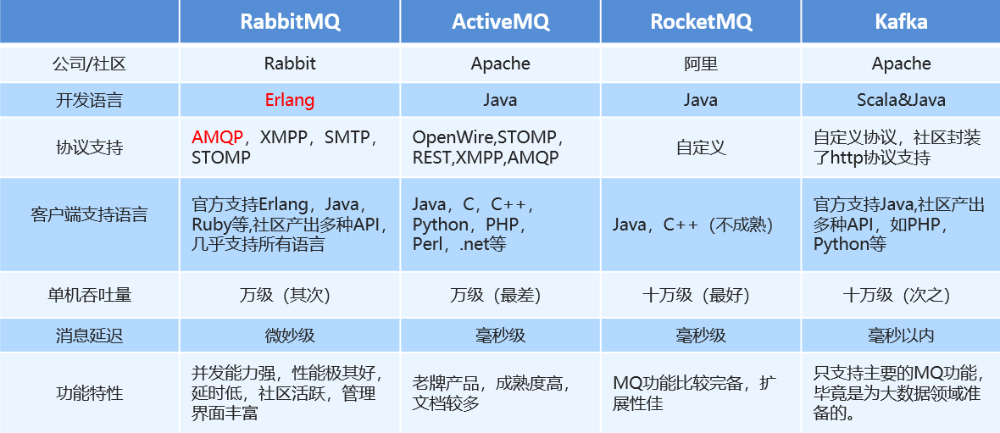

# RabbitMQ



RabbitMQ Offers 6 Different Modes

* Publish/Subscribe : One-to-many at once. \(Exchange & Queues\)
* Routing: Receives messages selectively \(routing key\)
* Topics: Receives messages based on a pattern
* 
