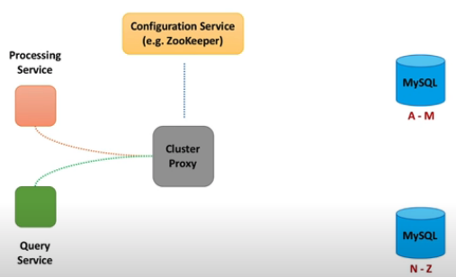

# System Design Notes

|  | sssss |
| :--- | :--- |

## System Design Interview - Step by Step Guide

<table>
  <thead>
    <tr>
      <th style="text-align:left">Recall</th>
      <th style="text-align:left">Notes</th>
    </tr>
  </thead>
  <tbody>
    <tr>
      <td style="text-align:left">
        
What is the most important

        
component for a successful
           system design interview?
           
           What should we focus on the most
           while preparing for one?

      </td>
      <td style="text-align:left">
        
===Chapter 1===

        <ul>
          <li>When interviewer gives you a Q:</li>
          <li>Then Ask Interviewers about 4 categories to
             get requirement clarifications.
             (1) Users/Customers
             (2) Scale (Read/Write)
             (3) Performance
             (4) Cost
             
          </li>
          <li>Why to things above?</li>
          <li>Get functional requirements &amp; non-functional requirements
             (1) <b>Functional Requirements (what system will do)</b>:
             system behavior, specific APIs,
             set of operations that system will support
             (2) <b>Non-Functional Requirements (what system is  supposed to be)</b>:
             system qualities, such as fast, fault-tolerant, secure
             
          </li>
          <li>
            
Functional Requirements - API
               Below are the steps to generalize APIs
               
               e.g. The system has to <code>count</code>  <em>video</em> view <b>events. </b>
            

            
--&gt; def <code>count</code>View<b>Event</b>(videoId):
               # get eventType such as &apos;view&apos;, &apos;like&apos;, &apos;share&apos;

            
--&gt; def <code>count</code><b>Event</b>(videoId, eventType):
               # sum all different functions such as &apos;count&apos;, &apos;sum&apos;,
              &apos;average&apos;
               --&gt; def process<b>Event</b>(videoId, eventType, function):
               # generalize events, APIs
               --&gt; def process<b>Event</b>s(listOfEvents)
               # each event is an object which contains info about video,
               type of the event, time of the event...
               
               e.g.2 Data Retrieval API
               The system has to return <em>video</em> views count for a time period.

            
--&gt; def getViewsCount(videoId, startTime, endTime)
               # video views -&gt; &apos;likes&apos;, &apos;dislikes&apos;, &apos;view&apos;
               --&gt; def getCount(videoId, eventType, startTime, endTime)
               # get stats and functions to the method
               --&gt; def getStats(videoId, eventType, function, startTime, endTime)
               
            

          </li>
          <li>
            
non-Functional Requirements

            
Interviewer Reply: Let&apos;s design xxx at <b>scale,  </b>let&apos;s
              try to make it as <b>fast</b> as possible.
               
               --&gt; then we use CAP theorem
               CAP theorem tells me we can&apos;t have <b>C</b>onsistency, <b>A</b>vailability,
               <b>P</b>erformance/Partition Tolerance all at once. Then I&apos;ll
               choose availability over consistency.
               * <b>Scalable</b> (tens of thousands of video views per sec)
               * <b>High Performant</b> (few tens of milliseconds to return
               total views count for a video)
               * <b>Highly Available</b> (survives hardware/network failures,
               no single point of failure)
               * Consistency
               * Cost (hardware, development, maintenance)
               
            

          </li>
        </ul>
      </td>
    </tr>
    <tr>
      <td style="text-align:left"></td>
      <td style="text-align:left">
        
===Chapter 2 Drive the Conversation: What to Store===

        

        <ul>
          <li>starts with...</li>
          <li><b>Data</b>
             -&gt; We need to think what data we want to store and how
             -&gt; We need to define data model</li>
          <li>
            
What do we <b>store</b>?

            <table>
              <thead>
                <tr>
                  <th style="text-align:left">Individual Events</th>
                  <th style="text-align:left">vs</th>
                  <th style="text-align:left">Aggregate Data (Batch Events)</th>
                </tr>
              </thead>
              <tbody>
                <tr>
                  <td style="text-align:left">Store <b>Raw Events</b>
                  </td>
                  <td style="text-align:left">Func</td>
                  <td style="text-align:left"><b>Aggregate</b> data in real-time</td>
                </tr>
                <tr>
                  <td style="text-align:left"><b>Stream</b> Data Processing</td>
                  <td style="text-align:left"></td>
                  <td style="text-align:left"><b>Batch</b> Data Processing</td>
                </tr>
                <tr>
                  <td style="text-align:left">
                    
*fast <b>writes</b>
                    

                    
*can slice however we need

                    
*can recalculate numbers if needed

                  </td>
                  <td style="text-align:left">Pros</td>
                  <td style="text-align:left">
                    
*fast <b>reads</b>
                    

                    
*data is ready for decision making

                  </td>
                </tr>
                <tr>
                  <td style="text-align:left">
                    
*slow reads

                    
*<b>Costly </b>for large scale

                    
(many events to be stored)

                  </td>
                  <td style="text-align:left">Cons</td>
                  <td style="text-align:left">
                    
*can <b>only query</b> the way it was <b>aggregated</b>
                    

                    
*<b>requires</b>  <b>data aggregation</b> pipeline (Hard!)

                    
*hard or even impossible to
                       fix errors

                  </td>
                </tr>
              </tbody>
            </table>
          </li>
          <li>Then ask interviewer <b>expected delay.  Time between when event happened &lt;--&gt; when event was processed  </b>(1)<b> </b>if
            expected delay is<b> less than several mins  </b>--&gt; aggregate
            data on the fly<b> </b>(2) if expected delay is<b> okay for several hours   </b>--&gt;
            store raw events and process them in the background
             (3) <b>combine both</b> approach, store raw events and batch process data
             --&gt; Flexibility up
             --&gt; <b>Raw Data:</b> store only several days/weeks raw data + purge old
            data
              <b>Batch Data</b>: store aggregated data (view counts) in real-time
             --&gt; Costly, expensive</li>
        </ul>
      </td>
    </tr>
    <tr>
      <td style="text-align:left"></td>
      <td style="text-align:left">
        
===Chapter 3 === Database

        

        <ul>
          <li>Can you give me a specific DB name? Explain your choice.</li>
          <li>Both SQL and NoSQL DB can scale and perform well, let me evaluate both
            types.</li>
          <li>Ask questions below</li>
          <li>
            

            <table>
              <thead>
                <tr>
                  <th style="text-align:left">
                    <ul>
                      <li>How to scale writes?</li>
                      <li>How to scale reads?</li>
                      <li>How to make both writes and reads fast?</li>
                      <li>How not losing data in case of hardware faults and network partitions?</li>
                      <li>How to recover data in case of an outage?</li>
                      <li>How to ensure data security?</li>
                      <li>How to make it extensible for data model changes in the future?</li>
                    </ul>
                  </th>
                </tr>
              </thead>
              <tbody></tbody>
            </table>
            <table>
              <thead>
                <tr>
                  <th style="text-align:left"></th>
                </tr>
              </thead>
              <tbody></tbody>
            </table>
          </li>
          <li>============================================
             How SQL handle these requirements--- Step by Step</li>
        </ul>
        
<b><code>@@@@ Scalability and Performance @@@@</code></b>
        

        <ul>
          <li>How to reduce the load on a single SQL machine?</li>
          <li><b>(1)</b>  <b>Add</b>  <b>Sharding DB</b> (several SQL DBs work together)</li>
        </ul>
        

        <ul>
          <li>How to route the traffic better?</li>
          <li><b>(2) Add Cluster Proxy</b> (a proxy machine and route traffic to correct
            shard)
             
             
            
             
          </li>
          <li>How do we make cluster proxy be aware of newly added DB?</li>
          <li><b>(3)</b>  <b>Add Configuration Service </b>(to maintain health check)
             -&gt; config service maintains a health check connection to all shards)
             -&gt; config service always know which DB is available
             
             
            
             
          </li>
          <li>Instead of calling shard DB instance directly, we add shard proxy
             (4) <b>Add Shard Proxy</b> (a DB helper to add more useful functions)
             --&gt; 1. shard proxy can cache query results
             --&gt; 2. monitor DB instance health
             --&gt; 3. publish metrics
             --&gt; 4. terminate query that takes too long</li>
        </ul>
        

          
           
           
           <b><code>@@@@ Availability @@@@</code></b>
        

        <ul>
          <li>What if DB shard died?</li>
          <li>How to ensure data is not lost?
             
          </li>
          <li>(5) Add Replicas between different data center
             --&gt; [<b>Write]</b> when the cluster proxy sends data to a shard(DB),
             --&gt; data is sync or async replicated to corresponding read replica.
             --&gt; <b>[Read]</b> when the cluster proxy retrieve data from a shard,
             --&gt; data will be retrieved either from master or read replica.
             
            
             
          </li>
          <li>e.g. Youtube built a DB solution to scale and manage large clusters
             of MySQL instance, called Vitess.
             
             
          </li>
          <li>=============================================</li>
          <li>How NoSQL handle these requirements --- Step by Step</li>
        </ul>
        

           <b><code>@@@@ Scalability and Performance @@@@</code></b>
        

        <ul>
          <li>Split data into chunks, we call it <b>nodes (= shards in SQL)</b>
          </li>
          <li><b> </b>
             
             
          </li>
        </ul>
        
<b>&lt;code&gt;&lt;/code&gt;</b>
        

        
ssss

      </td>
    </tr>
    <tr>
      <td style="text-align:left"></td>
      <td style="text-align:left"></td>
    </tr>
  </tbody>
</table>

* * aaa

