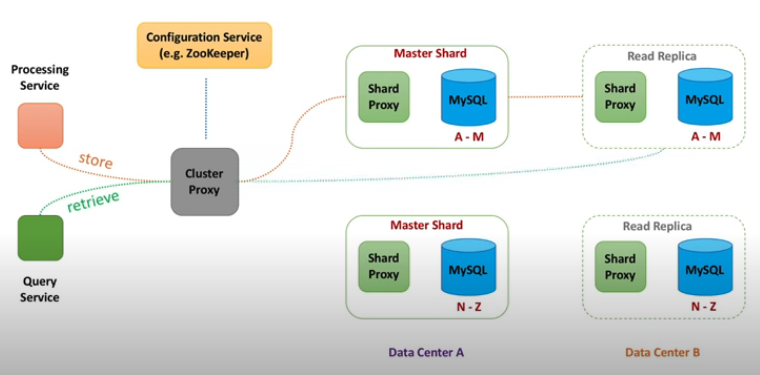
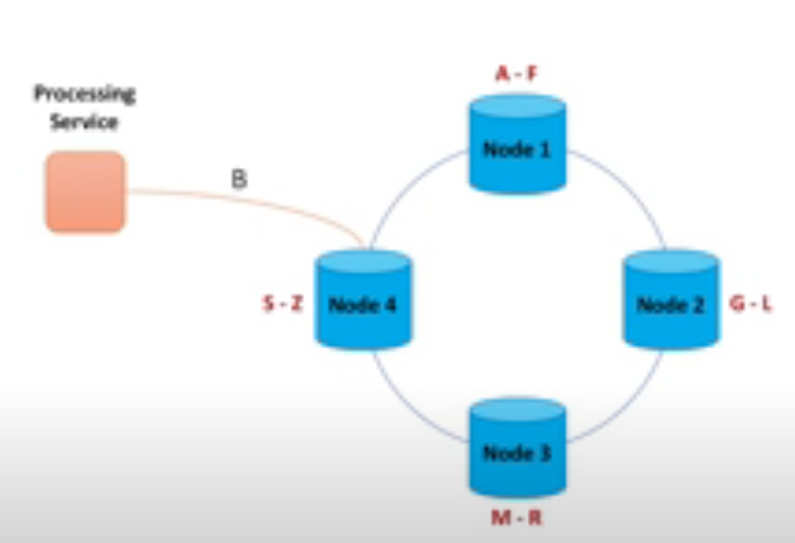
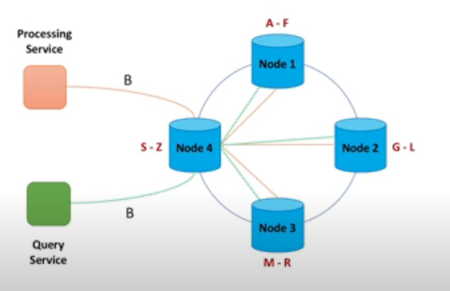
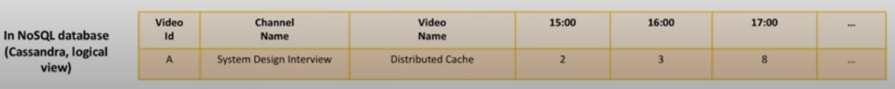
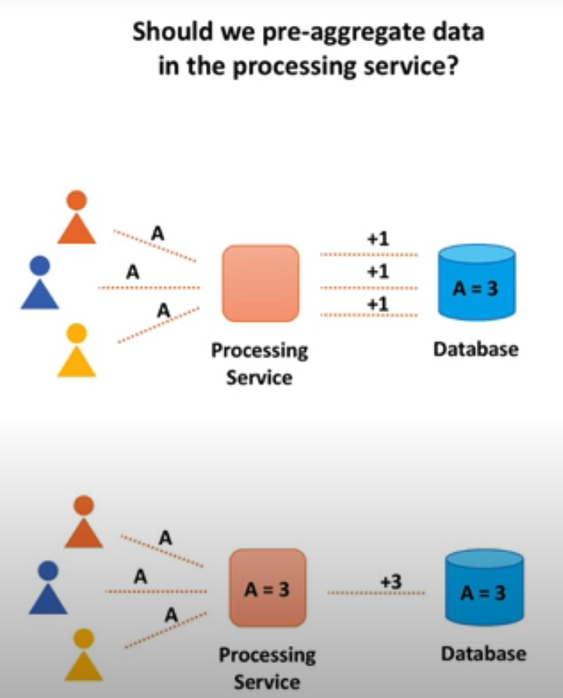

# System Design Notes

## s

## System Design Interview - Step by Step Guide

<table>
  <thead>
    <tr>
      <th style="text-align:left">Recall</th>
      <th style="text-align:left">Notes</th>
    </tr>
  </thead>
  <tbody>
    <tr>
      <td style="text-align:left">
        
What is the most important

        
component for a successful
           system design interview?
           
           What should we focus on the most
           while preparing for one?

      </td>
      <td style="text-align:left">
        
===Chapter 1===

        <ul>
          <li>When a interviewer gives you a Q:</li>
          <li>Then Ask Interviewers about 4 categories to
             get requirement clarifications.
             (1) Users/Customers
             (2) Scale (Read/Write)
             (3) Performance
             (4) Cost
             
          </li>
          <li>Why to things above?</li>
          <li>Get functional requirements &amp; non-functional requirements
             (1) <b>Functional Requirements (what system will do)</b>:
             system behavior, specific APIs,
             set of operations that system will support
             (2) <b>Non-Functional Requirements (what system is  supposed to be)</b>:
             system qualities, such as fast, fault-tolerant, secure
             
          </li>
          <li>
            
Functional Requirements - API
               Below are the steps to generalize APIs
               
               e.g. The system has to <code>count</code>  <em>video</em> view <b>events. </b>
            

            
--&gt; def <code>count</code>View<b>Event</b>(videoId):
               # get eventType such as &apos;view&apos;, &apos;like&apos;, &apos;share&apos;

            
--&gt; def <code>count</code><b>Event</b>(videoId, eventType):
               # sum all different functions such as &apos;count&apos;, &apos;sum&apos;,
              &apos;average&apos;
               --&gt; def process<b>Event</b>(videoId, eventType, function):
               # generalize events, APIs
               --&gt; def process<b>Event</b>s(listOfEvents)
               # each event is an object which contains info about video,
               type of the event, time of the event...
               
               e.g.2 Data Retrieval API
               The system has to return <em>video</em> views count for a time period.

            
--&gt; def getViewsCount(videoId, startTime, endTime)
               # video views -&gt; &apos;likes&apos;, &apos;dislikes&apos;, &apos;view&apos;
               --&gt; def getCount(videoId, eventType, startTime, endTime)
               # get stats and functions to the method
               --&gt; def getStats(videoId, eventType, function, startTime, endTime)
               
            

          </li>
          <li>
            
non-Functional Requirements

            
Interviewer Reply: Let&apos;s design xxx at <b>scale,  </b>let&apos;s
              try to make it as <b>fast</b> as possible.
               
               --&gt; then we use CAP theorem
               CAP theorem tells me we can&apos;t have <b>C</b>onsistency, <b>A</b>vailability,
               <b>P</b>erformance/Partition Tolerance all at once. Then I&apos;ll
               choose availability over consistency.
               * <b>Scalable</b> (tens of thousands of video views per sec)
               * <b>High Performant</b> (few tens of milliseconds to return
               total views count for a video)
               * <b>Highly Available</b> (survives hardware/network failures,
               no single point of failure)
               * Consistency
               * Cost (hardware, development, maintenance)
               
            

          </li>
        </ul>
      </td>
    </tr>
    <tr>
      <td style="text-align:left"></td>
      <td style="text-align:left">
        
===Chapter 2 Drive the Conversation: What to Store===

        

        <ul>
          <li>starts with...</li>
          <li><b>Data</b>
             -&gt; We need to think what data we want to store and how
             -&gt; We need to define data model</li>
          <li>
            
What do we <b>store</b>?

            <table>
              <thead>
                <tr>
                  <th style="text-align:left">Individual Events</th>
                  <th style="text-align:left">vs</th>
                  <th style="text-align:left">Aggregate Data (Batch Events)</th>
                </tr>
              </thead>
              <tbody>
                <tr>
                  <td style="text-align:left">Store <b>Raw Events</b>
                  </td>
                  <td style="text-align:left">Func</td>
                  <td style="text-align:left"><b>Aggregate</b> data in real-time</td>
                </tr>
                <tr>
                  <td style="text-align:left"><b>Stream</b> Data Processing</td>
                  <td style="text-align:left"></td>
                  <td style="text-align:left"><b>Batch</b> Data Processing</td>
                </tr>
                <tr>
                  <td style="text-align:left">
                    
*fast <b>writes</b>
                    

                    
*can slice however we need

                    
*can recalculate numbers if needed

                  </td>
                  <td style="text-align:left">Pros</td>
                  <td style="text-align:left">
                    
*fast <b>reads</b>
                    

                    
*data is ready for decision making

                  </td>
                </tr>
                <tr>
                  <td style="text-align:left">
                    
*slow reads

                    
*<b>Costly </b>for large scale

                    
(many events to be stored)

                  </td>
                  <td style="text-align:left">Cons</td>
                  <td style="text-align:left">
                    
*can <b>only query</b> the way it was <b>aggregated</b>
                    

                    
*<b>requires</b>  <b>data aggregation</b> pipeline (Hard!)

                    
*hard or even impossible to
                       fix errors

                  </td>
                </tr>
              </tbody>
            </table>
          </li>
          <li>Then ask interviewer <b>expected delay.  Time between when event happened &lt;--&gt; when event was processed  </b>(1)<b> </b>if
            expected delay is<b> less than several mins  </b>--&gt; aggregate
            data on the fly<b> </b>(2) if expected delay is<b> okay for several hours   </b>--&gt;
            store raw events and process them in the background
             (3) <b>combine both</b> approach, store raw events and batch process data
             --&gt; Flexibility up
             --&gt; <b>Raw Data:</b> store only several days/weeks raw data + purge old
            data
              <b>Batch Data</b>: store aggregated data (view counts) in real-time
             --&gt; Costly, expensive</li>
        </ul>
      </td>
    </tr>
    <tr>
      <td style="text-align:left"></td>
      <td style="text-align:left">
        
===Chapter 3 === Database

        

        <ul>
          <li>Can you give me a specific DB name? Explain your choice.</li>
          <li>Both SQL and NoSQL DB can scale and perform well, let me evaluate both
            types.</li>
          <li>Ask questions below</li>
          <li>
            

            <table>
              <thead>
                <tr>
                  <th style="text-align:left">
                    <ul>
                      <li>How to scale writes?</li>
                      <li>How to scale reads?</li>
                      <li>How to make both writes and reads fast?</li>
                      <li>How not losing data in case of hardware faults and network partitions?</li>
                      <li>How to recover data in case of an outage?</li>
                      <li>How to ensure data security?</li>
                      <li>How to make it extensible for data model changes in the future?</li>
                    </ul>
                  </th>
                </tr>
              </thead>
              <tbody></tbody>
            </table>
            <table>
              <thead>
                <tr>
                  <th style="text-align:left"></th>
                </tr>
              </thead>
              <tbody></tbody>
            </table>
          </li>
          <li>============================================
             How SQL handle these requirements--- Step by Step</li>
        </ul>
        
<b><code>@@@@ Scalability and Performance @@@@</code></b>
        

        <ul>
          <li>How to reduce the load on a single SQL machine?</li>
          <li><b>(1)</b>  <b>Add</b>  <b>Sharding DB</b> (several SQL DBs work together)</li>
        </ul>
        

        <ul>
          <li>How to route the traffic better?</li>
          <li><b>(2) Add Cluster Proxy</b> (a proxy machine and route traffic to correct
            shard)</li>
          <li>Cluster proxy is the only one who knew about all shards info.
             
             
            
             
          </li>
          <li>How do we make cluster proxy be aware of newly added DB?</li>
          <li><b>(3)</b>  <b>Add Configuration Service </b>(to maintain health check)
             -&gt; config service maintains a health check connection to all shards)
             -&gt; config service always know which DB is available
             
             
            
             
          </li>
          <li>Instead of calling shard DB instance directly, we add shard proxy
             (4) <b>Add Shard Proxy</b> (a DB helper to add more useful functions)
             --&gt; 1. shard proxy can cache query results
             --&gt; 2. monitor DB instance health
             --&gt; 3. publish metrics
             --&gt; 4. terminate query that takes too long</li>
        </ul>
        

          
           
           
           <b><code>@@@@ Availability @@@@</code></b>
        

        <ul>
          <li>What if DB shard died?</li>
          <li>How to ensure data is not lost?
             
          </li>
          <li>(5) Add Replicas between different data center
             --&gt; [<b>Write]</b> when the cluster proxy sends data to a shard(DB),
             --&gt; data is sync or async replicated to corresponding read replica.
             --&gt; <b>[Read]</b> when the cluster proxy retrieve data from a shard,
             --&gt; data will be retrieved either from master or read replica.
             
            
             
          </li>
          <li>e.g. Youtube built a DB solution to scale and manage large clusters
             of MySQL instance, called Vitess.
             
             
          </li>
          <li>=============================================</li>
          <li>How NoSQL handle these requirements --- Step by Step</li>
          <li>NoSQL DB (Cassandra)</li>
        </ul>
        

           <b><code>@@@@ Scalability and Performance @@@@</code></b>
        

        <ul>
          <li>Split data into chunks, we call it <b>nodes (= shards in SQL)</b>
          </li>
          <li>We don&apos;t need config service to manage each node, instead, we
             let nodes talk to each other and exchange information about
             their state.</li>
          <li>Every sec node exchanges information with a few other nodes
             (less than 3). State information about every node propagates
             throughout the cluster -- <b>gossip protocol</b>.
             This way, we also don&apos;t need cluster proxy anymore.</li>
        </ul>
        
<b> </b>
          
        

        <ul>
          <li>NoSQL Routing Process</li>
          <li>e.g. Processing service is asking us to store views count B, then
             Node4 has been selected. Node4 served as the coordinator node.
             which node do we store this view count B?
             (1) Round Robin Algorithm
             (2) Consistent Hashing Algorithm: choose a node that
             is closest to the client
             
          </li>
          <li><b>###Consistent Hashing###</b>
          </li>
          <li><b>Data Replication Using Quorum(&#x6CD5;&#x5B9A;&#x4EBA;&#x6578;)</b>
          </li>
          <li>Why? Because synchronous data replication is slow. We usually
             replicate data asynchronously. <b>    </b>
          </li>
          <li><b>Quorum Writes: </b>sends a &apos;successful&apos; message while 2 out
            of 3
             (not all) of replicas are successfully stored.<b>  </b>A coordinator
            node (node4) calls multiple nodes
             to replicate data, to store multiple copies(3 copies) of data.
             However, waiting for all (3 responses) from replicas maybe
             too slow, we can send a &apos;successful&apos; message once some
             (2 requests) succeeded.</li>
        </ul>
        
<b> </b>
          
        

        <ul>
          <li><b>Quorum Read</b>: read quorum defines a minimum number of nodes
             that have to agree on the response.</li>
          <li>Cassandra uses version number technique to determine the staleness of
            data.<b>  </b>
          </li>
          <li>For non-functional requirements, in this case, we choose
             <b>Availability over Consistency </b>--&gt; We prefer to show stale
            data over no data at all.</li>
          <li>For the case of <b>Leader-Follower replication</b>, some read replicas
             may be behind their master.
             --&gt; Different user would see <em>different view count</em> for a video.
             --&gt; But this is temporary, this situation will be resolved over time.
             --&gt; we call it <b>Eventual Consistency. </b>--&gt; Cassandra -
            tunable consistency
             
             
          </li>
          <li>======How to Store Data=======</li>
          <li><b>relational database, SQL</b>
             How do we store data in relational DB?
             First, we need to design Data Model, with the following steps</li>
          <li>
            

              
            

            <table>
              <thead>
                <tr>
                  <th style="text-align:left">
                    <ul>
                      <li>
                        
relational DB start with Nouns

                        
1) <b>Define Nouns</b>: we start with nouns in the system<b> </b>
                           2) <b>Convert Nouns to Tables</b>:
                           3) <b>Use Foreign Keys to reference related data</b>:
                           4) Normalization: to m<b>inimize data duplication across different tables  </b>e.g.
                          only store video name in video info table.
                           To minimize changes across different tables -&gt; cuz
                           inconsistent data is possible.
                           5)

                      </li>
                    </ul>
                  </th>
                </tr>
              </thead>
              <tbody></tbody>
            </table>
          </li>
          <li><b>NoSQL</b>
             How do we store data in NoSQL DB?</li>
          <li>NoSQL starts with <b>Queries</b>
          </li>
        </ul>
        

          
        

        <ul>
          <li>There are 4 types of NoSQL DB:
             (1) Column
             (2) Document
             (3) Key-Value
             (4) Graph
             
          </li>
          <li><b>About Cassandra DB</b>
          </li>
          <li>Cassandra DB&apos;s benefit:
             * fault-tolerant
             * scalable (both read and write throughput increases linearly as new
             * machine is added)
             * supports multi-datacenter replication
             * works well with time-series data</li>
          <li>Cassandra is <b>Column DB</b> that supports asynchronous
             masterless replication.
             
          </li>
          <li><b>About HBase</b>
          </li>
          <li>HBase is Column DB, similar to Cassandra, but it has a master-based
             architecture
             
          </li>
          <li><b>About MongoDB</b>
          </li>
          <li>MongoDB is <b>Documented-oriented DB</b>, uses leader-based replication
             
          </li>
        </ul>
        
ssss

      </td>
    </tr>
    <tr>
      <td style="text-align:left"></td>
      <td style="text-align:left">
        
==== Chapter 4 ==== Data Processing

        

        <ul>
          <li>starts with... requirements</li>
          <li>Requirements
             1) we want to scale the processing service to scale together when
             the video views increase. &lt;-- scalable
             2) we want to process events quickly. &lt;-- performance/fast
             3) we don&apos;t want to lose data &lt;-- availability/reliable
             
          </li>
          <li>The above questions turn into statements below:</li>
          <li>How to <b>scale</b>?</li>
          <li>How to achieve <b>high throughput</b>?</li>
          <li>How to <b>not losing data</b> when processing node crashes?</li>
          <li>What to do when DB is <b>unavailable</b> or slow?
             --&gt; How to make data processing <b>scalable, fast, and reliable?</b>
          </li>
        </ul>
        
&lt;b&gt;&lt;/b&gt;

        <ul>
          <li><b>Scalable == partitioning</b>
          </li>
          <li><b>Fast == in-memory &amp; minimize disk reads</b>
          </li>
          <li><b>Reliable == Replication and checkpointing</b>
          </li>
        </ul>
        
<b> %%%% Data Aggregation Basics %%%%</b>
        

        
<code>@@@ </code><b><code>Should we aggregate data first?</code></b><code> @@@</code>
        

        <ul>
          <li><b> </b>
            
          </li>
          <li>1st option, increment counter by 1 when an event comes (+1 +1 +1)</li>
          <li>2nd option, accumulate data in the processing service memory for
             several seconds. And add accumulated value to the DB counter. (+3)</li>
        </ul>
        
<code>@@@ </code><b><code>Push or Pull?</code></b><code> @@@</code>
        

        <ul>
          <li><b>Push &amp; Pull &#x600E;&#x9EBC;&#x770B;&#xFF1F; &#x90FD;&#x662F;&#x4EE5;Processing Service&#x70BA;&#x57FA;&#x6E96;&#xFF0C;either push&#x5230;PS&#xFF0C; &#x6216;&#x662F;pull&#x56DE;PS   </b>
            
          </li>
          <li><b>Push</b>: some other service sends events synchronously to the
             processing service
             
             [serviceA] -- event --&gt; [processing service]
             
          </li>
          <li><b>[v] Pull</b>: the processing service pulls events from some temp storage.
             
             []
             
          </li>
          <li><b>Pull option has more advantages</b>, as it provides a better fault
             tolerance support and easier to scale.
             
             Why? Because if processing service crashes, we still have events in
             the storage and can re-process them.
             
             
          </li>
          <li>How data aggregation happens during event processing?</li>
          <li>Checkpointing &amp; Partitioning</li>
        </ul>
        

          
        

        <ul>
          <li><b>++ Checkpointing ++</b>
          </li>
          <li>Checkpointing is a technique to <b>add fault-tolerance into the system</b>.
             It consists of saving a snapshot of the application&apos;s state, so it
            can
             restart at the point where it failed. It happens in the queue.</li>
          <li>After we processed several events and successfully stored them in
             the DB, we write checkpoint to some persistent storage.
             If processing service machine fails, it will be replaced with another
             one and this new machine will resume processing where the failed
             machine left off. (key in stream data processing)
             
          </li>
          <li><b>++ partitioning ++</b>
          </li>
          <li>Partitioning also happens in the queue.</li>
          <li>Each queue is independent from the others. Every queue physically
             lives on its own machine and stores a subset of all events
             (AA / BBB / C)
             We compute a hash based on video identifier and use this hash number to
            pick a queue.</li>
          <li>Partitioning allows us to <b>parallelize events processing</b>. More events
             we get, more partitions we create.</li>
        </ul>
        

        

          
        

        
@@@ Processing Service (Detailed Design) @@@

        <ul>
          <li><b>Partition Consumer + De-duplication Cache</b>:
             * <b>Partition Consumer</b>: we need a component to read events.
             from byte array and turn it to actual object.
             Here we <b>prefer single thread</b> to read data. Otherwise, if we use
             multi-threaded, checkpointing will be much harder to ensure order.
             * <b>De-duplication Cache</b>: to <b>avoid double counting</b>. Messages
            that
             get send to partition/shard could have duplicates. Meaning same
             message could be sent multiple times. Then we need de-duplication
             cache.
             This distributed cache <b>stores unique event identifiers</b>(uniq event
            id)
             for last 10 mins. Then if several identical messages arrived within
             10 mins interval, only one of them(first one) would be processed.
             
             
          </li>
          <li><b>Aggregator + In-memory Store</b>:
             * Aggregator: It does in-memory counting/</li>
          <li><b>Internal Queue</b>: s</li>
          <li><b>Database Writer + Embedded DB + Dead-Letter Queue</b>: ss</li>
          <li>State Store:</li>
        </ul>
        

           
        

        
&lt;b&gt;&lt;/b&gt;

        

      </td>
    </tr>
    <tr>
      <td style="text-align:left"></td>
      <td style="text-align:left"></td>
    </tr>
  </tbody>
</table>

## Ch5 

* * aaa
* 
