# System Design Notes

## Data Flow Simulation  

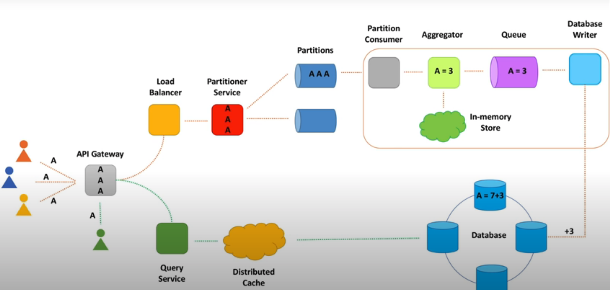

#### Design Diagram Examples

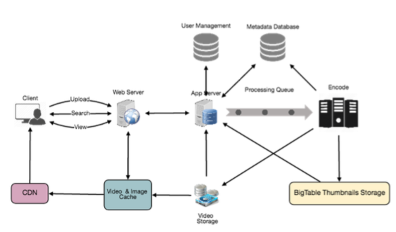

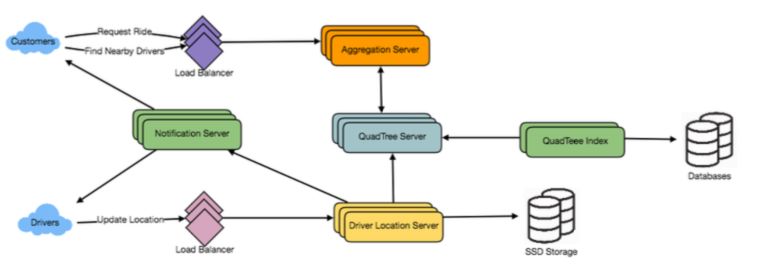

#### Cornell Note Taking Technique

<table>
  <thead>
    <tr>
      <th style="text-align:left">Cues/Recall</th>
      <th style="text-align:left">Cornell Notes Date</th>
    </tr>
  </thead>
  <tbody>
    <tr>
      <td style="text-align:left">
        <p>Keywords</p>
        <p>Questions</p>
      </td>
      <td style="text-align:left">
        <p>quick notes</p>
        <p>key thoughts and takeaways</p>
        <p>from lecture</p>
      </td>
    </tr>
    <tr>
      <td style="text-align:left"></td>
      <td style="text-align:left">Summary</td>
    </tr>
  </tbody>
</table>

## System Design Interview - Step by Step Guide

The following steps are needed to run through the system design interview

* STEP1.  **Requirements Gathering -** user/scale/performance/cost
* STEP2.  **Define System Interface** - Define what APIs are expected
* STEP3.  **Estimate Scale** - Using CAP Theorem. Then focusing on scaling, partitioning, load balancing, and caching
* STEP4.  **Define Data Model** - def data model helps us to clarify data flow between different of the system
* STEP5.  **High Level Design** - draw components diagram
* STEP6.  **Detailed Level Design** - get interviewer's feedback and check which part of the system needs to explain further
* STEP7.  **Identifying and Resolving Bottlenecks** - once identified, then we can discuss how to mitigate the bottlenecks


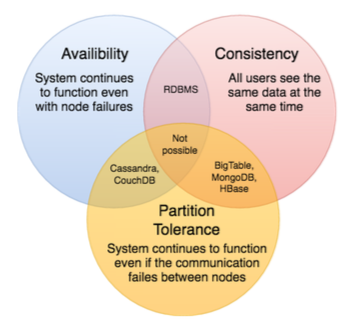

## === Prerequisite, Basic Components ===

Here are the basic components of a system.

User --&gt; Web Proxy --&gt; Web Server --&gt; Application Server --&gt; Database Server

Application Server 跟 Web Server 的差異又為何呢？

* _**Web Server**_：如 Nginx、Apache，只能拿來處理靜態資源，負載平衡、代理，所謂動態的資源，是指會把需求轉發到程式語言起的 Application Server，由Application Server 處理完後，再丟 response 回去，由 Web Server 進行回應，最後才回到 Client 端。
* _**Application Server**_：就是可以用程式語言建立出的 Server，且可以靜態跟動態解析。

## === Ch1 Reqiurements Gathering  === 

In Requirements Gathering Stage, there will be three important pieces to be covered:  
\(1\) Get Requirements Clarifications  
\(2\) Functional Requirements  
\(3\) Non-Functional Requirements

* When an interviewer gives you a Q:
* Then ask interviewers about 4 categories to get requirement clarifications. **\(1\) Users/Customers \(2\) Scale \(Read/Write\) \(3\) Performance \(4\) Cost** 
* Why do things above?
* Get functional requirements & non-functional requirements \(1\) **Functional Requirements \(what system will do\)**:  system behavior, specific APIs,  set of operations that system will support \(2\) **Non-Functional Requirements \(what quality of this system is  supposed to be\)**:  system qualities, such as fast, fault-tolerant, secure 

### 1. Functional Requirements - API Design

* **Functional Requirements - API**  
  Below are the steps to generalize APIs  
  
  e.g. The system has to `count` _video_ view **events.** 

  --&gt; def `count`View**Event**\(videoId\):  
       \# get eventType such as 'view', 'like', 'share'

  --&gt; def  `count`**Event**\(videoId, eventType\):   
       \# sum all different functions such as 'count', 'sum', 'average'  
  --&gt; def process**Event**\(videoId, eventType, function\):  
       \# generalize events, APIs  
  --&gt; def process**Event**s\(listOfEvents\)   
       \# each event is an object which contains info about video,   
           type of the event, time of the event...   
  
  e.g.2 Data Retrieval API   
  The system has to return _video_ views count for a time period.

  --&gt; def getViewsCount\(videoId, startTime, endTime\)  
  \# video views -&gt; 'likes', 'dislikes', 'view'  
  --&gt; def getCount\(videoId, eventType, startTime, endTime\)  
  \# get stats and functions to the method  
  --&gt; def getStats\(videoId, eventType, function, startTime, endTime\)

### 2. Non-Functional Requirements - CAP Theorem

* **Non-Functional Requirements**

  Interviewer Reply: Let's design xxx at **scale,**   
  let's try to make it as **fast** as possible.  
  
  --&gt; then we use CAP theorem  
  CAP theorem tells me we can't have **C**onsistency, **A**vailability, **P**erformance/Partition Tolerance all at once.   
  Then I'll choose availability over consistency.   
  \* **Scalable** \(tens of thousands of video views per sec\)  
  \* **High Performant** \(few tens of milliseconds to return  
  total views count for a video\)  
  \* **Highly Available** \(survives hardware/network failures,   
  no single point of failure\)  
  \* Consistency  
  \* Cost \(hardware, development, maintenance\)

**What will be covered in Functional Requirements?**  
Q: The following requirements should be met  
\(1\) Users should be able to upload videos  
\(2\) Users should be able to share and view videos  
\(3\) Users can perform searches based on video titles  
\(4\) Our sys should be able to record stats of videos, such as likes/dislikes, total views...  
  
Ans: Let's start with API design based on those requirement keywords above.  
We should iterate the API and improve it over time.  
  
Below are the parts that need to be covered: **\(1\) parameters \(2\) returns**

#### \(1\) API Parameters

```python
# upload videos
# share videos, view videos
def uploadVideo()
def shareVideo()
def viewVideo()

# what's the parameter for APIs? -> videoId 
def xxxVideo(videoId)
# combine upload/share/view? -> add eventType parameter
# Rename method: upload+share+view -> process
def processVideo(videoId, eventType)

#----
# sys should have total view count 
def getTotalViewCount(videoId)

# sys should record stats of videos
# add more stats(e.g. like/dislike, total view count, ...)
# like/dislike + total view count -> funtions 
def getStats(videoId, eventType, function)

```

#### \(2\) API Returns

What should this API returns? Generally speaking, the name of this function will be what this function should be returned. 

```python
# return uploaded/shared/view video -> return processed video object
def processVideo(videoId, eventType)
    return videoObj

# total view count API
# -> return total view count
def getTotalViewCount(videoId)
    return totalViewCount
# like/dislike + total view count API -> return stats object
def getStats(videoId, eventType, function)
    return statsObj   # stats obj includes all stats such as viewCount, like...
    
```

**What will be covered in Non-Functional Requirements?**  
Q: The following non-func req should be met  
\(1\) The sys should be highly reliable, and video uploaded should not be lost  
\(2\) The sys should be highly available. Consistency can take a hit, if a user doesn't see a video for a while, it should be fine.  
\(3\) User should have real-time experience while watching videos and should not feel any lag.

### Req Gathering Summary

<table>
  <thead>
    <tr>
      <th style="text-align:left">Cues/Recall</th>
      <th style="text-align:left">Cornell Notes Date</th>
    </tr>
  </thead>
  <tbody>
    <tr>
      <td style="text-align:left">
        <p></p>
        <ul>
          <li>
            <p>What is the most important</p>
            <p>component for a successful
              <br />system design interview?
              <br />
            </p>
          </li>
          <li>What should we focus on the most
            <br />while preparing for one?
            <br />
          </li>
          <li>How to break down requirements
            <br />that the interviewer answered?
            <br />
          </li>
          <li>What&apos;s inside functional requirements?</li>
          <li>
            <p>What&apos;s inside non-functional</p>
            <p>requirements?</p>
          </li>
        </ul>
      </td>
      <td style="text-align:left">
        <p></p>
        <ul>
          <li>Where to start? Requirement gathering
            <br />
          </li>
          <li>To get <b>requirement clarifications</b>, we need
            <br />information to include the following categories
            <ul>
              <li><b>Users (amount of users)</b>
              </li>
              <li><b>Scale (highly scalable, or just single)</b>
              </li>
              <li><b>Performance (high, low)</b>
              </li>
              <li><b>Cost (high, low)<br /></b>
              </li>
            </ul>
          </li>
          <li><b>Functional Requirements</b> -
            <br />how to break down requirements into smaller
            <br />pieces
            <ul>
              <li>generalize APIs
                <br />
              </li>
            </ul>
          </li>
          <li><b>Non-Functional Requirements </b>
            <br />The use of CAP Theorem
            <ul>
              <li>Consistency --&gt; Same Data, scalable</li>
              <li>Availability --&gt; Highly available</li>
              <li>Partition Tolerance --&gt; High performant</li>
            </ul>
          </li>
        </ul>
      </td>
    </tr>
    <tr>
      <td style="text-align:left"></td>
      <td style="text-align:left">
        <p><b>Summary</b>
        </p>
        <p>This Requirement Gathering chapter explains</p>
        <p>(1) Categories to ask interviewers to further</p>
        <p>explain the exptectation</p>
        <p>(2) Functional Requirements
          <br />(<b>What system will do</b>)</p>
        <p>(3) Non-Functional Requirements</p>
        <p>(<b>What quality of this system is supposed to be</b>)</p>
      </td>
    </tr>
  </tbody>
</table>

## === Ch2 What to Store ===

### 1. Aggregated Data or Individual Events

### 2. Expected Delay

* starts with...
* **Data** -&gt; We need to think what data we want to store and how -&gt; We need to define data model
* What do we **store**?

  <table>
    <thead>
      <tr>
        <th style="text-align:left">Individual Events</th>
        <th style="text-align:left">vs</th>
        <th style="text-align:left">Aggregate Data (Batch Events)</th>
      </tr>
    </thead>
    <tbody>
      <tr>
        <td style="text-align:left">Store <b>Raw Events</b>
        </td>
        <td style="text-align:left">Func</td>
        <td style="text-align:left"><b>Aggregate</b> data in real-time</td>
      </tr>
      <tr>
        <td style="text-align:left"><b>Stream</b> Data Processing</td>
        <td style="text-align:left"></td>
        <td style="text-align:left"><b>Batch</b> Data Processing</td>
      </tr>
      <tr>
        <td style="text-align:left">
          <p>*fast <b>writes</b>
          </p>
          <p>*can slice however we need</p>
          <p>*can recalculate numbers if needed</p>
        </td>
        <td style="text-align:left">Pros</td>
        <td style="text-align:left">
          <p>*fast <b>reads</b>
          </p>
          <p>*data is ready for decision making</p>
        </td>
      </tr>
      <tr>
        <td style="text-align:left">
          <p>*slow reads</p>
          <p>*<b>Costly </b>for large scale</p>
          <p>(many events to be stored)</p>
        </td>
        <td style="text-align:left">Cons</td>
        <td style="text-align:left">
          <p>*can <b>only query</b> the way it was <b>aggregated</b>
          </p>
          <p>*<b>requires</b>  <b>data aggregation</b> pipeline (Hard!)</p>
          <p>*hard or even impossible to
            <br />fix errors</p>
        </td>
      </tr>
    </tbody>
  </table>

* Then ask interviewer **expected delay.  Time between when event happened &lt;--&gt; when event was processed**  \(1\) ****if expected delay is **less than several mins**  --&gt; aggregate data on the fly ****\(2\) if expected delay is **okay for several hours**   --&gt; store raw events and process them in the background \(3\) **combine both** approach, store raw events and batch process data --&gt; Flexibility up  --&gt; **Raw Data:** store only several days/weeks raw data + purge old data      **Batch Data**: store aggregated data \(view counts\) in real-time  --&gt; Costly, expensive

### What to Store Summary

<table>
  <thead>
    <tr>
      <th style="text-align:left">Cues/Recall</th>
      <th style="text-align:left">Cornell Notes Date</th>
    </tr>
  </thead>
  <tbody>
    <tr>
      <td style="text-align:left">
        <p>Keywords</p>
        <p>Questions</p>
      </td>
      <td style="text-align:left">
        <p>quick notes</p>
        <p>key thoughts and takeaways</p>
        <p>from lecture</p>
      </td>
    </tr>
    <tr>
      <td style="text-align:left"></td>
      <td style="text-align:left">Summary</td>
    </tr>
  </tbody>
</table>

## === Ch3 Database Design ===

### 1. Scalability and Performance

### 2. Availability

### 3. How to Store Data? SQL or NoSQL

* Can you give me a specific DB name? Explain your choice.
* Both SQL and NoSQL DB can scale and perform well, let me evaluate both types.
* Ask questions below
*   <table>
    <thead>
      <tr>
        <th style="text-align:left">
          <ul>
            <li>How to scale writes?</li>
            <li>How to scale reads?</li>
            <li>How to make both writes and reads fast?</li>
            <li>How not losing data in case of hardware faults and network partitions?</li>
            <li>How to recover data in case of an outage?</li>
            <li>How to ensure data security?</li>
            <li>How to make it extensible for data model changes in the future?</li>
          </ul>
        </th>
      </tr>
    </thead>
    <tbody></tbody>
  </table>

  |  |
  | :--- |

* ============================================ How SQL handle these requirements--- Step by Step 

**`@@@@ Scalability and Performance @@@@`**

* How to reduce the load on a single SQL machine? 
* **\(1\)** **Add** **Sharding DB** \(several SQL DBs work together\)

 

* How to route the traffic better?
* **\(2\) Add Cluster Proxy** \(a proxy machine and route traffic to correct shard\)
* Cluster proxy is the only one who knew about all shards info.    
* How do we make cluster proxy be aware of newly added DB?
* **\(3\)** **Add Configuration Service** \(to maintain health check\) -&gt; config service maintains a health check connection to all shards\) -&gt; config service always know which DB is available   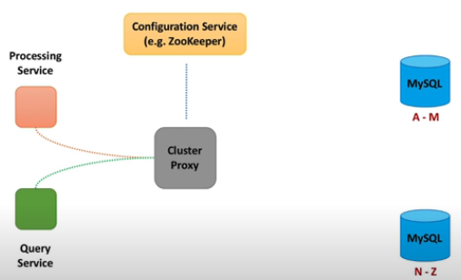  
* Instead of calling shard DB instance directly, we add shard proxy \(4\) **Add Shard Proxy** \(a DB helper to add more useful functions\) --&gt; 1. shard proxy can cache query results --&gt; 2. monitor DB instance health --&gt; 3. publish metrics --&gt; 4. terminate query that takes too long 

 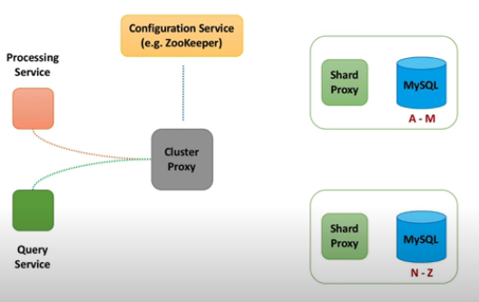   
  
  
**`@@@@ Availability @@@@`**

* What if DB shard died?
* How to ensure data is not lost? 
* \(5\) Add Replicas between different data center --&gt; \[**Write\]** when the cluster proxy sends data to a shard\(DB\),  --&gt; data is sync or async replicated to corresponding read replica. --&gt; **\[Read\]** when the cluster proxy retrieve data from a shard,  --&gt; data will be retrieved either from master or read replica.  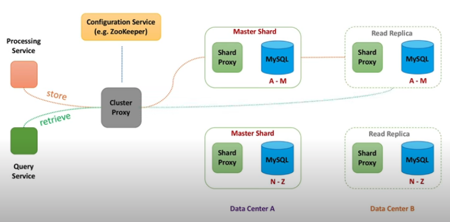  
* e.g. Youtube built a DB solution to scale and manage large clusters  of MySQL instance, called Vitess.  
* =============================================
* How NoSQL handle these requirements  --- Step by Step
* NoSQL DB \(Cassandra\)

  
**`@@@@ Scalability and Performance @@@@`**

* Split data into chunks, we call it **nodes \(= shards in SQL\)**
* We don't need config service to manage each node, instead, we  let nodes talk to each other and exchange information about their state.
* Every sec node exchanges information with a few other nodes  \(less than 3\). State information about every node propagates throughout the cluster -- **gossip protocol**. This way, we also don't need cluster proxy anymore.   

 ****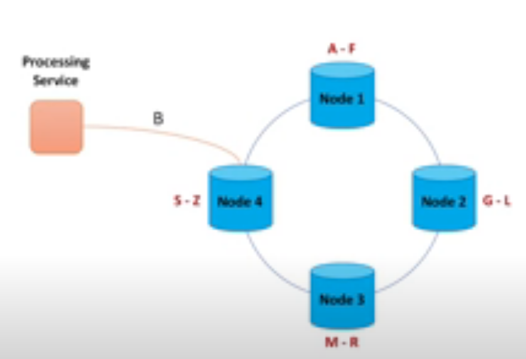 

* NoSQL Routing Process
* e.g. Processing service is asking us to store views count B, then Node4 has been selected. Node4 served as the coordinator node. which node do we store this view count B?  \(1\) Round Robin Algorithm \(2\) Consistent Hashing Algorithm: choose a node that  is closest to the client   
* **\#\#\#Consistent Hashing\#\#\#**
* **Data Replication Using Quorum\(法定人數\)**
* Why? Because synchronous data replication is slow. We usually replicate data asynchronously.     ****
* **Quorum Writes:** sends a 'successful' message while 2 out of 3  \(not all\) of replicas are successfully stored.  ****A coordinator node \(node4\) calls multiple nodes to replicate data, to store multiple copies\(3 copies\) of data. However, waiting for all \(3 responses\) from replicas maybe too slow, we can send a 'successful' message once some  \(2 requests\) succeeded.

 ****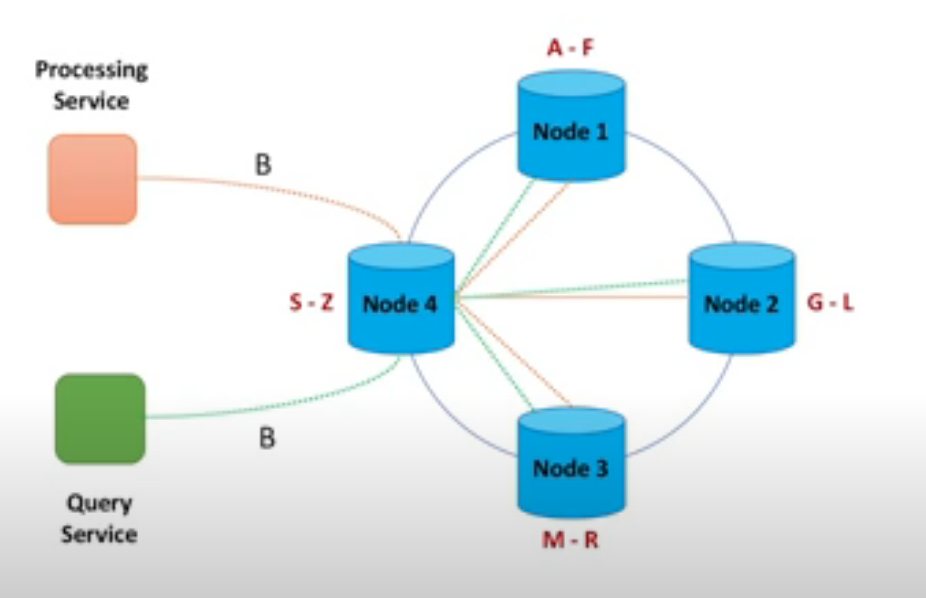 

* **Quorum Read**: read quorum defines a minimum number of nodes that have to agree on the response.
* Cassandra uses version number technique to determine the staleness of data.  ****
* For non-functional requirements, in this case, we choose  **Availability over Consistency** --&gt; We prefer to show stale data over no data at all.
* For the case of **Leader-Follower replication**, some read replicas may be behind their master. --&gt; Different user would see _different view count_ for a video.  --&gt; But this is temporary, this situation will be resolved over time. --&gt; we call it **Eventual Consistency.** --&gt; Cassandra - tunable consistency  
* ======How to Store Data=======
* **relational database, SQL** How do we store data in relational DB?   First, we need to design Data Model, with the following steps
* 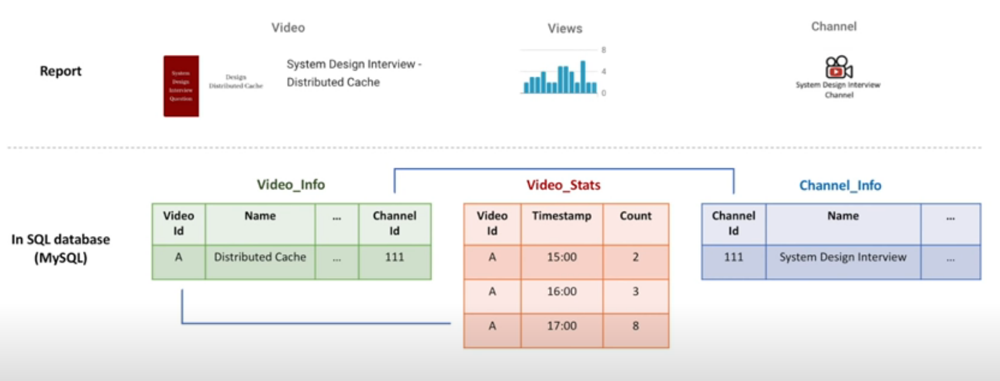 

  <table>
    <thead>
      <tr>
        <th style="text-align:left">
          <ul>
            <li>
              <p>relational DB start with Nouns</p>
              <p>1) <b>Define Nouns</b>: we start with nouns in the system<b> </b>
                <br />2) <b>Convert Nouns to Tables</b>:
                <br />3) <b>Use Foreign Keys to reference related data</b>:
                <br />4) Normalization: to m<b>inimize data duplication across different tables <br /></b>e.g.
                only store video name in video info table.
                <br />To minimize changes across different tables -&gt; cuz
                <br />inconsistent data is possible.
                <br />5)</p>
            </li>
          </ul>
        </th>
      </tr>
    </thead>
    <tbody></tbody>
  </table>

* **NoSQL** How do we store data in NoSQL DB?  
* NoSQL starts with **Queries**

 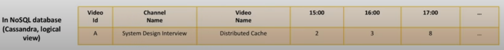 

* There are 4 types of NoSQL DB: \(1\) Column \(2\) Document \(3\) Key-Value \(4\) Graph 
* **About Cassandra DB**
* Cassandra DB's benefit:  \* fault-tolerant  \* scalable \(both read and write throughput increases linearly as new \* machine is added\) \* supports multi-datacenter replication \* works well with time-series data
* Cassandra is **Column DB** that supports asynchronous  masterless replication.  
* **About HBase**
* HBase is Column DB, similar to Cassandra, but it has a master-based architecture 
* **About MongoDB**
* MongoDB is **Documented-oriented DB**, uses leader-based replication

### DB Summary

<table>
  <thead>
    <tr>
      <th style="text-align:left">Cues/Recall</th>
      <th style="text-align:left">Cornell Notes Date</th>
    </tr>
  </thead>
  <tbody>
    <tr>
      <td style="text-align:left">
        <p>Keywords</p>
        <p>Questions</p>
      </td>
      <td style="text-align:left">
        <p>quick notes</p>
        <p>key thoughts and takeaways</p>
        <p>from lecture</p>
      </td>
    </tr>
    <tr>
      <td style="text-align:left"></td>
      <td style="text-align:left">Summary</td>
    </tr>
  </tbody>
</table>

## === Ch4 Data Processing ===

* starts with... requirements
* Requirements 1\) we want to scale the processing service to scale together when the video views increase.                         &lt;-- scalable 2\) we want to process events quickly.   &lt;-- performance/fast 3\) we don't want to lose data                  &lt;-- availability/reliable  
* The above questions turn into statements below:
* How to **scale**?
* How to achieve **high throughput**?
* How to **not losing data** when processing node crashes?
* What to do when DB is **unavailable** or slow? --&gt; How to make data processing **scalable, fast, and reliable?**

\*\*\*\*

* **Scalable == partitioning**
* **Fast == in-memory & minimize disk reads**
* **Reliable == Replication and checkpointing**

  
**%%%% Data Aggregation Basics %%%%**

`@@@` **`Should we aggregate data first?`** `@@@`

*  ****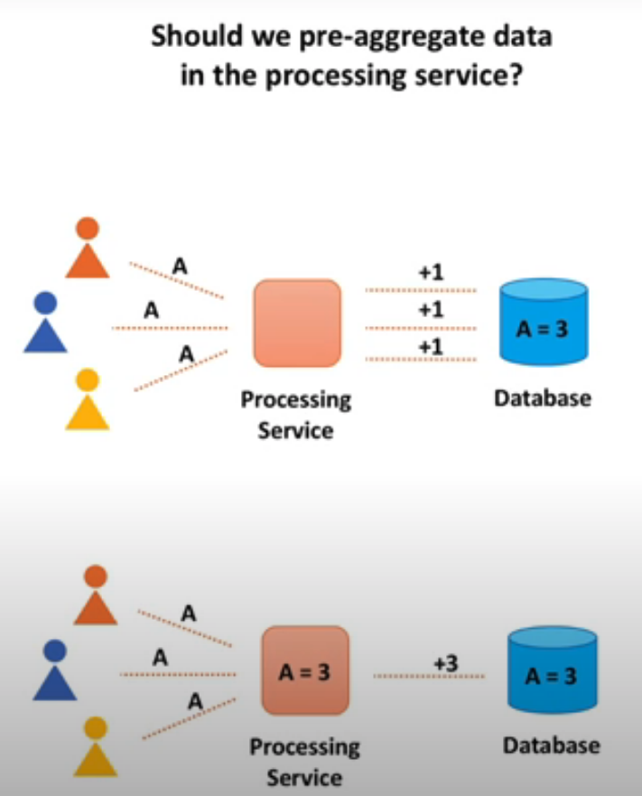 
* 1st option, increment counter by 1 when an event comes \(+1 +1 +1\)
* 2nd option, accumulate data in the processing service memory for several seconds. And add accumulated value to the DB counter. \(+3\)

`@@@` **`Push or Pull?`** `@@@`

* **Push & Pull 怎麼看？ 都是以Processing Service為基準，either push到PS， 或是pull回PS**   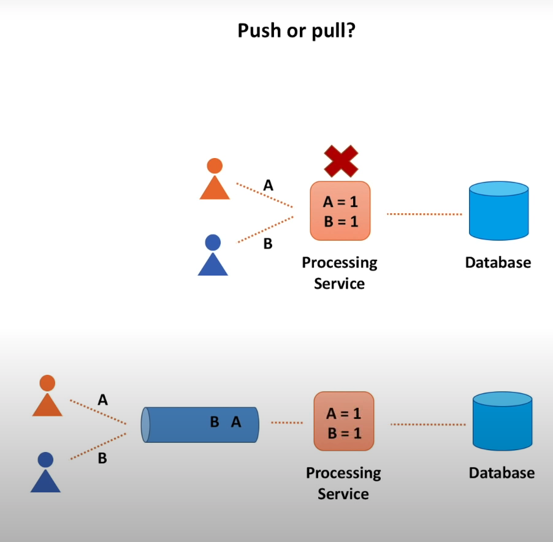 
* **Push**: some other service sends events synchronously to the  processing service  \[serviceA\] -- event --&gt; \[processing service\] 
* **\[v\] Pull**: the processing service pulls events from some temp storage.  \[\] 
* **Pull option has more advantages**, as it provides a better fault tolerance support and easier to scale.   Why? Because if processing service crashes, we still have events in  the storage and can re-process them.  
* How data aggregation happens during event processing? 
* Checkpointing & Partitioning

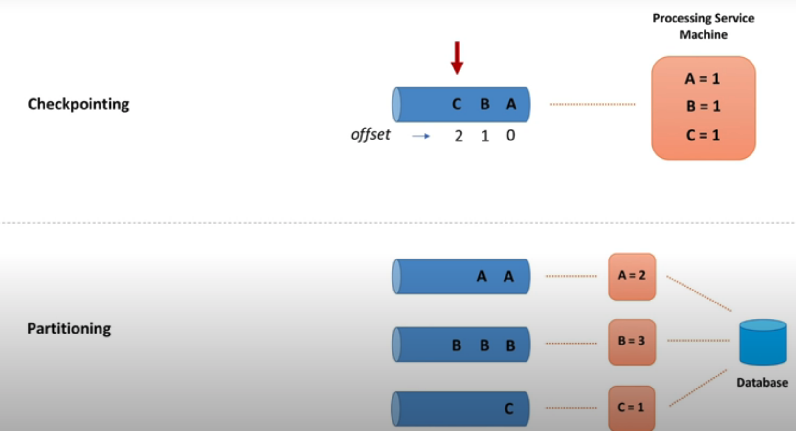 

* **++ Checkpointing ++**
* Checkpointing is a technique to **add fault-tolerance into the system**.  It consists of saving a snapshot of the application's state, so it can restart at the point where it failed. It happens in the queue.
* After we processed several events and successfully stored them in the DB, we write checkpoint to some persistent storage. If processing service machine fails, it will be replaced with another one and this new machine will resume processing where the failed machine left off. \(key in stream data processing\) 
* **++ partitioning ++**
* Partitioning also happens in the queue.
* Each queue is independent from the others. Every queue physically lives on its own machine and stores a subset of all events  \(AA / BBB / C\) We compute a hash based on video identifier and use this hash number to pick a queue.
* Partitioning allows us to **parallelize events processing**. More events  we get, more partitions we create.


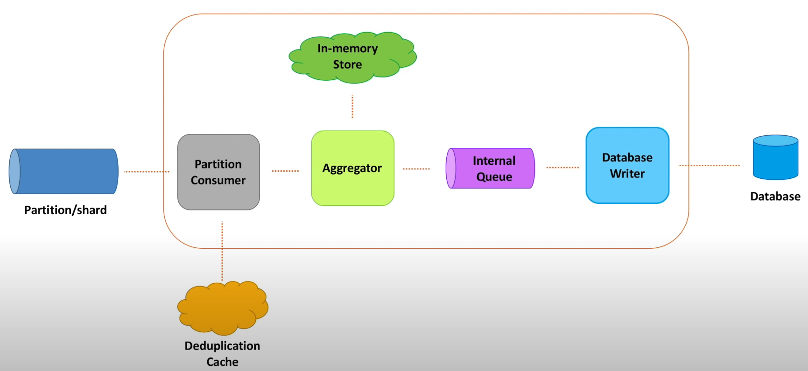 

@@@ Processing Service \(Detailed Design\) @@@

* **Partition Consumer + De-duplication Cache**:  \* **Partition Consumer**: we need a component to read events. from byte array and turn it to actual object.  Here we **prefer single thread** to read data. Otherwise, if we use multi-threaded, checkpointing will be much harder to ensure order. \* **De-duplication Cache**: to **avoid double counting**. Messages that  get send to partition/shard could have duplicates. Meaning same  message could be sent multiple times. Then we need de-duplication cache.  This distributed cache **stores unique event identifiers**\(uniq event id\) for last 10 mins. Then if several identical messages arrived within  10 mins interval, only one of them\(first one\) would be processed.    
* **Aggregator + In-memory Store**:  \* **Aggregator \(passport check officer, consumption\)**:  It does in-memory counting.  \[hash table1\]   --&gt;  \[hash table2\] --&gt; \[hash table3\] ... 1 1 1 1 1\(stop\) -&gt; 1 1 1 +1... While adding hash table2,  The hash table1\(complete\) was sent to internal queue.  A **hash table** that accumulates data for some period of time.  This hash table is stored in the in-memory store. Periodically, we stop writing to the current hash table and create a new one. Then a new hash table keeps accumulating incoming data. While old hash table is no longer counting any data and each  counter from old hash table is sent to the internal queue for further processing.  Why aggregator is connected with Internal Queue? Ans: To speed up processing, with multiple threads. We can also do the other way around, where queue -&gt; aggregator. Especially if processing data takes time. By sending data to the  internal queue, **we decouple consumption and processing**. 
* **Internal Queue \(multi-lines luggage check, processing\)**:  Internal queue speeds up processing with mulitple threads. Processing data takes longer time.  
* **Database Writer + Embedded DB + Dead-Letter Queue**:  \* **DB writer** can be either single thread or multi-threaded. Single thread: **checkpointing is easy** / but slow Multi threaded: checkpointing is hard / but **increases throughput**.  \[Dead-Letter Queue is useful\] How do we handle undelivered data?  \* **\(1\)** **Dead-Letter Queue**: To temporary store data when data cannot  be routed to their destination.  DLQ Pros: To protect DB performance or availability issues.  Very useful when we need to preserve data incase of downstream services degradation. \(availiability up\) \* **\(2\) Local Disk Storage / Data Enrichment**:  To temporary store undelivered messages. Minimal information, like  video identifier and timestamp. We don't need to store video titile or channel name or video creation date. \* **Embedded DB**:  To store additional attributes, like video title or channel name. Embedded DB is on local machine, which eliminates a need for remote calls.  
* **State Store \(Recover from prev un-lost state\)**:  State management. To periodically save the entire in-memory data to a durable storage. It helps to recover when PS is down, and then embedded DB/in-memory state is lost. If breakdown happends, just re-create the point where it failed. A new machine just have to re-load this state into its memory  when started.


### Data Processing Summary

<table>
  <thead>
    <tr>
      <th style="text-align:left">Recall</th>
      <th style="text-align:left">Notes</th>
    </tr>
  </thead>
  <tbody>
    <tr>
      <td style="text-align:left">
        <p>What is the most important</p>
        <p>component for a successful
          <br />system design interview?
          <br />
          <br />What should we focus on the most
          <br />while preparing for one?</p>
      </td>
      <td style="text-align:left">
        <p>===Chapter 1===</p>
        <ul>
          <li>When an interviewer gives you a Q:</li>
          <li>Then Ask Interviewers about 4 categories to
            <br />get requirement clarifications.
            <br />(1) Users/Customers
            <br />(2) Scale (Read/Write)
            <br />(3) Performance
            <br />(4) Cost
            <br />
          </li>
          <li>Why do things above?</li>
          <li>Get functional requirements &amp; non-functional requirements
            <br />(1) <b>Functional Requirements (what system will do)</b>:
            <br />system behavior, specific APIs,
            <br />set of operations that system will support
            <br />(2) <b>Non-Functional Requirements (what system is <br />supposed to be)</b>:
            <br
            />system qualities, such as fast, fault-tolerant, secure
            <br />
          </li>
          <li>
            <p>Functional Requirements - API
              <br />Below are the steps to generalize APIs
              <br />
              <br />e.g. The system has to <code>count</code>  <em>video</em> view <b>events. </b>
            </p>
            <p>--&gt; def <code>count</code>View<b>Event</b>(videoId):
              <br /># get eventType such as &apos;view&apos;, &apos;like&apos;, &apos;share&apos;</p>
            <p>--&gt; def <code>count</code><b>Event</b>(videoId, eventType):
              <br /># sum all different functions such as &apos;count&apos;, &apos;sum&apos;,
              &apos;average&apos;
              <br />--&gt; def process<b>Event</b>(videoId, eventType, function):
              <br /># generalize events, APIs
              <br />--&gt; def process<b>Event</b>s(listOfEvents)
              <br /># each event is an object which contains info about video,
              <br />type of the event, time of the event...
              <br />
              <br />e.g.2 Data Retrieval API
              <br />The system has to return <em>video</em> views count for a time period.</p>
            <p>--&gt; def getViewsCount(videoId, startTime, endTime)
              <br /># video views -&gt; &apos;likes&apos;, &apos;dislikes&apos;, &apos;view&apos;
              <br
              />--&gt; def getCount(videoId, eventType, startTime, endTime)
              <br /># get stats and functions to the method
              <br />--&gt; def getStats(videoId, eventType, function, startTime, endTime)
              <br
              />
            </p>
          </li>
          <li>
            <p>non-Functional Requirements</p>
            <p>Interviewer Reply: Let&apos;s design xxx at <b>scale, <br /></b>let&apos;s
              try to make it as <b>fast</b> as possible.
              <br />
              <br />--&gt; then we use CAP theorem
              <br />CAP theorem tells me we can&apos;t have <b>C</b>onsistency, <b>A</b>vailability,
              <br
              /><b>P</b>erformance/Partition Tolerance all at once. Then I&apos;ll
              <br
              />choose availability over consistency.
              <br />* <b>Scalable</b> (tens of thousands of video views per sec)
              <br />* <b>High Performant</b> (few tens of milliseconds to return
              <br />total views count for a video)
              <br />* <b>Highly Available</b> (survives hardware/network failures,
              <br />no single point of failure)
              <br />* Consistency
              <br />* Cost (hardware, development, maintenance)
              <br />
            </p>
          </li>
        </ul>
      </td>
    </tr>
    <tr>
      <td style="text-align:left"></td>
      <td style="text-align:left">
        <p>===Chapter 2 Drive the Conversation: What to Store===</p>
        <p></p>
        <ul>
          <li>starts with...</li>
          <li><b>Data</b>
            <br />-&gt; We need to think what data we want to store and how
            <br />-&gt; We need to define data model</li>
          <li>
            <p>What do we <b>store</b>?</p>
            <table>
              <thead>
                <tr>
                  <th style="text-align:left">Individual Events</th>
                  <th style="text-align:left">vs</th>
                  <th style="text-align:left">Aggregate Data (Batch Events)</th>
                </tr>
              </thead>
              <tbody>
                <tr>
                  <td style="text-align:left">Store <b>Raw Events</b>
                  </td>
                  <td style="text-align:left">Func</td>
                  <td style="text-align:left"><b>Aggregate</b> data in real-time</td>
                </tr>
                <tr>
                  <td style="text-align:left"><b>Stream</b> Data Processing</td>
                  <td style="text-align:left"></td>
                  <td style="text-align:left"><b>Batch</b> Data Processing</td>
                </tr>
                <tr>
                  <td style="text-align:left">
                    <p>*fast <b>writes</b>
                    </p>
                    <p>*can slice however we need</p>
                    <p>*can recalculate numbers if needed</p>
                  </td>
                  <td style="text-align:left">Pros</td>
                  <td style="text-align:left">
                    <p>*fast <b>reads</b>
                    </p>
                    <p>*data is ready for decision making</p>
                  </td>
                </tr>
                <tr>
                  <td style="text-align:left">
                    <p>*slow reads</p>
                    <p>*<b>Costly </b>for large scale</p>
                    <p>(many events to be stored)</p>
                  </td>
                  <td style="text-align:left">Cons</td>
                  <td style="text-align:left">
                    <p>*can <b>only query</b> the way it was <b>aggregated</b>
                    </p>
                    <p>*<b>requires</b>  <b>data aggregation</b> pipeline (Hard!)</p>
                    <p>*hard or even impossible to
                      <br />fix errors</p>
                  </td>
                </tr>
              </tbody>
            </table>
          </li>
          <li>Then ask interviewer <b>expected delay. <br />Time between when event happened &lt;--&gt; when event was processed<br /><br /></b>(1)<b> </b>if
            expected delay is<b> less than several mins<br /> </b>--&gt; aggregate
            data on the fly<b><br /></b>(2) if expected delay is<b> okay for several hours <br /> </b>--&gt;
            store raw events and process them in the background
            <br />(3) <b>combine both</b> approach, store raw events and batch process data
            <br
            />--&gt; Flexibility up
            <br />--&gt; <b>Raw Data:</b> store only several days/weeks raw data + purge old
            data
            <br /> <b>Batch Data</b>: store aggregated data (view counts) in real-time
            <br
            />--&gt; Costly, expensive</li>
        </ul>
      </td>
    </tr>
    <tr>
      <td style="text-align:left"></td>
      <td style="text-align:left">
        <p>===Chapter 3 === Database</p>
        <p></p>
        <ul>
          <li>Can you give me a specific DB name? Explain your choice.</li>
          <li>Both SQL and NoSQL DB can scale and perform well, let me evaluate both
            types.</li>
          <li>Ask questions below</li>
          <li>
            <p></p>
            <table>
              <thead>
                <tr>
                  <th style="text-align:left">
                    <ul>
                      <li>How to scale writes?</li>
                      <li>How to scale reads?</li>
                      <li>How to make both writes and reads fast?</li>
                      <li>How not losing data in case of hardware faults and network partitions?</li>
                      <li>How to recover data in case of an outage?</li>
                      <li>How to ensure data security?</li>
                      <li>How to make it extensible for data model changes in the future?</li>
                    </ul>
                  </th>
                </tr>
              </thead>
              <tbody></tbody>
            </table>
            <table>
              <thead>
                <tr>
                  <th style="text-align:left"></th>
                </tr>
              </thead>
              <tbody></tbody>
            </table>
          </li>
          <li>============================================
            <br />How SQL handle these requirements--- Step by Step</li>
        </ul>
        <p><b><code>@@@@ Scalability and Performance @@@@</code></b>
        </p>
        <ul>
          <li>How to reduce the load on a single SQL machine?</li>
          <li><b>(1)</b>  <b>Add</b>  <b>Sharding DB</b> (several SQL DBs work together)</li>
        </ul>
        <p></p>
        <ul>
          <li>How to route the traffic better?</li>
          <li><b>(2) Add Cluster Proxy</b> (a proxy machine and route traffic to correct
            shard)</li>
          <li>Cluster proxy is the only one who knew about all shards info.
            <br />
            <br />
            
            <br />
          </li>
          <li>How do we make cluster proxy be aware of newly added DB?</li>
          <li><b>(3)</b>  <b>Add Configuration Service </b>(to maintain health check)
            <br
            />-&gt; config service maintains a health check connection to all shards)
            <br
            />-&gt; config service always know which DB is available
            <br />
            <br />
            
            <br />
          </li>
          <li>Instead of calling shard DB instance directly, we add shard proxy
            <br />(4) <b>Add Shard Proxy</b> (a DB helper to add more useful functions)
            <br
            />--&gt; 1. shard proxy can cache query results
            <br />--&gt; 2. monitor DB instance health
            <br />--&gt; 3. publish metrics
            <br />--&gt; 4. terminate query that takes too long</li>
        </ul>
        <p>
          
          <br />
          <br />
          <br /><b><code>@@@@ Availability @@@@</code></b>
        </p>
        <ul>
          <li>What if DB shard died?</li>
          <li>How to ensure data is not lost?
            <br />
          </li>
          <li>(5) Add Replicas between different data center
            <br />--&gt; [<b>Write]</b> when the cluster proxy sends data to a shard(DB),
            <br
            />--&gt; data is sync or async replicated to corresponding read replica.
            <br
            />--&gt; <b>[Read]</b> when the cluster proxy retrieve data from a shard,
            <br
            />--&gt; data will be retrieved either from master or read replica.
            <br />
            
            <br />
          </li>
          <li>e.g. Youtube built a DB solution to scale and manage large clusters
            <br
            />of MySQL instance, called Vitess.
            <br />
            <br />
          </li>
          <li>=============================================</li>
          <li>How NoSQL handle these requirements --- Step by Step</li>
          <li>NoSQL DB (Cassandra)</li>
        </ul>
        <p>
          <br /><b><code>@@@@ Scalability and Performance @@@@</code></b>
        </p>
        <ul>
          <li>Split data into chunks, we call it <b>nodes (= shards in SQL)</b>
          </li>
          <li>We don&apos;t need config service to manage each node, instead, we
            <br
            />let nodes talk to each other and exchange information about
            <br />their state.</li>
          <li>Every sec node exchanges information with a few other nodes
            <br />(less than 3). State information about every node propagates
            <br />throughout the cluster -- <b>gossip protocol</b>.
            <br />This way, we also don&apos;t need cluster proxy anymore.</li>
        </ul>
        <p><b> </b>
          
        </p>
        <ul>
          <li>NoSQL Routing Process</li>
          <li>e.g. Processing service is asking us to store views count B, then
            <br />Node4 has been selected. Node4 served as the coordinator node.
            <br />which node do we store this view count B?
            <br />(1) Round Robin Algorithm
            <br />(2) Consistent Hashing Algorithm: choose a node that
            <br />is closest to the client
            <br />
          </li>
          <li><b>###Consistent Hashing###</b>
          </li>
          <li><b>Data Replication Using Quorum(&#x6CD5;&#x5B9A;&#x4EBA;&#x6578;)</b>
          </li>
          <li>Why? Because synchronous data replication is slow. We usually
            <br />replicate data asynchronously. <b>  <br /> </b>
          </li>
          <li><b>Quorum Writes: </b>sends a &apos;successful&apos; message while 2 out
            of 3
            <br />(not all) of replicas are successfully stored.<b><br /><br /></b>A coordinator
            node (node4) calls multiple nodes
            <br />to replicate data, to store multiple copies(3 copies) of data.
            <br />However, waiting for all (3 responses) from replicas maybe
            <br />too slow, we can send a &apos;successful&apos; message once some
            <br />(2 requests) succeeded.</li>
        </ul>
        <p><b> </b>
          
        </p>
        <ul>
          <li><b>Quorum Read</b>: read quorum defines a minimum number of nodes
            <br />that have to agree on the response.</li>
          <li>Cassandra uses version number technique to determine the staleness of
            data.<b><br /><br /></b>
          </li>
          <li>For non-functional requirements, in this case, we choose
            <br /><b>Availability over Consistency<br /></b>--&gt; We prefer to show stale
            data over no data at all.</li>
          <li>For the case of <b>Leader-Follower replication</b>, some read replicas
            <br
            />may be behind their master.
            <br />--&gt; Different user would see <em>different view count</em> for a video.
            <br
            />--&gt; But this is temporary, this situation will be resolved over time.
            <br
            />--&gt; we call it <b>Eventual Consistency.<br /></b>--&gt; Cassandra -
            tunable consistency
            <br />
            <br />
          </li>
          <li>======How to Store Data=======</li>
          <li><b>relational database, SQL</b>
            <br />How do we store data in relational DB?
            <br />First, we need to design Data Model, with the following steps</li>
          <li>
            <p>
              
            </p>
            <table>
              <thead>
                <tr>
                  <th style="text-align:left">
                    <ul>
                      <li>
                        <p>relational DB start with Nouns</p>
                        <p>1) <b>Define Nouns</b>: we start with nouns in the system<b> </b>
                          <br />2) <b>Convert Nouns to Tables</b>:
                          <br />3) <b>Use Foreign Keys to reference related data</b>:
                          <br />4) Normalization: to m<b>inimize data duplication across different tables <br /></b>e.g.
                          only store video name in video info table.
                          <br />To minimize changes across different tables -&gt; cuz
                          <br />inconsistent data is possible.
                          <br />5)</p>
                      </li>
                    </ul>
                  </th>
                </tr>
              </thead>
              <tbody></tbody>
            </table>
          </li>
          <li><b>NoSQL</b>
            <br />How do we store data in NoSQL DB?</li>
          <li>NoSQL starts with <b>Queries</b>
          </li>
        </ul>
        <p>
          
        </p>
        <ul>
          <li>There are 4 types of NoSQL DB:
            <br />(1) Column
            <br />(2) Document
            <br />(3) Key-Value
            <br />(4) Graph
            <br />
          </li>
          <li><b>About Cassandra DB</b>
          </li>
          <li>Cassandra DB&apos;s benefit:
            <br />* fault-tolerant
            <br />* scalable (both read and write throughput increases linearly as new
            <br
            />* machine is added)
            <br />* supports multi-datacenter replication
            <br />* works well with time-series data</li>
          <li>Cassandra is <b>Column DB</b> that supports asynchronous
            <br />masterless replication.
            <br />
          </li>
          <li><b>About HBase</b>
          </li>
          <li>HBase is Column DB, similar to Cassandra, but it has a master-based
            <br
            />architecture
            <br />
          </li>
          <li><b>About MongoDB</b>
          </li>
          <li>MongoDB is <b>Documented-oriented DB</b>, uses leader-based replication
            <br
            />
          </li>
        </ul>
        <p>ssss</p>
      </td>
    </tr>
    <tr>
      <td style="text-align:left"></td>
      <td style="text-align:left">
        <p>==== Chapter 4 ==== Data Processing</p>
        <p></p>
        <ul>
          <li>starts with... requirements</li>
          <li>Requirements
            <br />1) we want to scale the processing service to scale together when
            <br />the video views increase. &lt;-- scalable
            <br />2) we want to process events quickly. &lt;-- performance/fast
            <br />3) we don&apos;t want to lose data &lt;-- availability/reliable
            <br />
          </li>
          <li>The above questions turn into statements below:</li>
          <li>How to <b>scale</b>?</li>
          <li>How to achieve <b>high throughput</b>?</li>
          <li>How to <b>not losing data</b> when processing node crashes?</li>
          <li>What to do when DB is <b>unavailable</b> or slow?
            <br />--&gt; How to make data processing <b>scalable, fast, and reliable?</b>
          </li>
        </ul>
        <p>&lt;b&gt;&lt;/b&gt;</p>
        <ul>
          <li><b>Scalable == partitioning</b>
          </li>
          <li><b>Fast == in-memory &amp; minimize disk reads</b>
          </li>
          <li><b>Reliable == Replication and checkpointing</b>
          </li>
        </ul>
        <p><b><br />%%%% Data Aggregation Basics %%%%</b>
        </p>
        <p><code>@@@ </code><b><code>Should we aggregate data first?</code></b><code> @@@</code>
        </p>
        <ul>
          <li><b> </b>
            
          </li>
          <li>1st option, increment counter by 1 when an event comes (+1 +1 +1)</li>
          <li>2nd option, accumulate data in the processing service memory for
            <br />several seconds. And add accumulated value to the DB counter. (+3)</li>
        </ul>
        <p><code>@@@ </code><b><code>Push or Pull?</code></b><code> @@@</code>
        </p>
        <ul>
          <li><b>Push &amp; Pull &#x600E;&#x9EBC;&#x770B;&#xFF1F;<br />&#x90FD;&#x662F;&#x4EE5;Processing Service&#x70BA;&#x57FA;&#x6E96;&#xFF0C;either push&#x5230;PS&#xFF0C;<br />&#x6216;&#x662F;pull&#x56DE;PS<br /><br /> </b>
            
          </li>
          <li><b>Push</b>: some other service sends events synchronously to the
            <br />processing service
            <br />
            <br />[serviceA] -- event --&gt; [processing service]
            <br />
          </li>
          <li><b>[v] Pull</b>: the processing service pulls events from some temp storage.
            <br
            />
            <br />[]
            <br />
          </li>
          <li><b>Pull option has more advantages</b>, as it provides a better fault
            <br
            />tolerance support and easier to scale.
            <br />
            <br />Why? Because if processing service crashes, we still have events in
            <br
            />the storage and can re-process them.
            <br />
            <br />
          </li>
          <li>How data aggregation happens during event processing?</li>
          <li>Checkpointing &amp; Partitioning</li>
        </ul>
        <p>
          
        </p>
        <ul>
          <li><b>++ Checkpointing ++</b>
          </li>
          <li>Checkpointing is a technique to <b>add fault-tolerance into the system</b>.
            <br
            />It consists of saving a snapshot of the application&apos;s state, so it
            can
            <br />restart at the point where it failed. It happens in the queue.</li>
          <li>After we processed several events and successfully stored them in
            <br />the DB, we write checkpoint to some persistent storage.
            <br />If processing service machine fails, it will be replaced with another
            <br
            />one and this new machine will resume processing where the failed
            <br />machine left off. (key in stream data processing)
            <br />
          </li>
          <li><b>++ partitioning ++</b>
          </li>
          <li>Partitioning also happens in the queue.</li>
          <li>Each queue is independent from the others. Every queue physically
            <br />lives on its own machine and stores a subset of all events
            <br />(AA / BBB / C)
            <br />We compute a hash based on video identifier and use this hash number to
            pick a queue.</li>
          <li>Partitioning allows us to <b>parallelize events processing</b>. More events
            <br
            />we get, more partitions we create.</li>
        </ul>
        <p></p>
        <p>
          
        </p>
        <p>@@@ Processing Service (Detailed Design) @@@</p>
        <ul>
          <li><b>Partition Consumer + De-duplication Cache</b>:
            <br />* <b>Partition Consumer</b>: we need a component to read events.
            <br />from byte array and turn it to actual object.
            <br />Here we <b>prefer single thread</b> to read data. Otherwise, if we use
            <br
            />multi-threaded, checkpointing will be much harder to ensure order.
            <br
            />* <b>De-duplication Cache</b>: to <b>avoid double counting</b>. Messages
            that
            <br />get send to partition/shard could have duplicates. Meaning same
            <br />message could be sent multiple times. Then we need de-duplication
            <br />cache.
            <br />This distributed cache <b>stores unique event identifiers</b>(uniq event
            id)
            <br />for last 10 mins. Then if several identical messages arrived within
            <br
            />10 mins interval, only one of them(first one) would be processed.
            <br />
            <br />
          </li>
          <li><b>Aggregator + In-memory Store</b>:
            <br />* <b>Aggregator (passport check officer, consumption)</b>:
            <br />It does in-memory counting.
            <br />[hash table1] --&gt; [hash table2] --&gt; [hash table3] ...
            <br />1 1 1 1 1(stop) -&gt; 1 1 1 +1...
            <br />While adding hash table2,
            <br />The hash table1(complete) was sent to internal queue.
            <br />
            <br />A <b>hash table</b> that accumulates data for some period of time.
            <br />This hash table is stored in the in-memory store.
            <br />Periodically, we stop writing to the current hash table and create
            <br
            />a new one. Then a new hash table keeps accumulating incoming data. While
            old hash table is no longer counting any data and each counter from old
            hash table is sent to the internal queue for further processing.
            <br />
            <br />Why aggregator is connected with Internal Queue?
            <br />Ans: To speed up processing, with multiple threads.
            <br />We can also do the other way around, where queue -&gt; aggregator.
            <br
            />Especially if processing data takes time. By sending data to the
            <br />internal queue, <b>we decouple consumption and processing</b>.
            <br />
          </li>
          <li><b>Internal Queue (multi-lines luggage check, processing)</b>:
            <br />Internal queue speeds up processing with mulitple threads.
            <br />Processing data takes longer time.
            <br />
          </li>
          <li><b>Database Writer + Embedded DB + Dead-Letter Queue</b>:
            <br />* <b>DB writer</b> can be either single thread or multi-threaded.
            <br />Single thread: <b>checkpointing is easy</b> / but slow
            <br />Multi threaded: checkpointing is hard / but <b>increases throughput</b>.
            <br
            />
            <br />[Dead-Letter Queue is useful]
            <br />How do we handle undelivered data?
            <br />* <b>(1)</b>  <b>Dead-Letter Queue</b>: To temporary store data when data
            cannot
            <br />be routed to their destination.
            <br />DLQ Pros: To protect DB performance or availability issues.
            <br />Very useful when we need to preserve data incase of downstream
            <br />services degradation. (availiability up)
            <br />* <b>(2) Local Disk Storage / Data Enrichment</b>:
            <br />To temporary store undelivered messages. Minimal information, like
            <br
            />video identifier and timestamp. We don&apos;t need to store video titile
            or
            <br />channel name or video creation date.
            <br />* <b>Embedded DB</b>:
            <br />To store additional attributes, like video title or channel name.
            <br />Embedded DB is on local machine, which eliminates a need for
            <br />remote calls.
            <br />
          </li>
          <li><b>State Store (Recover from prev un-lost state)</b>:
            <br />State management. To periodically save the entire in-memory data
            <br />to a durable storage. It helps to recover when PS is down, and then
            <br
            />embedded DB/in-memory state is lost.
            <br />If breakdown happends, just re-create the point where it failed.
            <br />A new machine just have to re-load this state into its memory
            <br />when started.</li>
        </ul>
        <p>&lt;b&gt;&lt;/b&gt;</p>
        <p></p>
      </td>
    </tr>
  </tbody>
</table>

## === Ch5 Data Ingestion ===

#### Data Ingestion Path


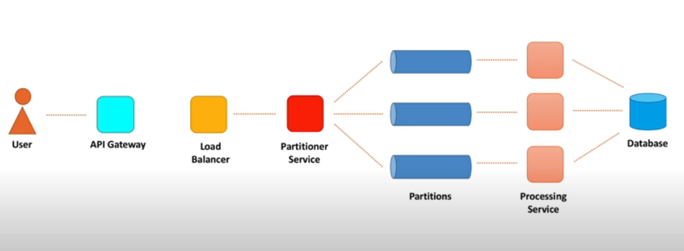

#### Ingestion Path Components

| Partitioner Service Client/ API Gateway | Load Balancer | Partitioner Service and Partitions |
| :--- | :--- | :--- |
| Blocking vs non-blocking I/O | Software vs hardware balancing | Partition Strategy |
| Buffering and batching | Networking Protocols | Service Discovery |
| Timeouts | Load balancing algorithms | Replication |
| Retrics | DNS | Message Format |
| Exponential backoff and jitter | Health Checking |  |
| Circuit breaker | High Availiability |  |

## API Gateway/Partitioner Service Client

* **Blocking vs non-blocking I/O**:

  **Blocking I/O  `(one socket per connection style)`**

  \(1\) One thread per connection. New client, new thread, new connection.  
  \(2\) Initiated the connection by using sockets.   
  \(3\) \[Single execution thread\] When a client makes a request, the socket that handles the connection on the server is blocked. We can then track progress of the request. \(Easy to debug\)  
  \(4\) We can use thread local variables in blocking I/O. When issue happens, exception pops up the stack and it is easy to catch them.   
  \(5\) Pros: Not complex, **easy to debug**.  
       Cons: **Not efficient**    
  \(6\) When server starts to experience a slow down, the whole cluster of machines may die \(一起掛）  
  \(7\) How to solve this? We need **Rate Limiter**. 

  * **Rate Limiter**: Help to keep the system stable during traffic peeks.   

  **Non-Blocking I/O `(Queue Style)`**  
  \(1\) Single thread to handle multiple concurrent connections.   
  \(2\) Server just **queues** the request and the actual I/O is then processed at some later point.  
  \(3\) Piling up requests in queue are far less expensive than piling up threads.   
  \(4\) Pros: **More efficient** and has **higher throughput**.    
       ****Cons: **Adding more complexity** of operations.  
  

* **Buffering and Batching `(send group events in one shot)` Batching** \(send group events together in a single request\) **Buffer** \(a place to put grouped events\) \(1\) Instead of sending each event individually, we first put events into a buffer.  \(2\) We then wait up to several seconds before buffer's content or until batch fills up.  \(3\) Pros: **Increases throughput**, **save on cost**, **effective request compression**       Cons: **More complex** both on client and server side. \(4\) e.g. In a batch request, some events fail, while other succeed.       Should we resend whole batch or only failed events? 
* **Timeouts `(wait until xx time and leave)`**  
  \(1\) Timeouts define how much time a client is willing to wait for a response from a server.

  * **Connection Timeout:  \*** connection timeout defines how much time a client is willing to wait for a connection to establish. \* usually connection timeout is small, 10/milliseconds. Because there's no heavy request happening just yet.
  * **Request Timeout: \*** request timeout happens when request processing takes too much time, and a client is not willing to wait any longer.  \* How to choose request timeout value? We need to **analyze latency percentiles**.  e.g. latency **1% of the slowest requests** in the system and set it as req timeout. 

* **Retries** **`(what to do with failed requests? Use retries, try again.)`** \(1\) Timeout is probably due to a bad machine was hitted. The second attempt may hit a different server machine. \(2\) Retry smart. We **shouldn't do all retries at the same time**. We may create a so-called  **retry storm event** and overload server with too many requests.  
* **Exponential Backoff and Jitter Algorithms \(how not to do all retries at the same time?\)**  
  \(1\) To prevent all retries start at the same time, we need exponential backoff and jitter algorithms. 

  * **Exponential Backoff:**  Exponential backoff increases the waiting time between retries up to a maximum backoff time.  e.g. 1s -&gt; 2s -&gt; 5s -&gt; 10s -&gt; 30s -&gt; 1min -&gt; 5min -&gt; 10min
  * **Jitter:** Jitter **adds randomness** **to retry intervals to spread out the load**. If we do not add jitter, exponential backoff algorithm will retry requests at the same time. Jitter helps to separate the retries. 

  \(2\)  Be aware of too many retries.   
         e.g.  when partitioner service is down or degraded, then retries would never succeed.    

* **Circuit Breaker `(stops unlimited retries with a threshold)`**   
  \(1\) Circuit breaker pattern stops a client from repeatedly trying to execute an operation that is likely to fail.  
  \(2\) We simply calculate how many requests have failed recently. If error threshold is exceeded, we stop calling a downstream service.   
  \(3\) **\[Retry with limited requests\]** Sometime later, a limited number of requests from the client are allowed to pass through and invoke the operation. If requests are successful, it is assumed that the fault has been fixed.  
  \(4\) **\[Success, then allow all\]** Then we allow all requests at this point and start counting failed requests from scratch \(start over again.\) 

  \(5\) Pros: Have a threshold to stop requests.   
       Cons: **Hard to test the system,** Error **threshold** and timers are **hard to set** 

### API Gateway Summary

<table>
  <thead>
    <tr>
      <th style="text-align:left">Recall / Questions / Keywords</th>
      <th style="text-align:left">Cornell Notes Date</th>
    </tr>
  </thead>
  <tbody>
    <tr>
      <td style="text-align:left">
        <p></p>
        <ul>
          <li>When data flows into API gateway,
            <br />what could happen?</li>
          <li>
            <p>What are the techniques to improve</p>
            <p>availability, scalability?
              <br />
            </p>
          </li>
          <li>How to improve the efficiency of events delivery?
            <br />
          </li>
          <li>Efficiency is solved, what if grouped events cannot be delivered?
            <br />
          </li>
          <li>We need to set a timeout to prevent infinite tries.
            <br />What are the two different ways of timeout?
            <br />
          </li>
          <li>If events still not being delivered, should we retry?
            <br />
          </li>
          <li>What are the retry techniques?
            <br />
          </li>
          <li>What if retry still not successful, should we set a threshold?</li>
        </ul>
      </td>
      <td style="text-align:left">
        <ul>
          <li>Blocking &amp; Non-blocking I/O
            <ul>
              <li>Blocking I/O - 1 thread per connection</li>
              <li>Non-Blocking I/O - Queue style
                <br />
              </li>
            </ul>
          </li>
          <li>Batching &amp; Buffering
            <ul>
              <li>Batching - send events in a group</li>
              <li>Buffering - put grouped events in a buffer
                <br />
              </li>
            </ul>
          </li>
          <li>Timeouts
            <ul>
              <li>Request Timeout - during request, the request takes too long, then a client
                is not willing to wait</li>
              <li>Connection Timeout - Init the request, how much time a client is willing
                to wait for a connection
                <br />
              </li>
            </ul>
          </li>
          <li>Retries
            <ul>
              <li>Prevent all retries at the same time
                <br />
              </li>
            </ul>
          </li>
          <li>Exponential Backoff &amp; Jitter
            <ul>
              <li>Exponential Backoff - wait time increases
                <br />1-&gt;2-&gt;5-&gt;10-&gt;30-&gt;60</li>
              <li>Jitter - add randomness to retry intervals
                <br />
              </li>
            </ul>
          </li>
          <li>Circuit Breaker
            <ul>
              <li>limited retry requests - set a <b>threshold</b> to stop infinite retrying</li>
              <li>Success and go - if a message could be delivered, then allow all messages
                to pass.</li>
            </ul>
          </li>
        </ul>
      </td>
    </tr>
    <tr>
      <td style="text-align:left"></td>
      <td style="text-align:left">
        <p><b>Summary</b>
        </p>
        <p>This API Gateway Chapter explains
          <br />(1) how messages/events are being delivered</p>
        <p>(2) techniques of improving the success rate of message delivery</p>
        <p>(3) ways of unblocking resources when events could not be delivered for
          a long period of time.</p>
      </td>
    </tr>
  </tbody>
</table>

## Load Balancer

To increase scalability and reduce redundancy, we can add load balancer \(LB\) to the following three places:  
\(1\) between the **user** and **web server \(e.g. reverse proxy\)**  
\(2\) between **web server** and **application server \(e.g. cache service, application server\)**  
\(3\) between **application server** and **database server** 

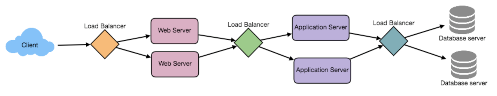

\(4\) Examples of Load Balancer Tools   
       1\) user &lt;-&gt; web server: Nginx, HAProxy  
       2\) web server &lt;-&gt; app server: AWS ELB \(Elastic Load Balancing\)

### 1. Hardware vs Software Load Balancing

* **Hardware vs Software Load Balancing:**
  * **Hardware Load Balancer**: Hardware load balancers are network devices we buy, such as CPU cores, memories that are optimized to handle very high throughput. Millions of requests per second.
  * **Software Load Balancer**:  lv2 Software load balancers are provided by public clouds \(e.g. ELB Elastic Load Balancing from AWS\)  lv1 Software LB is what traffic they serve TCP or HTTP.   Many of them are open source. 

### 2. Networking Protocols

* **Load Balancing in Networking Protocols Layer**
  * **TCP Load Balancers**  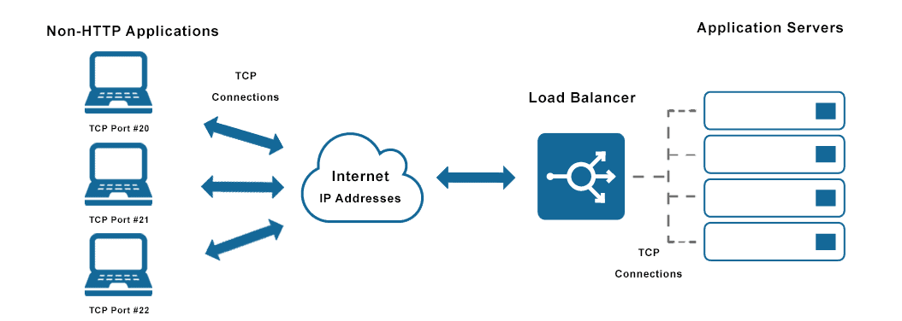  TCP \(Transmission Control Protocol\) Load Balancers are simply forward network packets without inspecting the content of packets. TCP LB operates at lv4 the transport layer.   Think of it as if we established a single end-to-end TCP connection between a client and a server. This allows TCP LB to be super fast and handle millions of requests per second. HTTP load balancers, in contrast, HTTP LB terminates the connection.  Where does TCP LB being used? TCP LB is used where the application that do not speak HTTP. TCP LB verifies information sent to IP addresses, which ensures the data arrives error-free to non-HTTP applications.  Where does HTTP LB being used? HTTP LB is a simple HTTP request/response architecture.   
  * **HTTP Load Balancers**  
    \(1\) Load Balancers gets an HTTP request from a client, establishes a connection to a server, and sends a request to this server.   
    \(2\) HTTP LB can look inside a message and make a load-balancing decision based on the content of the message.  
    \(3\) Based on cookie information or a header, LB may use several algorithms to distribute the load.   
    e.g. Round Robin Algorithm, Least Connection Algorithm

    * **Round Robin Algorithm**

            Round Robin algorithm distributes requests in sequencial order across the list of servers. 

    * **Least Connection Algorithm**  Least Connection Algorithm sends requests to **the server with the lowest number of active connections**. 
    * **Least Response Time Algorithm**  Least Response Time Algorithm sends requests to **the server with the** **fastest response time**. 
    * **Hash-based Algorithm** Hash-based algorithms distribute requests **based on a key we define, such as the client IP address or the request URL**. 

How does our API gateway/Partitioner service client know about our Load Balancer?  
How does Load Balancer know about partitioner service machines?   
How does Load Balancer guarantee high availability? \(LB could be a single point of failure\)

#### Load Balancer in Network Layer - Reverse Proxy:  

大家在網址輸入 **github.com** 時要怎麼 **平均分配流量** 到每一台機器呢？這時候就要靠 Reverse Proxy 了。

Reverse Proxy 會把背後的機器藏起來，當瀏覽器發出請求到 **github.com** 時，他就把請求轉發給後面有空的機器處理，處理完再回覆給瀏覽器。

對於使用者（瀏覽器）來說，他只知道 Reverse Proxy 這台機器的 IP 位址，至於這台機器是怎麼把他的請求轉發給背後的機器處理，使用者（瀏覽器）完全不需要也沒辦法知道

而對於網站開發者來說，Reverse Proxy 除了做 **負載均衡** 之外也可以避免外界直接攻擊到背後的 API server，畢竟 **所有請求都要經過 Reverse Proxy** ，可以把一些奇怪的請求先行過濾掉  

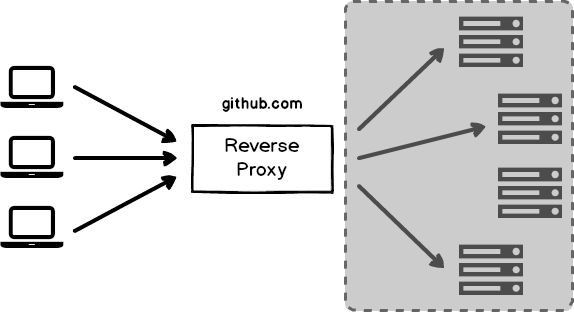


### 3. DNS - Domain Name System

* **DNS - Domain Name System  DNS between Load Balancer and web IP address**  DNS is like a **phone book for the internet**. It maintains a directory of domain names and translates them to IP addresses.  \(1\) We register our partitioner service in DNS, specify the domain name. \(e.g. partitionerservice.domain.com\) \(2\) And then we associate DNS with the IP address of the load balancer device.  partitionerservice.elb1.domain.com &lt;----&gt; Load balancer 1  partitionerservice.elb2.domain.com &lt;----&gt; Load balancer 2 .... \(3\) When the client hits the domain name, requests are forwarded to the load balancer device.  \(4\) We need to explictly tell the load balancer the IP address of each machine. \(5\) Both Software and Hardware LB provide API to register and unregister servers.

### 4. Health Checking

* **Health Checking** Load balancer checks the health of each server.  \(6\) LB needs to know which server from the registered list is healthy and which is unavailable at the moment. This way, LB ensures that traffic is routed to healthy servers only.  \(7\) LB pings each server periodically. If the unhealthy server is identified, LB stops sending traffic to it.  \(8\) LB will then resume routing traffic to that server when it detects that the server is healthy again. 

### 5. High Availability

* **High Availability** High availability of load balancers.  \(1\) To achieve high availability of load balancers, we utilize the concept of primary and secondary nodes.  \(2\) **Primary Node / Primary Load Balancer**: The Primary LB accepts connections and serves requests, while the Secondary LB monitors the primary.   \(3\) **Secondary Node / Secondary Load Balancer:**   The Secondary LB monitors the primary. If for any reason, the primary LB is unable to accept the connections, the secondary LB takes over. Primary and Secondary LB live in different data centers, in case one data center goes down.

### Summary

<table>
  <thead>
    <tr>
      <th style="text-align:left">Recall / Questions / Keywords</th>
      <th style="text-align:left">Cornell Notes Date</th>
    </tr>
  </thead>
  <tbody>
    <tr>
      <td style="text-align:left">
        <p></p>
        <ul>
          <li>Load Balancing</li>
          <li>How do we balance load when
            <br />there are lots of incoming requests?</li>
          <li>What are the different techniques?
            <br />
          </li>
          <li>Once we have LB, how do we manage them?</li>
          <li>How does our client know about our LB?
            <br />How to sync between client and server?
            <br />
          </li>
          <li>How does LB know about our partitioner service machines?
            <br />
          </li>
          <li>How do we know whether LB could route
            <br />to this instance or not?
            <br />
          </li>
          <li>
            <p>How do we ensure web servers are always</p>
            <p>available to us?</p>
          </li>
        </ul>
      </td>
      <td style="text-align:left">
        <ul>
          <li>Hardware vs Software Load Balancer
            <ul>
              <li>Hardware Load Balancer -
                <br />More CPU cores, more memories</li>
              <li>Software Load Balancer -
                <ul>
                  <li>networking protocols TCP/HTTP LB</li>
                  <li>public cloud LB, e.g. AWS ELK</li>
                </ul>
              </li>
            </ul>
          </li>
          <li>LB in Networking Protocols Layer
            <ul>
              <li>TCP LB</li>
              <li>HTTP LB</li>
            </ul>
          </li>
          <li>Domain Name System (DNS)
            <ul>
              <li>route assigned address from LB to specific instance</li>
            </ul>
          </li>
          <li>Health Checking
            <ul>
              <li>ping every instance periodically,
                <br />makes sure we only route
                <br />traffic to healthy instances</li>
            </ul>
          </li>
          <li>High Availability
            <ul>
              <li>to get high availability, we need to
                <br />keep monitoring health of each
                <br />instance</li>
              <li>Primary LB - served as primary</li>
              <li>
                <p>Secondary LB - backup, also checks</p>
                <p>health of primary LB</p>
              </li>
            </ul>
          </li>
        </ul>
      </td>
    </tr>
    <tr>
      <td style="text-align:left"></td>
      <td style="text-align:left">
        <p><b>Summary</b>
        </p>
        <p>This Load Balancer Chapter explains
          <br />(1) Different types of LB
          <br />(2) How LB works internally
          <br />(3) LB in Networking Protocols Layer
          <br />(4) Benefits of using LB
          <br />.</p>
      </td>
    </tr>
  </tbody>
</table>

## Caching

Load balancing helps you to scale horizontally across servers, but caching will help you better use of the resources you already have.   

* Application Server Cache 
* Distributed Cache
* Global Cache

#### CDN Content Distribution Network

CDN is a kind of cache that comes into play for sites serving large amount of media.  

### Cache Eviction Policies

1. FIFO \(First In First Out\)
2. LIFO \(Last In First Out\)
3. LRU \(Least Recently Used\)
4. MRU \(Most Recently Used\)
5. LFU \(Least Frequently Used\)
6. RR \(Random Replacement\)

## Messaging System/Partitioner Service and Partitions

Why partition? Because we need to process events/messages/data more faster and more accurate.

#### Partitioner Service

Partitioner Service is a web service that gets requests from clients, looks inside each request to retrieve individual video view events \(because remember we batch events on the client-side\), and route each event/message to some partition.

#### Partitions

Partition is also a web service, which gets messages and stores them on a disk, in the form of the append-only log file. Therefore, we have a totally ordered sequence of messages ordered by time. This is not a large single log file, but a set of files of the predefined size.

Partitioner service has to use some rule, partition strategy, that defines which partition gets what message.  

### 1. Partition Strategy

To send messages to partitions, the partitioner service needs to know about every partition.  

* **Hash Function Strategy  \(key-value pair between item &lt;-&gt; machine\)** A simple strategy is to **calculate a hash function based on some key**, let's say video identifier, **and** **choose a machine based on this hash**.  However, this strategy does not work very well on large scale. As it may lead to so-called "hot partitions."   **Hot Partitions Problem** For example, when we have a very popular video or set of videos, all view events go to the same partition. Approaches to deal with hot partition:  \(1\) **To Include Event Time** To include event time \(a minute\) to the video identifier/partition key. All video events within the current minute interval are forwarded to some partition. The next minute, all events go to a different partition.   Within one minute interval, a single partition gets a lot of data, but over several minutes, data is **spread more evenly among partitions**.  \| ---- 11:30am ---- \| ---- 11:31am ---- \| ---- 11:32 am --- \| ---- 11:33 am ---- \| ---- 11:34 am ---- \| ---- ....    A A A A A A A       B B B B B            C C C C C C C C   A A A                    B B B B B B B B    C C   \(2\) **Split Original Hot Partition in Half** Another solution is to split this hot partition into two partitions.  How does this approach actually look like? Consistent hashing algorithm and how adding a new node to the consistent hashing ring split a range of keys into two new ranges.    Furthermore, we can also explicitly **allocate dedicated partitions** for some popular video channels. All video view events from such channels go to their allocated partitions. And view events from all other channels never go to those partitions.  

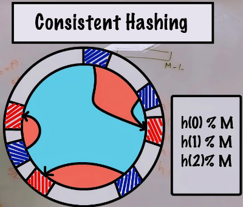

### 2. Service Discovery

In order to let partitioner service know every partition, we need service discovery. There are two types of service discovery: 

* **Service-side discovery**  We've already looked at server-side discovery when talked about load balancers. Clients know about load balancer, load balancer knows about server-side instances. But we don't need an LB between partitioner service and partitions. **Partitioner service itself acts as a load balance**r by distributing events over partitions. 
* **Client-side discovery** For client-side discovery, **every server instance registers itself in some commonplace**, named service registry.   **Service Registry** The service registry is another highly available web service, which can perform health checks to determine the health of each registered instance.  The client then queries the service registry and obtains a list of available servers.  E.g. Zookeeper.  In our case, each partition registers itself in Zookeeper, while every partitioner service instance queries Zookeeper for the list of partitions.   During distributed cache design, when cache client needs to pick a cache shard that stores the data. // Check Distributed Cache design video

**Service Discovery Technique in Cassandra Nodes**  
Similar to the Cassandra nodes knowing each other technique, every node in the cluster knows about other nodes. It means clients need to contact one node from the server cluster to figure out information about the whole cluster. 

### 3. Replication

We must not lose events when storing them in partitions. When an event is persisted in a partition, we need to replicate it. If this partition machine goes down, events are not lost. There are three main approaches to replication: 

* **Single Leader Replication** Think about how to scale a SQL database.  \[Cluster proxy\]  ------  \[Actual Read\]   \[Read Replica1\]  \[Read Replica2\]  \[Read Replica3\]  Each partition will have a leader and several followers. We always write events and read them from the leader only.  While a leader stays alive, all followers copy events from their leader. And if the leader dies, we choose a new leader from their followers.  The leader keeps track of all its followers, to check whether the followers are alive and whether any of the followers are too far behind. If a follower dies, gets stuck, or falls behind, the leader will remove it from the list of its followers.  
* **Multi Leader Replication** Multi leader replication is mostly being used in several data centers. 
* **Leaderless Replication** Think about how Cassandra Quorum Read/Quorum Write works. We consider a write to be successful, when a predefined number of replicas acknowledge \(acked\) the write.  Similar concept applies to partitions. When partitioner service makes a call to a partition, we may send response back as soon as leader partition persisted the message, or only when message was replicated to a specified number of replicas. When we write to a leader only, we may still lose data if leader goes down before replication really happened. When we wait for the replication to complete, we increase durability of the system, but latency will increase \(Availability up, Performance down\).  Plus if required number of replicas is not available at the moment, availability will suffer.

### 4. Message Format

Formats for Encoding Data

We can use either textual or binary format for messages.   
**Textual Formats**  
Popular textual formats are **XML**, **CSV**, and **JSON**.   
**Binary Formats**  
Popular binary formats are **Thrift**, **Protocol Buffers**, and **Avro**. 

* **Textual Formats** When represented data in JSON format, every message contains field name, which greatly increase total message size. 
  * XML, CSV, JSON
  * Pros: Human readable, well-known, widely supported, and heavily used by many distributed systems.
  * Cons:
* **Binary Formats** Very good for **large scale real-time processing** system that provide much more benefits. Format require a schema, and when schema is defined, we no longer need to keep field names. \(有了schema, 便知道格式長什麼樣, 就不需要field names了\)  e.g. Apache Thrift and Protocol Buffers use **field tag** instead of field names. Tags are just numbers and they act like aliases for fields. Tags occupy less space when encoded. 
  * Thrift, Protocol Buffers, Avro
  * Pros: Messages in binary format are more compat, and faster to parse
  * Cons:  
* **Why Schema is important for message format?**  \(1\) Schema are crucial for binary formats. Message producers need to know the schema to serialize the data. Message consumers \(processing service in our case\) require the data. \(2\) Schema are usually stored in some shared database where both producers and consumers can retrieve them.  \(3\) Important to mention that schemas may and will change over time. We may want to add more attributes into messages and use them later for counting or filtering.  \(4\) Apache Avro is a good choice for our counting system. 

### Summary

<table>
  <thead>
    <tr>
      <th style="text-align:left">Recall / Questions / Keywords</th>
      <th style="text-align:left">Cornell Notes Date</th>
    </tr>
  </thead>
  <tbody>
    <tr>
      <td style="text-align:left">
        <p></p>
        <ul>
          <li>When data flows into API gateway,
            <br />what could happen?</li>
          <li></li>
        </ul>
      </td>
      <td style="text-align:left">
        <ul>
          <li>Blocking &amp; Non-blocking I/O
            <ul>
              <li>Blocking I/O - 1 thread per connection</li>
              <li>Non-Blocking I/O - Queue style
                <br />
              </li>
            </ul>
          </li>
          <li></li>
        </ul>
      </td>
    </tr>
    <tr>
      <td style="text-align:left"></td>
      <td style="text-align:left">
        <p><b>Summary</b>
        </p>
        <p>This xxxx Chapter explains</p>
      </td>
    </tr>
  </tbody>
</table>

## 

## === Ch6 Tech Stacks ===

## Tech Stacks That We Can Choose From

<table>
  <thead>
    <tr>
      <th style="text-align:left">Client-side</th>
      <th style="text-align:left">Load Balancing</th>
      <th style="text-align:left">
        <p>Messaging Systems/</p>
        <p>Partitioner Service &amp; Partitions</p>
      </th>
      <th style="text-align:left">Data Processing</th>
      <th style="text-align:left">Storage</th>
    </tr>
  </thead>
  <tbody>
    <tr>
      <td style="text-align:left">Netty</td>
      <td style="text-align:left">Citrix NetScaler</td>
      <td style="text-align:left">Apache Kafka</td>
      <td style="text-align:left">Apache Spark</td>
      <td style="text-align:left">Apache Cassandra</td>
    </tr>
    <tr>
      <td style="text-align:left">Netflix Hystrix</td>
      <td style="text-align:left">Nginx</td>
      <td style="text-align:left">AWS Kinesis</td>
      <td style="text-align:left">Apache Flink</td>
      <td style="text-align:left">Apache HBase</td>
    </tr>
    <tr>
      <td style="text-align:left">Polly</td>
      <td style="text-align:left">AWS ELB</td>
      <td style="text-align:left"></td>
      <td style="text-align:left">AWS Kinesis Data Analytics</td>
      <td style="text-align:left">InfluxDB</td>
    </tr>
    <tr>
      <td style="text-align:left"></td>
      <td style="text-align:left"></td>
      <td style="text-align:left"></td>
      <td style="text-align:left"></td>
      <td style="text-align:left">Apache Hadoop</td>
    </tr>
    <tr>
      <td style="text-align:left"></td>
      <td style="text-align:left"></td>
      <td style="text-align:left"></td>
      <td style="text-align:left"></td>
      <td style="text-align:left">AWS Redshift</td>
    </tr>
    <tr>
      <td style="text-align:left"></td>
      <td style="text-align:left"></td>
      <td style="text-align:left"></td>
      <td style="text-align:left"></td>
      <td style="text-align:left">AWS S3</td>
    </tr>
  </tbody>
</table>


| Other Useful Tech Stacks | Binary Messaging Format |
| :---: | :--- |
| **Vitess** \(manage large DB instances\) | Thrift |
| **Redis** \(scale read data queries & message deduplication\) | Protocol Buffer |
| **AWS SQS / RabbitMQ** \(message broker, dead letter queue\) | Avro |
| **RocksDB** \(data enrichment, key-value data\) |  |
| **Apache Zookeeper** \(manage service discovery, distributed config service\) |  |
| **Netflix Eureka** \(service discovery\) |  |
| **AWS CloudWatch** **/ Elasticsearch, Logstash, Kibana**  \(logs management, monitor components on the cloud\) |  |
| **MurmurHash** \(for partitioner service to partition\) |  |

### 1. Client-side \(Netty, Hystrix, Polly\)

* **Netty**: A high-performance non-blocking IO framework for network applications
* **Netflix Hystrix / Polly**: Hystrix and Polly simplifies implementation of many client-side concepts that we discussed before, such as timeouts, retries, circuit breaker pattern.

### 2. Load Balancing \(NetScaler, Nginx, AWS ELB\)

* **Citrix NetScaler**: The most famous hardware load balancer. 
* **Nginx**: A popular software load balancer. 
* **AWS Elastic Load Balancer \(AWS ELB\)**: When running LB on the cloud, then AWS ELB is great.

### 3. Messaging Systems \(Kafka, AWS Kinesis\)

* **Apache Kafka**: Kafka implements partitioner service and partitions concept. 
* **Amazon Kinesis**: messaging system on the cloud.

### 4. Stream Data Processing \(Spark, Flink, Kinesis Data Analytics\)

* **Apache Spark**: To process events and aggregate them in memory, we can use **stream-data-processing framework** such as Spark. 
* **Apache Flink**: same as Spark.
* **AWS Kinesis Data Analytics**: stream data processing solution on the cloud.

### 5. Database Storage \(Cassandra, HBase, InfluxDB, Hadoop, AWS Redshift\)

* **Apache Cassandra**: A good choice for storing **time-series** data, **wide column DB**.
* **Apache HBase/Influx DB**:  Another choice for time-series data, and also a **wide column DB**. 
* **Apache Hadoop**: Hadoop is a good choice for storing **raw event**. Raw events are used to recalculate counts in case of any error or if customers need to run ad-hoc queries.
* **AWS Redshift**: A cloud data warehouse. 
* **AWS S3**: When we need to roll up the data and **archive it on the cloud**, AWS S3 is a good choice. 

### 6. Other

* **Scaling and Managing large clusters of DB instances -- Vitess:**   A DB solution for **scaling and managing large clusters** of MySQL instances.  Vitess has been serving all Youtube DB traffic since 2011. 
* **Distributed Cache -- Redis**: Redis is for **message deduplication** and to **scale read data queries**.  
* **Message Broker -- RabbitMQ**: For a **dead-letter queue** mechanism, we need to **temporarily queue undelivered messages**, we can use an open source **messaage broker** like RabbitMQ. 
* **Message Broker -- AWS SQS**: Message broker solution on the cloud.
* **Data Enrichment -- RocksDB**: For data enrichment, when we store video and channel related information locally on the machine and inject this information in real-time, we may use RocksDB.  RocksDB is a **high performance embedded DB for key-value data**. 
* **Service Discovery, distributed config service -- Zookeeper**: To do leader election for partitions and to **manage service discovery**, we can use Apache Zookeeper.  Zookeeper is a distributed configuration service. 
* **Service Discovery -- Netflix Eureka**: Netflix Eureka is a service discovery alternative compare to Zookeeper.
* **Logs Management / Monitor Components --  AWS CloudWatch / Elasticsearch, Logstash, Kibana**:  \(AWS\) To monitor each of our system design components, we can choose AWS CloudWatch.  \(Open Source Frameworks\) Elasticsearch, Logstash, Kibana.  
* **For Partitioner service to partition data -- MurmurHash:** For partitioner service to partition, MurmurHash has good hashing function. 
* **Binary Messaging Format -- Thrift, Protocol Buffer, Avro**

## === Ch7 Identify Bottlenecks ===

Interviewer Q: How to identify bottlenecks?  
Ans: We need to **test it under a heavy load**. Then we need to do performance testing.

Performance testing includes the following

* **Load Testing**: when we measure behavior of a system under a specific expected load.  With load testing, we want to understand that our system is indeed scalable and can handle a load we expect.  For example, a 2x or 3x increase in traffic.  
* **Stress Testing**: when we test beyond normal operational capacity, often to a breaking point. With stress testing, we want to identify a breaking point in the system, **which component will start to suffer first**. If so, what resource it will be: memory, CPU, network, disk IO? 
* **Soak Testing**: when we test a system with a typical production load for an extended period of time. With soak testing, we want to find leaks in resources. For example, **memory leaks**. 

**Tech Stack: JMeter**  
Therefore generating high load is a key, tools like **Apache JMeter** can be used to generate a desired load.  

Interviewer Q: How to you make sure the system is running healthy?  
Ans: All the components of our system must be instrumented with monitoring of the health. Metrics, dashboards, and alerts should be our friends all the time.

* **Metric**: Metric is a variable that we measure, like error count or processing time. 
* **Dashboard**: Dashboard provides a summary view of a service's core metrics. 
* **Alert**: Alert is a notification sent to service owners in a reaction to some issue happening in the service. 

#### 4 Golden Signals of Monitoring: Latency, Traffic, Errors, and Saturation. 

* Latency
* Traffic 
* Errors 
* Saturation


### Lambda Architecture

Interviewer Q: How to make sure the system produces accurate results?  
Ans: We can build an **audit system**. There can be two flavors of audit systems, weak audit, and strong audit. 

* Weak Audit System:  Weak audit system is a **continuously running end-to-end test**. Let's say once a minute we generate several video view events in the system, call query service and validate that returned value equals to the expected results. This simple test gives us a high confidence that the system counts correctly. And it is easy to implement and maintain such test. - Not 100% Reliable However, it may not be 100% reliable. What if our system loses events in some rare scenarios? Then weak audit test may not identify this issue for a long period of time.  
* Strong Audit System:  Strong audit system calculates video views using a completely different path than weak audit testing.  For example, we store raw events in Hadoop and use MapReduce to count events. And then compare results of both systems. 

Weak and Strong Audit System are doing almost the same, however, this thing has a name called Lambda Architecture. The key idea of Lambda Architecture is to **send events to a batch system and a stream processing system in parallel**. Then stitch together the result from both systems at query time. 

### What tech to choose? MapReduce if not latency sensitive

We should use a batch processing framework \(e.g. MapReduce\) if we are not latency sensitive. MapReduce based system would have a much higher latency.   
Use a stream processing framework if we are not trying to do both at the same time unless we absolutely must. 

### Q: Processing Service Cannot Keep up with the Load

Interviewer Q: What if the processing service cannot keep up with the speed when new messages arrive?  --&gt; processing service cannot keep up with the load,   
maybe because number of events is huge,   
maybe processing of a single event is complicated and time consuming  
   
Ans: We batch events and store them in the Object Storage service \(Cold\), for example AWS S3. Then every time when we persist a batch of events, we send a message to a message broker, for example AWS SQS.   
Then we have a big cluster of machines, for example AWS EC2, that retrieve messages from SQS.  
Then EC2 reads a corresponding batch of events from S3 thru SQS and processes each event.  
This approach is a bit slower than stream processing, but faster than batch processing.

## Final Summary

STEP0. **Requirements Gathering**: we start with requirements clarification  
STEP1. **Functional Requirements \(API\)**: we need to define APIs, what exactly our system is supposed to do.   
STEP2. **Non-Functional Requirements \(qualities\)**: we then discuss non-functional requirements with the interviewer and figure out what qualities of the system he is most interested in.    
STEP3. **High-level Design**: we can now outline a high-level architecture of the system. Then draw some key components on the whiteboard.  
STEP4. **Detailed Design**: At the next stage we should dive deep into several of those components.   
STEP5. **Bottlenecks and Tradeoffs**: At the last important step is to discuss bottlenecks and how to deal with them. We should also address tradeoffs.  


* Functional Requirements \(API\):   
  To define APIs, we discuss with the interviewer what specific behaviors or functions of the system we need to design. 

  * **Write down verbs**  we write down verbs characterizing these functions and start thinking about input parameters. 
  * **Define input parameters and return values**
  * **Make several iterations** we then can make several iterations to brush up the APIs.

  After these steps, we should be clear on what the scope of the design is. 

* Non-functional Requirements \(qualities\): To define qualities, just know what your options are. Open a list of non-functional requirements on wiki, or just focus on **scalability, availability, and performance**. Pick top 3.
  * **Scalability**
  * **Availability**
  * **Performance**
  * And others .... consistency, durability, maintainability and cost. 
* High-Level Design: To outline a high-level design, think about how data gets into the system, try to think the following parts and then draw components on the whiteboard. It's okay to be generic here. Our goal here is to get an understanding of what components to focus on next. 
  * **How data gets In**
  * **How data gets Out**
  * **Where data is stored inside the system**
  * **Try to drive the conversation** While designing specific components, start with data. 
* Detailed Design: While designing specific components, start with data. 
  * **It's all about data** \(storage, transfer, processing\)
  * Use fundamental concepts and then **make small incremental improvements**.
  * **Apply relevant technologies**
* Bottlenecks and Tradeoffs
  * **Listen carefully to the interviewer** \(what he wants to focus on\) As he sees bottlenecks of our design, in his questions there will be some hints of what those bottlenecks are
  * **Know the tradeoffs** pick and apply the proper one.


