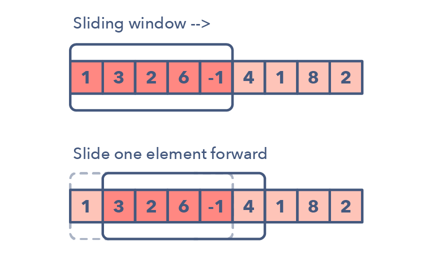
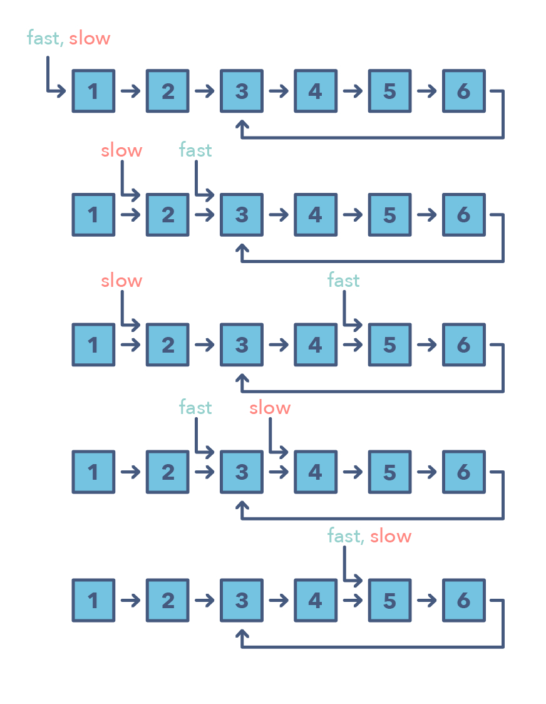

# Two Pointers

## 思路

Two Pointers解法的精髓，是透過兩個指針控制一個區間\(window\)，保證區間滿足特定的條件。

## 1. 同向指針\(L-&gt;/R-&gt;\): O\(n\)

### **\(1\) Sliding Window 模板**

使用Sliding Window必要條件：數據如果是Int, 必須都是positive Integers



```python
    [a b c] a b c b b
     d   |
(left)-> |
       char
     (right) ->   
def slidingWindow(self, s):
    
    window = {}
    left, right = 0, 0
    result = 0
    # 0.右指針開始往右走
    while right < len(s):
        #1-1.更新數據 ADD right char
        char = s[right]
        window[char] add ...
        #1-2.右指針右移
        right += 1
        
        #2.判斷條件 收縮窗口
        while window[char] > 1:
            #4.符合條件時更新答案
            if ....
                result = 
            
            #3-1.更新數據 DELETE left d
            d = s[left]
            window remove d ...
            #3-2.左指針右移
            left += 1 
                 
        #4.或是在這更新答案 
        result = ....
```





要如何判斷這題是否可以用Sliding Window解題呢？

很多sliding window的題，都是在linear data structure的框架下，並且答案是要求要contigous或是其他黏在一起的組合\(substring, subarray, anagram, permutation...\)

The Sliding Window pattern is used to perform a required operation on a specific window size of a given array or linked list, such as finding the longest subarray containing all 1s. Sliding Windows start from the 1st element and keep shifting right by one element and adjust the length of the window according to the problem that you are solving. In some cases, the window size remains constant and in other cases, the sizes grow or shrink.

**Following are some ways you can identify that the given problem might require a sliding window**:

* The problem input is a **linear data structure** such as a linked list, array, or string
* You’re asked to find the longest/shortest substring, subarray, or the desired value

Common problems you use the sliding window pattern with:

* Maximum sum subarray of size ‘K’ \(easy\)
* Longest substring with ‘K’ distinct characters \(medium\)
* String anagrams \(hard\) 
* [x] Minimum Window Substring
* [x] Longest Substring Without Repeating Characters
* [ ] Longest Substring with At Most K Distinct Characters
* [x] Minimum Size Subarray Sum

### **\(2\) Fast & Slow Pointers**

Fast & Slow Pointer通常都跟Linked List有關。而且題目會要求 `'Could you do this in one pass?'`，基本上就是要求用Fast&Slow Pointer + Linked List這種組合。

The Fast and Slow pointer approach, also known as the **Hare & Tortoise algorithm**, is a pointer algorithm that uses two pointers which move through the array \(or sequence/linked list\) at different speeds. **This approach is quite useful when dealing with cyclic linked lists or arrays.**By moving at different speeds \(say, in a cyclic linked list\), the algorithm proves that the two pointers are bound to meet. The fast pointer should catch the slow pointer once both the pointers are in a cyclic loop.

#### Fast&Slow Pointers Pattern:

* The problem will deal with **a loop in a linked list or array**
* When you need to know **the position of a certain element** or the **overall length of the linked list**.

When should I use Fast&Slow pointers over the Two Pointer method mentioned above?

* There are some cases where you shouldn’t use the Two Pointer approach such as in a singly linked list where you can’t move in a backwards direction. An example of when to use the Fast and Slow pattern is when you’re trying to determine if a linked list is a palindrome.



#### Linked List常用技巧：

* `slow.next = slow.next.next` \(slow pointer跳過下一位\)
* `fast = fast.next` \(fast pointer往後移一位，通常會放在for/while loop裡\)
* `if fast.next == None`, then `return head.next` \(fast.next == None代表fast指的是最後一個\)


* [ ] Find the Middle of Linked List
* [x] Remove Nth Node From End of List
* [x] Linked List Cycle
* [ ] Linked List Cycle II
* Linked List Cycle \(easy\)
* Palindrome Linked List \(medium\)
* Cycle in a Circular Array \(hard\)

## 題目類型

1. Remove Duplicates
2. Sliding Window
3. Middle of Linked List
4. Two Difference
5. Circle in a Linked List

## 2. 相向指針\(L-&gt;/&lt;-R\): O\(n\)

#### 相向指針模板 \(1\) While Loop 

```python
L, R = 0, len(nums)-1

while L < R:
    
    # If statement is not required. 
    # Sometimes it will just do something without if/elif statement.
    if nums(L) nums(R) == target:
        L += 1
        R -= 1 
        return result or add result to the final list
    elif > target
    
    # check its condition to add 'if' statement if necessary. 
    L += 1
    R -= 1
```

#### \(2\) For Loop

```java
for (int i = 0, j = nums.size()-1; i < j; i++, j--)
```

### \(3\)-&gt;/&lt;-指針 isPalindrome 模板



```python
# s can be already sliced string like s[start:end]
def isPalindrome(self, s):
    i, j = 0, len(s)-1
    while i < j:
        if s[i] != s[j]:
            return False
        i += 1
        j -= 1
    return True


def isPalindrome(self, s):    
    reversed_s = s[::-1] #reverse s
    for i in range(len(s)):
        if s[i] != reversed_s[i]:
            return False
    return True
```



#### 相關題目

* [x] \*\*\*Two Sum & Related 
* [ ] \*\*Partition xxx & Related
* [ ] \*Reverse xxx & Related
* [x] Longest Palindromic Substring
* [x] Palindromic Substring
* [ ] Find K Closest Elements

## 練習

* [Two Sum](https://leetcode.com/problems/two-sum/)
* [Three Sum](https://leetcode.com/problems/3sum/)
* [ ] Two Sum
* [ ] Three Sum
* [ ] Valid Palindrome
* [ ] Container With Most Water
* [ ] Find K Closest Elements

