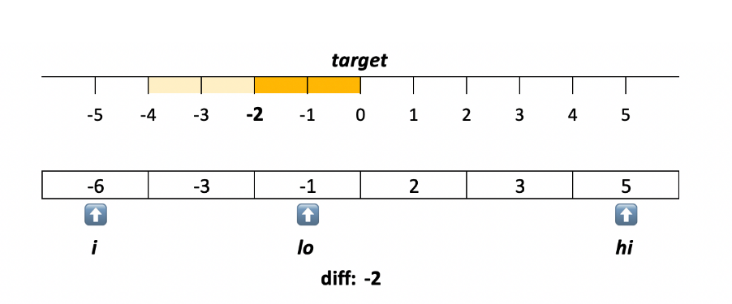

# \[Medium\] 3 Sum

[3 Sum  
](https://leetcode.com/problems/3sum/)Given an array `nums` of _n_ integers, are there elements _a_, _b_, _c_ in `nums` such that _a_ + _b_ + _c_ = 0? Find all unique triplets in the array which gives the sum of zero.

**Note:**  
The solution set must not contain duplicate triplets.

## Thought Process

### Two Pointers \(L-&gt;/&lt;-R\)

1.由`a + b + c = 0`我們可以想到轉化為`a + b = -c`，因此，我們可以發現其可以轉化a + b為 two sum來求解，而`-c` 就由for loop的`nums[i]`來代替。  
2.另外，由於nums裡的element有可能重複\(ex: `(-1) + (-1) + 2 = 0`\) ，我們可以利用對nums“排序”來處理結果，使得在加和時比較方便，又排序需要O\(nlogn\)時間，比起此題two pointer的O\(n^2\)並不會增加複雜度。  
3. 最後要注意的是，結果也有可能重複\(\[-1,-1,2\] == \[-1,2,-1\]\)，因此我們需要再remove result's duplicates。  
  
**Time Complexity: O\(**$$n^2$$**\)，兩重loop，一個是-c的，一個是two pointers L,R的。**  
**Space Complexity: O\(** $$n$$ **\)**


注意: \(1\)兩重loop，一個`-c，`另一個是two pointers L,R  
\(2\)邊界條件：-c \(0 -&gt; **len\(\)-2**\), L = **i + 1**, R = **len\(\) -1**  
\(3\)remove duplicates：如果找到sum = 0時，還要用新的while loop繼續移動 L, R，  
即nums\[L\] == nums\[L-1\] L++, nums\[R\] == nums\[R+1\] R--  
\(4\)最後一步要remove result's duplicates


#### Two Pointers在TwoSum題模板

```python
# 1.Preserve Order: enumerate and sort nums
enumerate(nums)
sorted(nums) 

# 2.init two pointers 
L, R = 0, len(nums)-1 

# 3. L should always be smaller than R
while L < R:
    total = nums[L] + nums[R]
    if total == target: # meet the condition
        return result 
    elif total < target: # L
        L += 1
    else: # R
        R -= 1
        
return result
```

#### Remove Duplicates from a List of Lists

Refer to [this](https://app.gitbook.com/@iscolectivo/s/algonote/~/drafts/-MBWtajXsJQVkkuDbqkO/basics-1/suan-fa-dao-du) page.

## Code



```python
def threeSum(self, nums: List[int]) -> List[List[int]]:
    
    result = []
    
    if not nums:
        return result
    
    # sort nums to make calc easier
    nums = sorted(nums)
    
    # -c
    for i in range(len(nums)-2):
        
        # a+b
        L, R = i+1 , len(nums)-1
        while L < R:
        
            total = nums[L] + nums[R] + nums[i]
            if total == 0:
                result.append([nums[L], nums[R], nums[i]])
                L += 1
                R -= 1
                
                # if there are duplicated values, [-3,-2,-2,-2,1]
                # then keep move pointer forward/backward
                while L < R and nums[L] == nums[L-1]:
                    L += 1
                while L < R and nums[R] == nums[R+1]:
                    R -= 1
            
            elif total < 0:
                L += 1
            else:
                R -= 1
        
    # remove result's duplicate
    reuslt = [tuple(i) for i in result]
    result = set(result)
    result = [list(i) for i in result]
        
    return result
```



## [\[Medium\] 3 Sum Closest](https://leetcode.com/problems/3sum-closest/)

### 1. Two Pointers \(L-&gt;/&lt;-R\):     O\(n^2\) / O\(logn\)-O\(n\)

> 利用sorted array的特性，我們可以比較容易找出哪三個連續數的sum最接近target。  
>   
> 首先要知道目前離target多遠，我們用`diff`來紀錄so far最近的difference。  
>   
> 如何決定哪三個連續數？  
> 用`nums[i], nums[left], nums[right]`。  
> `nums[i]` 由左至右, `0 ~ len(nums)`  
> `nums[left]` 由左至右, `i + 1 ~ len(nums)-1`   
> `nums[right]`  由右至左, `len(nums)-1 ~ left`



The two-pointers pattern requires the array to be sorted, so we do sorting first.

In the sorted array, we process each value from left to right. For value `v`, we need to find a pair which sum, ideally, is equal to `target - v`. We will follow the same two pointers approach as for 3Sum, however, since this 'ideal' pair may not exist, we will track the smallest absolute difference between the sum and the target. The two pointers approach naturally enumerates pairs so that the sum moves toward the target.

```python
def threeSumClosest(self, nums: List[int], target: int) -> int:
    
    nums = sorted(nums)         # O(nlogn)
    diff = float('inf')
    
    for i in range(len(nums)):               # O(n^2), two loops
        left, right = i + 1, len(nums) - 1
        while left < right:
            total = nums[i] + nums[left] + nums[right]
            
            # found smaller diff, then we need to update
            if abs(target - total) < abs(diff):
                diff = target - total
            # total在target左邊，move left pointer 
            if total < target:
                left += 1
            # total在target右邊，move right pointer
            else:
                right -= 1
                
        # possibly end the loop early
        if diff == 0:
            break
    
    return target - diff
```

